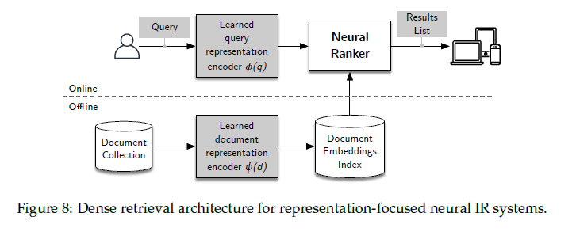

## 4.2.3 Conversão de MIP para Nearest Neighbor Search

### Introdução
Como discutido na Seção 4.2.2, o problema de **Maximum Inner Product (MIP)** search é fundamental na recuperação de informação densa, pois busca encontrar o documento cuja representação vetorial (embedding) maximiza o produto interno com o embedding da query [^29]. No entanto, a complexidade computacional e espacial do MIP search direto em um *flat index* torna-o inviável para grandes datasets [^30]. Uma estratégia comum para mitigar essa ineficiência é transformar o problema de MIP em um problema de **Nearest Neighbor (NN)** search, que possui estruturas de dados e algoritmos de busca mais eficientes [^30]. Esta seção explora como essa conversão é realizada e suas implicações.

### Transformação do MIP para NN Search
O objetivo do Nearest Neighbor search é encontrar o ponto em um conjunto de dados que minimiza uma métrica de distância em relação a um ponto de query. No contexto atual, o objetivo é encontrar o embedding de documento $\psi^{\dagger}$ que minimiza a distância em relação ao embedding da query:

$$\psi^{\dagger} = \underset{\psi \in \Psi}{\text{arg min}} \ ||\phi - \psi|| $$ [^30]

Para converter o MIP search em NN search, é necessário adaptar o problema de forma que a maximização do produto interno seja equivalente à minimização da distância Euclidiana. Isso é alcançado através de uma transformação do espaço de embeddings de $R^l$ para $R^{l+1}$ [^30]. A transformação, conforme apresentada em [Bachrach et al. 2014, Neyshabur and Srebro 2015], é definida como [^30]:

$$\hat{\phi} = \begin{bmatrix} 0 \\ \phi / M \end{bmatrix}, \ \ \ \hat{\psi} = \begin{bmatrix} \sqrt{1 - ||\psi||^2 / M^2} \\ \psi / M \end{bmatrix} $$ [^30]

onde $M = \underset{\psi \in \Psi}{\text{max}} ||\psi||$, ou seja, o valor máximo da norma dos embeddings dos documentos no conjunto $\Psi$ [^30].

> 💡 **Exemplo Numérico:** Suponha que temos três documentos com embeddings: $\psi_1 = [0.8, 0.6]$, $\psi_2 = [0.9, 0.4]$, e $\psi_3 = [0.7, 0.7]$. Primeiro, calculamos as normas: $||\psi_1|| = \sqrt{0.8^2 + 0.6^2} = 1.0$, $||\psi_2|| = \sqrt{0.9^2 + 0.4^2} = 0.984$, and $||\psi_3|| = \sqrt{0.7^2 + 0.7^2} = 0.990$. Então, $M = \text{max}(1.0, 0.984, 0.990) = 1.0$. Agora, consideremos uma query embedding $\phi = [0.5, 0.5]$. Vamos aplicar the transformation for document $\psi_2$: $\hat{\psi_2} = \begin{bmatrix} \sqrt{1 - 0.984^2 / 1.0^2} \\ [0.9, 0.4] / 1.0 \end{bmatrix} = \begin{bmatrix} 0.179 \\ 0.9 \\ 0.4 \end{bmatrix}$. And for the query: $\hat{\phi} = \begin{bmatrix} 0 \\ 0.5 \\ 0.5 \end{bmatrix}$. This illustrates how embeddings are augmented and scaled.

Ao aplicar esta transformação, o problema original de MIP pode ser resolvido utilizando algoritmos de NN search no espaço transformado. Para demonstrar a equivalência, considera-se a distância Euclidiana ao quadrado entre os embeddings transformados $\hat{\phi}$ e $\hat{\psi}$:

$$||\hat{\phi} - \hat{\psi}||^2 = ||\hat{\phi}||^2 + ||\hat{\psi}||^2 - 2 \langle \hat{\phi}, \hat{\psi} \rangle$$

Substituindo as definições de $\hat{\phi}$ e $\hat{\psi}$, obtemos:

$$||\hat{\phi} - \hat{\psi}||^2 = 0 + \frac{||\phi||^2}{M^2} + (1 - \frac{||\psi||^2}{M^2}) + \frac{||\psi||^2}{M^2} - 2 \left( 0 \cdot \sqrt{1 - \frac{||\psi||^2}{M^2}} + \frac{\langle \phi, \psi \rangle}{M^2} \right) $$

$$||\hat{\phi} - \hat{\psi}||^2 = 1 + \frac{||\phi||^2}{M^2} - 2 \frac{\langle \phi, \psi \rangle}{M^2} $$

Minimizar $||\hat{\phi} - \hat{\psi}||^2$ equivale a maximizar $\langle \phi, \psi \rangle$ [^30]. Portanto, o documento $\psi^*$ que maximiza o produto interno $\langle \phi, \psi \rangle$ é também o documento $\hat{\psi}^{\dagger}$ que minimiza a distância Euclidiana $||\hat{\phi} - \hat{\psi}||$.

> 💡 **Exemplo Numérico:** Continuamos com o exemplo anterior. We now calculate the squared Euclidean distance between $\hat{\phi}$ and $\hat{\psi_2}$: $||\hat{\phi} - \hat{\psi_2}||^2 = (0-0.179)^2 + (0.5-0.9)^2 + (0.5-0.4)^2 = 0.032 + 0.16 + 0.01 = 0.202$. The goal is to find the document with the smallest distance, thus approximating the MIP.

**Proposição 1** Uma condição suficiente para que a transformação acima seja bem definida é que $M$ seja maior ou igual a $||\psi||$ para todo $\psi \in \Psi$.

*Demonstração:*
A transformação requer o cálculo de $\sqrt{1 - ||\psi||^2 / M^2}$. Para que a raiz quadrada seja um número real, é necessário que $1 - ||\psi||^2 / M^2 \geq 0$, o que implica $||\psi||^2 / M^2 \leq 1$ ou $||\psi|| \leq M$. Portanto, se $M$ é o máximo da norma dos embeddings em $\Psi$, a condição é satisfeita. $\blacksquare$

Além disso, vale ressaltar que a escolha do valor de $M$ influencia a escala dos embeddings transformados e, consequentemente, o desempenho dos algoritmos de NN search.

**Observação:** A escolha de $M$ como o máximo da norma dos embeddings garante que a transformação seja válida, mas pode ser subótima em termos de desempenho do NN search. Em vez de usar o valor máximo, pode-se considerar o uso de um percentil alto das normas ou uma estimativa robusta da norma máxima para reduzir a sensibilidade a outliers.

### Implicações e Benefícios
A transformação descrita permite a utilização de estruturas de dados eficientes para NN search, como *k-d trees*, *ball trees* e grafos de proximidade aproximados (ANN), que geralmente oferecem complexidades sublineares na busca [^30]. A complexidade de espaço, no entanto, é aumentada devido à necessidade de armazenar os embeddings transformados em $R^{l+1}$ [^30].

É importante notar que, após a transformação, o algoritmo de NN search retorna um resultado aproximado para o problema original de MIP [^30]. A qualidade da aproximação depende da precisão do algoritmo de NN search e da distribuição dos dados.

**Teorema 1** Seja $\epsilon > 0$. Se um algoritmo de Nearest Neighbor retorna um $\hat{\psi}^{\dagger}$ tal que $||\hat{\phi} - \hat{\psi}^{\dagger}||^2 \leq \underset{\psi \in \Psi}{\text{min}} \ ||\hat{\phi} - \hat{\psi}||^2 + \epsilon$, então o produto interno $\langle \phi, \psi^{\dagger} \rangle$ satisfaz:

$$\langle \phi, \psi^{\dagger} \rangle \geq \underset{\psi \in \Psi}{\text{max}} \ \langle \phi, \psi \rangle - \frac{M^2 \epsilon}{2}$$

*Demonstração:*
Sabemos que $||\hat{\phi} - \hat{\psi}^{\dagger}||^2 = 1 + \frac{||\phi||^2}{M^2} - 2 \frac{\langle \phi, \psi^{\dagger} \rangle}{M^2}$ e $\underset{\psi \in \Psi}{\text{min}} \ ||\hat{\phi} - \hat{\psi}||^2 = 1 + \frac{||\phi||^2}{M^2} - 2 \frac{\underset{\psi \in \Psi}{\text{max}} \ \langle \phi, \psi \rangle}{M^2}$.

Portanto, $1 + \frac{||\phi||^2}{M^2} - 2 \frac{\langle \phi, \psi^{\dagger} \rangle}{M^2} \leq 1 + \frac{||\phi||^2}{M^2} - 2 \frac{\underset{\psi \in \Psi}{\text{max}} \ \langle \phi, \psi \rangle}{M^2} + \epsilon$.

Simplificando, $- 2 \frac{\langle \phi, \psi^{\dagger} \rangle}{M^2} \leq - 2 \frac{\underset{\psi \in \Psi}{\text{max}} \ \langle \phi, \psi \rangle}{M^2} + \epsilon$.

Multiplicando por $-\frac{M^2}{2}$, temos $\langle \phi, \psi^{\dagger} \rangle \geq \underset{\psi \in \Psi}{\text{max}} \ \langle \phi, \psi \rangle - \frac{M^2 \epsilon}{2}$. $\blacksquare$

Este teorema quantifica a perda na maximização do produto interno devido à aproximação do Nearest Neighbor search.

> 💡 **Exemplo Numérico:** Let's assume the maximum possible inner product is 0.9 and that $\epsilon = 0.05$ and $M=1$. Then, $\langle \phi, \psi^{\dagger} \rangle \geq 0.9 - (1^2 * 0.05) / 2 = 0.9 - 0.025 = 0.875$. This means that even with the approximation, we are guaranteed to find an inner product that is at least 0.875, which is close to the optimal 0.9. This shows the impact of epsilon on the approximated inner product.

### Simplificação da Notação
Para simplificar a notação nas seções subsequentes, a notação "chapéu" é descartada, e o embedding transformado é denotado simplesmente como $\phi$ e $\psi$ [^30]. Além disso, a dimensão do espaço de embeddings é tratada como $l$, onde $l$ representa a dimensão aumentada (originalmente $l+1$) [^30].

### Conclusão
A conversão do MIP search em NN search é uma técnica fundamental para melhorar a escalabilidade e eficiência dos sistemas de recuperação de informação densa [^30]. Ao transformar o espaço de embeddings, é possível utilizar algoritmos e estruturas de dados otimizadas para NN search, permitindo a busca eficiente de documentos relevantes em grandes datasets. A escolha do algoritmo de NN search e a qualidade da aproximação devem ser consideradas cuidadosamente para garantir um bom desempenho do sistema.

### Referências
[^29]: Ver seção 4.2.2
[^30]: Bachrach, Y., Finkelstein, Y., Gilad-Bachrach, R., Katzir, L., Koenigstein, N., Nice, N., & Paquet, U. (2014). Speeding up the Xbox Recommender System Using a Euclidean Transformation for Inner-Product Spaces. *In Proc. RecSys*, p. 257–264.
<!-- END -->