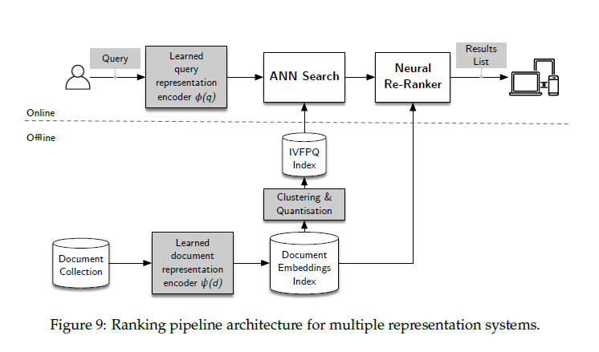

## 4.4.1 Aprofundamento no Índice Product Quantization (PQ) e IVFPQ

Como vimos na Seção 4.4 [^32], a **quantização vetorial** oferece uma alternativa à divisão aleatória do espaço de entrada, como no **Locality Sensitive Hashing (LSH)**, permitindo que a distribuição dos dados guie a partição do espaço. O **Product Quantization (PQ)** é uma técnica avançada de quantização vetorial que decompõe o espaço vetorial em subespaços menores para reduzir a complexidade computacional e de armazenamento [^32]. Esta seção explora os detalhes da construção e utilização de índices PQ e suas variações, em particular o **Inverted File with Product Quantization (IVFPQ)**, no contexto do *Neural Information Retrieval*.

### Índice Product Quantization (PQ)

No índice PQ, para cada embedding $\psi \in \Psi$, armazena-se a codificação $(i_1, ..., i_m)$, onde cada $i_j$ representa o índice do centróide do $j$-ésimo subvetor de $\psi$. A exigência de armazenamento é de $m \log k$ bits [^32], onde $m$ é o número de subvetores e $k$ é o número de centróides em cada subespaço.

> 💡 **Exemplo Numérico:** Suponha que temos um embedding $\psi$ e dividimos ele em $m=4$ subvetores. Em cada subvetor, usamos $k=256$ centróides (o que requer $\log_2(256) = 8$ bits para representar cada índice). O requisito total de armazenamento para esse embedding seria $4 \times 8 = 32$ bits.
>
> 💡 **Exemplo Prático:** Se tivermos 1 milhão de embeddings, o espaço total necessário para armazenar os códigos PQ seria $1,000,000 \times 32 \text{ bits} = 32,000,000 \text{ bits} = 4 \text{ MB}$.  Isso demonstra a eficiência de armazenamento do PQ, especialmente para vetores de alta dimensão.

A distância entre um embedding de consulta $\phi$ e um embedding de documento $\psi$ é aproximada usando a quantização de produto:

$$
||\psi - \phi||^2 \approx ||pq(\psi) - \phi||^2 = \sum_{j=1}^{m} ||q_j(\psi_j) - \phi_j||^2
$$

onde $pq(\psi)$ é a representação quantizada de produto de $\psi$, $q_j(\psi_j)$ é o centróide atribuído ao $j$-ésimo subvetor de $\psi$, e $\phi_j$ é o $j$-ésimo subvetor de $\phi$ [^32]. Para implementar esta computação de distância, são computadas $m$ tabelas de lookup, uma por subvetor quantizador. A $j$-ésima tabela é composta pelas distâncias quadradas entre o $j$-ésimo subvetor de $\phi$ e os centróides de $M_j$. Essas tabelas são então usadas para rapidamente computar as somas na Equação (23) para cada embedding de documento [^33].

> 💡 **Exemplo Numérico:** Suponha que temos um embedding de consulta $\phi$ e dividimos ele em $m=2$ subvetores, $\phi_1$ e $\phi_2$. Para o primeiro subvetor, calculamos as distâncias quadradas até os $k=4$ centróides mais próximos: $||q_1(\psi_1) - \phi_1||^2 = [0.1, 0.2, 0.3, 0.4]$. Similarmente, para o segundo subvetor, calculamos: $||q_2(\psi_2) - \phi_2||^2 = [0.5, 0.6, 0.7, 0.8]$. Para encontrar a distância aproximada entre $\phi$ e $\psi$, somamos os menores valores em cada lista. Neste caso, $0.1 + 0.5 = 0.6$. Este valor aproximado é então usado para ranquear os documentos.

Para melhor elucidar o processo de quantização, podemos expressar o resíduo da quantização de produto da seguinte forma:

**Proposição 1** O resíduo da quantização de produto é dado por:

$$
r(\psi, \phi) = ||\psi - \phi||^2 - ||pq(\psi) - \phi||^2 =  ||\psi - \phi||^2 - \sum_{j=1}^{m} ||q_j(\psi_j) - \phi_j||^2
$$

*Prova:* A proposição segue diretamente da definição da aproximação da distância no Product Quantization.  O termo $r(\psi, \phi)$ representa a diferença entre a distância real e a distância aproximada após a quantização. $\blacksquare$

Além disso, a escolha do número de subvetores $m$ impacta diretamente na precisão da aproximação.  Um valor maior de $m$ implica subespaços menores, potencialmente permitindo uma melhor representação dos vetores originais, mas aumentando a complexidade computacional das tabelas de *lookup*.

> 💡 **Exemplo Comparativo:**
>
> | Número de Subvetores (m) | Precisão da Aproximação | Tamanho das Tabelas de Lookup | Custo Computacional |
> | ------------------------- | ----------------------- | ---------------------------- | ------------------- |
> | 2                         | Baixa                   | Pequeno                      | Baixo               |
> | 8                         | Média                   | Médio                        | Médio               |
> | 32                        | Alta                    | Grande                       | Alto                |
>
> Um valor maior de $m$ leva a uma aproximação mais precisa da distância real, mas também aumenta o custo computacional devido ao maior tamanho das tabelas de *lookup*.

### Índice Inverted File com Product Quantization (IVFPQ)

Como mencionado na Seção 4.4 [^32], a busca *Approximate Nearest Neighbor (ANN)* em um índice PQ ainda pode ser exaustiva. Para evitar isso, o índice **IVFPQ** combina arquivos invertidos com quantização de produto. Uma quantização inicial particiona o conjunto de dados de entrada em listas invertidas, para um acesso rápido a pequenas porções dos dados de entrada. Em uma dada lista invertida, a diferença entre cada dado de entrada e o centróide da lista (isto é, o resíduo de entrada) é codificada com um quantizador de produto [^33]. Assim fazendo, a busca ANN exaustiva pode ser realizada em um número limitado das partições computadas pelo quantizador grosseiro.

**Em resumo, o processo IVFPQ consiste em duas etapas principais:**

1.  **Quantização Grosseira:** O espaço vetorial é particionado em $k'$ clusters usando um algoritmo de clustering como o *k-means*. Cada cluster é representado por seu centróide, e os vetores são atribuídos ao cluster mais próximo.

2.  **Quantização de Produto no Resíduo:** Para cada cluster, calcula-se o vetor resíduo subtraindo o centróide do cluster de cada vetor no cluster. Em seguida, aplica-se a quantização de produto aos vetores resíduo, dividindo cada vetor em $m$ subvetores e quantizando cada subvetor separadamente [^32].

O IVFPQ equilibra a necessidade de precisão com a eficiência computacional, permitindo a busca em grandes conjuntos de dados com um custo aceitável de aproximação. A escolha do número de clusters $k'$ e o número de subvetores $m$ são parâmetros cruciais que afetam o desempenho do índice. O IVFPQ apresenta um *trade-off* entre a precisão e o *recall* e o custo computacional [^32].

> 💡 **Exemplo Numérico:** Imagine que temos um conjunto de dados de 10.000 vetores. Na etapa de quantização grosseira, escolhemos $k'=100$ clusters. Isso significa que cada cluster conterá, em média, 100 vetores. Ao invés de procurar nos 10.000 vetores, restringimos a busca aos vetores dentro de um ou alguns clusters mais próximos da query, digamos 2 clusters, reduzindo a busca para aproximadamente 200 vetores. A quantização de produto é então aplicada a esses 200 vetores para refinar ainda mais a busca.

Para formalizar a etapa de quantização grosseira, considere a função $c(\psi)$ que mapeia um vetor $\psi$ para o índice do cluster mais próximo.  Assim, a quantização grosseira pode ser expressa como $\hat{\psi} = C_{c(\psi)}$, onde $C_{c(\psi)}$ é o centróide do cluster $c(\psi)$.

**Proposição 2** O resíduo da quantização grosseira é definido como:

$$
e(\psi) = \psi - \hat{\psi} = \psi - C_{c(\psi)}
$$

Este resíduo $e(\psi)$ é então submetido à quantização de produto na segunda etapa do IVFPQ.

*Prova:* A proposição segue diretamente da definição de resíduo, que é a diferença entre o vetor original e sua representação quantizada pelo quantizador grosseiro. $\blacksquare$

> 💡 **Exemplo Numérico:** Suponha que um vetor $\psi = [1.2, 3.4, 5.6, 7.8]$ e o centróide do cluster ao qual ele pertence é $C_{c(\psi)} = [1.0, 3.0, 5.0, 7.0]$. O resíduo da quantização grosseira seria $e(\psi) = [1.2-1.0, 3.4-3.0, 5.6-5.0, 7.8-7.0] = [0.2, 0.4, 0.6, 0.8]$. Este vetor resíduo é então usado na etapa de quantização de produto.

### Vantagens do IVFPQ
*   **Redução do Custo Computacional:** Ao restringir a busca a um subconjunto dos clusters, o IVFPQ diminui significativamente o número de cálculos de distância necessários, comparado a uma busca exaustiva [^32].
*   **Escalabilidade:** A capacidade de particionar o espaço de busca torna o IVFPQ adequado para indexar grandes conjuntos de dados, facilitando a busca eficiente em larga escala.
*   **Compensação entre Precisão e Eficiência:** A escolha do número de clusters e o número de bits usados na quantização de produto permite ajustar o equilíbrio entre a precisão dos resultados da busca e a velocidade da busca [^33].

### Desafios
*   **Ajuste de Parâmetros:** Selecionar os valores ótimos para o número de clusters na quantização inicial e o número de subvetores na quantização de produto pode ser desafiador e requer experimentação.
*   **Custo de Armazenamento:** Embora a quantização de produto reduza o custo de armazenamento comparado a armazenar os vetores originais, o índice ainda requer uma quantidade considerável de espaço, especialmente para alta dimensionalidade [^32].
*   **Sensibilidade à Distribuição de Dados:** O desempenho do IVFPQ pode ser afetado pela distribuição dos dados, e o desempenho ideal é alcançado quando os dados são distribuídos uniformemente dentro de cada cluster.

Adicionalmente, a escolha do algoritmo de clustering na etapa de quantização grosseira pode impactar significativamente o desempenho do IVFPQ.  Enquanto o *k-means* é frequentemente utilizado devido à sua simplicidade e eficiência, outros algoritmos como o *agglomerative clustering* ou *spectral clustering* podem ser mais adequados dependendo da estrutura dos dados.

A arquitetura de sistemas de recuperação de informação que empregam IVFPQ pode ser melhor compreendida visualmente. A figura a seguir ilustra esse processo.

**Proposição 3** A complexidade da busca em IVFPQ é dada por $O(n_{s} \cdot m \cdot k)$, onde $n_s$ é o número de vetores em um subconjunto selecionado de clusters, $m$ é o número de subvetores na quantização de produto, e $k$ é o número de centróides em cada subespaço.

*Prova:* A complexidade da busca depende do número de vetores ($n_s$) que precisam ser comparados na etapa de quantização de produto. Para cada vetor, são realizadas $m$ comparações (uma por subvetor), e cada comparação envolve uma busca em uma tabela de lookup de tamanho $k$. Portanto, a complexidade total é $O(n_{s} \cdot m \cdot k)$. $\blacksquare$

> 💡 **Exemplo Numérico:** Se $n_s = 200$, $m = 4$, e $k = 256$, a complexidade da busca seria $O(200 \cdot 4 \cdot 256) = O(204,800)$. Isso mostra como os parâmetros afetam diretamente a complexidade computacional. Reduzir $n_s$ selecionando menos clusters na etapa de quantização grosseira, ou diminuir $m$ e $k$, pode diminuir significativamente o tempo de busca, mas potencialmente à custa da precisão.

$\blacksquare$
<!-- END -->