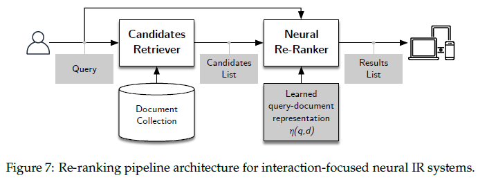

## Otimizações em Arquiteturas de Recuperação e Busca Vetorial: Implementações de Índices de Embedding

### Introdução
No capítulo anterior, exploramos diversas arquiteturas de *Retrieval* e busca vetorial, focando em algoritmos e estruturas de dados que viabilizam a identificação eficiente de vizinhos mais próximos (NN) e a maximização do produto interno (MIP) em espaços vetoriais de alta dimensão [^28]. Este capítulo aprofunda-se nas otimizações práticas e implementações de índices de *embedding*, detalhando as características e os *trade-offs* de diferentes abordagens, como índices planos (flat), *Locality Sensitive Hashing* (LSH), arquivos invertidos (IVF), *Product Quantization* (PQ), IVFPQ e *Hierarchical Navigable Small World* (HNSW) [^34].

### Implementações de Índices de Embedding
Conforme discutido anteriormente, a performance de sistemas de *Retrieval* baseados em *embeddings* densos depende crucialmente da eficiência com que os documentos relevantes são identificados [^22]. As implementações de índices de *embedding* visam acelerar essa busca, permitindo que os *backends* de *Retrieval* processem um grande volume de dados em tempo hábil.

#### Índices Planos (Flat)
Os índices planos são a forma mais direta de indexação, armazenando os *embeddings* dos documentos explicitamente em um *array* ou lista [^30]. A busca por similaridade envolve o cálculo da distância ou produto interno entre o *embedding* da *query* e todos os *embeddings* no índice.

*   **Vantagens:** Simplicidade de implementação e garantia de resultados exatos.
*   **Desvantagens:** Complexidade computacional $O(nl)$, onde *n* é o número de documentos e *l* é a dimensão dos *embeddings*, torna-se proibitiva para grandes conjuntos de dados [^30].
*   **Casos de Uso:** Adequado para conjuntos de dados pequenos, onde a precisão é primordial e a latência não é crítica [^34].

> 💡 **Exemplo Numérico:**
>
> Considere um conjunto de dados com apenas 5 documentos, e cada documento é representado por um *embedding* de dimensão 100. Queremos encontrar o documento mais similar a uma *query* específica.
>
> 1.  Armazenamos os 5 *embeddings* em um *array*.
> 2.  Para cada documento, calculamos o produto interno (ou similaridade do cosseno) entre o *embedding* da *query* e o *embedding* do documento.
> 3.  Selecionamos o documento com o maior produto interno.
>
> Este processo garante que encontraremos o vizinho mais próximo exato, mas o custo computacional é proporcional a $5 \times 100 = 500$ operações (aproximadamente), o que pode se tornar inviável para conjuntos de dados maiores.
>
> | Documento | Produto Interno |
> | --------- | --------------- |
> | Doc 1     | 0.85            |
> | Doc 2     | 0.92            |
> | Doc 3     | 0.78            |
> | Doc 4     | 0.88            |
> | Doc 5     | 0.95            |
>
> Neste exemplo, o Doc 5 seria retornado como o mais similar à *query*.

Para complementar a discussão sobre índices planos, é útil analisar o custo computacional de operações básicas.

**Proposição 1** O custo de adicionar um novo embedding a um índice plano é $O(1)$, assumindo que há espaço alocado disponível no array ou lista. O custo de deletar um embedding é $O(1)$ se a ordem dos embeddings não precisar ser preservada (podemos simplesmente substituir o embedding a ser deletado pelo último embedding da lista e reduzir o tamanho da lista em 1), e $O(n)$ se a ordem precisar ser preservada (requerendo o deslocamento de todos os embeddings subsequentes).

*Proof.* Adicionar um novo embedding ao final de um array ou lista tem custo constante. A deleção sem preservar a ordem também tem custo constante. Preservar a ordem requer percorrer o array e deslocar os elementos, resultando em um custo linear.

<!-- END_ADDITION -->

#### Locality Sensitive Hashing (LSH)
LSH é uma família de algoritmos de *hashing* que visa agrupar *embeddings* similares em "baldes" (buckets) de *hash* [^31]. O princípio subjacente é que, após uma "projeção" por meio de uma função de *hash*, *embeddings* próximos permanecem próximos, enquanto *embeddings* distantes têm baixa probabilidade de colidir no mesmo balde.

*   **Vantagens:** Busca sublinear com complexidade $O(n^c)$, onde $c < 1$, oferecendo um *trade-off* entre precisão e velocidade [^31].
*   **Desvantagens:** Requer um ajuste cuidadoso dos parâmetros de *hash* para otimizar o balanço entre a probabilidade de colisão para vizinhos próximos (alta) e a probabilidade de colisão para itens distantes (baixa). O consumo de memória pode ser elevado, especialmente para garantir resultados precisos [^31].
*   **Casos de Uso:** Útil quando a latência é uma preocupação maior que a precisão, e existe a possibilidade de otimizar as funções de *hash* para o domínio específico [^34].

> 💡 **Exemplo Numérico:**
>
> Imagine que temos 10.000 documentos com *embeddings* de dimensão 128. Utilizamos LSH com 100 tabelas de *hash* e cada tabela tem 1000 baldes.
>
> 1.  Para uma dada *query*, calculamos o *hash* para cada uma das 100 tabelas.
> 2.  Em cada tabela, recuperamos os documentos que estão no mesmo balde de *hash* que a *query*.
> 3.  Unimos os resultados das 100 tabelas (removendo duplicatas).
> 4.  Calculamos a similaridade (produto interno ou cosseno) entre a *query* e os documentos resultantes.
> 5.  Retornamos os *k* documentos mais similares.
>
> Sem LSH, teríamos que comparar a *query* com os 10.000 documentos. Com LSH, esperamos comparar a *query* com um número muito menor de documentos, dependendo da distribuição dos dados e da qualidade das funções de *hash*. Por exemplo, se em média 10 documentos colidem no mesmo balde em cada tabela, compararíamos a *query* com aproximadamente $100 \times 10 = 1000$ documentos (após remover duplicatas), o que representa uma redução significativa no custo computacional. No entanto, essa redução pode vir à custa da precisão, já que alguns dos vizinhos mais próximos verdadeiros podem não ter sido incluídos nos baldes recuperados.

Um aspecto importante do LSH é a escolha da família de funções de hash. Uma família popular é o E2LSH (Exact Euclidean LSH), adequado para espaços Euclidianos.

**Teorema 2** (E2LSH) Para qualquer $c > 1$, existe uma família de funções de hash $H$ para o espaço Euclidiando $R^d$ tal que para quaisquer pontos $p, q \in R^d$:

*   Se $||p - q|| \leq r$, então $P_H[h(p) = h(q)] \geq P_1$
*   Se $||p - q|| \geq cr$, então $P_H[h(p) = h(q)] \leq P_2$

onde $P_1 > P_2$ e $P_H$ denota a probabilidade sobre a escolha aleatória de $h$ de $H$.

Este teorema formaliza a ideia de que pontos próximos têm maior probabilidade de colidir sob uma função de hash escolhida aleatoriamente da família $H$. A eficiência do LSH depende criticamente da escolha de $c$, $r$, $P_1$, e $P_2$, que são parâmetros a serem otimizados.

<!-- END_ADDITION -->

#### Arquivos Invertidos (IVF)
IVF é uma técnica que combina indexação invertida com quantização vetorial [^32]. O espaço de *embedding* é particionado em *k* *clusters* usando algoritmos como *k-means*, e os documentos são atribuídos ao *cluster* cujo centróide é o mais próximo.

*   **Vantagens:** Permite restringir a busca a um subconjunto dos *clusters* mais relevantes para a *query*, reduzindo drasticamente o tempo de busca.
*   **Desvantagens:** A qualidade da busca depende da escolha dos centróides e do número de partições *k*. Requer a manutenção de um índice adicional para mapear *embeddings* para *clusters* [^32].
*   **Casos de Uso:** Boa opção quando a estrutura do espaço de *embedding* permite uma clusterização eficaz, e o objetivo é reduzir o tempo de busca sem incorrer em perdas de precisão significativas [^34].

> 💡 **Exemplo Numérico:**
>
> Suponha que temos 1 milhão de documentos e decidimos usar IVF com *k* = 1000 *clusters*. Isso significa que primeiro executamos o algoritmo *k-means* para agrupar os documentos em 1000 *clusters*.
>
> 1.  Para cada documento, calculamos a distância entre seu *embedding* e os 1000 centróides.
> 2.  Atribuímos o documento ao *cluster* cujo centróide é o mais próximo.
> 3.  Agora, para buscar documentos similares a uma *query*, calculamos a distância entre o *embedding* da *query* e os 1000 centróides.
> 4.  Selecionamos os *n* *clusters* mais próximos da *query* (por exemplo, os 10 *clusters* mais próximos).
> 5.  Comparamos a *query* apenas com os documentos pertencentes a esses 10 *clusters*.
>
> Se cada *cluster* contiver em média 1000 documentos, em vez de comparar a *query* com 1 milhão de documentos, comparamos apenas com $10 \times 1000 = 10000$ documentos, reduzindo significativamente o tempo de busca. A escolha de *n* (número de *clusters* a serem considerados) afeta o *trade-off* entre precisão e velocidade.

Para melhorar a eficiência da alocação de vetores aos clusters no IVF, podemos considerar a utilização de estruturas de dados auxiliares.

**Lema 3** A atribuição de um vetor a um cluster pode ser acelerada utilizando estruturas de dados como k-d trees ou ball trees para indexar os centróides dos clusters. Com essas estruturas, o custo da atribuição se torna $O(log k)$ por vetor, onde k é o número de clusters, em vez de $O(k)$ com uma busca linear.

*Proof.* k-d trees e ball trees são estruturas de dados espaciais que permitem a busca do vizinho mais próximo em tempo logarítmico sob certas condições. Ao indexar os centróides dos clusters com essas estruturas, a busca pelo centróide mais próximo para um dado vetor se torna uma operação de busca do vizinho mais próximo, resultando na complexidade de tempo mencionada.

<!-- END_ADDITION -->

#### Product Quantization (PQ) e IVFPQ
PQ decompõe o espaço de *embedding* em múltiplos subespaços de menor dimensão, quantizando cada subvetor independentemente [^32]. IVFPQ combina IVF com PQ, aplicando PQ aos resíduos após a atribuição do *cluster* [^33].

*   **Vantagens:** PQ reduz drasticamente os requisitos de armazenamento, enquanto IVFPQ combina essa economia de espaço com a velocidade da busca baseada em *clusters*.
*   **Desvantagens:** A quantização introduz erros, o que pode afetar a precisão da busca. A complexidade de implementação é maior comparada com índices planos ou LSH [^34].
*   **Casos de Uso:** Ideal para cenários onde a memória é limitada e a busca exata é dispensável, permitindo escalar para conjuntos de dados muito grandes com uma perda controlada de precisão [^34].

> 💡 **Exemplo Numérico:**
>
> Considere *embeddings* de dimensão 128. Com PQ, podemos dividir cada *embedding* em 8 subvetores de dimensão 16. Para cada subvetor, realizamos *k-means* para criar um codebook de, digamos, 256 centróides.
>
> 1.  Cada subvetor é então substituído pelo ID do centróide mais próximo em seu codebook. Assim, cada *embedding* original de 128 dimensões é agora representado por 8 IDs, cada um ocupando 8 bits (já que $2^8 = 256$). Isso reduz drasticamente o espaço de armazenamento.
> 2.  Durante a busca, a *query* também é dividida em subvetores, e cada subvetor é quantizado usando os mesmos codebooks.
> 3.  As distâncias entre a *query* quantizada e os *embeddings* quantizados são então aproximadas usando tabelas pré-computadas de distâncias entre os centróides.
>
> No IVFPQ, primeiro usamos IVF para restringir a busca a um subconjunto de *clusters*, e então aplicamos PQ aos resíduos (a diferença entre o *embedding* original e o centróide do *cluster*). Isso pode melhorar a precisão em comparação com o PQ puro.

É importante notar que a escolha do número de subespaços e o número de centróides por subespaço em PQ afeta diretamente o desempenho e a precisão.

**Teorema 4** Seja *m* o número de subespaços em PQ, e *k'* o número de centróides em cada subespaço. A memória total requerida para armazenar os centróides é $m \cdot k' \cdot l/m$, onde *l* é a dimensão original do embedding. A precisão da quantização aumenta com o aumento de *k'*, mas o custo computacional da quantização também aumenta.

*Proof.* A memória total requerida é simplesmente o número de subespaços multiplicado pelo número de centróides por subespaço multiplicado pela dimensão de cada centróide (que é *l/m*). A relação entre *k'* e precisão decorre do fato de que com mais centróides, a representação quantizada pode aproximar melhor o vetor original. O aumento do custo computacional com *k'* se deve ao fato de que a atribuição de um subvetor a um centróide requer a busca pelo vizinho mais próximo entre os *k'* centróides.

<!-- END_ADDITION -->

#### Hierarchical Navigable Small World (HNSW)
HNSW organiza os *embeddings* em uma estrutura hierárquica de grafos, onde cada camada representa uma aproximação mais grosseira do conjunto de dados [^33]. A busca começa na camada superior e, a cada nível, o algoritmo refina a busca para os vizinhos mais próximos.

*   **Vantagens:** Oferece um excelente equilíbrio entre velocidade e precisão, sendo capaz de lidar com grandes conjuntos de dados com baixa latência. A estrutura hierárquica permite buscas eficientes em espaços de alta dimensionalidade [^33].
*   **Desvantagens:** A construção do índice pode ser computacionalmente intensiva. Requer um ajuste fino dos parâmetros para otimizar o desempenho em diferentes conjuntos de dados [^34].
*   **Casos de Uso:** Tornou-se uma escolha popular para aplicações de *Retrieval* denso, onde a combinação de alta velocidade e boa precisão é essencial [^34].

> 💡 **Exemplo Numérico:**
>
> Imagine construir um índice HNSW para 1 milhão de documentos.
>
> 1.  Começamos com uma camada superior que contém apenas alguns nós (os "vizinhos mais diversos").
> 2.  Cada nó na camada superior tem conexões com nós na camada inferior, que representam uma aproximação mais refinada dos dados.
> 3.  Continuamos adicionando camadas até chegar à camada inferior, que contém todos os 1 milhão de documentos.
> 4.  Para buscar um vizinho próximo de uma *query*:
>     *   Começamos na camada superior e encontramos o nó mais próximo da *query*.
>     *   Movemos para a camada inferior, restringindo a busca aos vizinhos do nó selecionado na camada superior.
>     *   Repetimos o processo até chegar à camada inferior, onde encontramos o vizinho mais próximo final.
>
> A estrutura hierárquica permite que o algoritmo ignore grande parte do conjunto de dados durante a busca, resultando em uma busca muito mais rápida em comparação com uma busca exaustiva.

Um dos parâmetros cruciais no HNSW é o número de conexões por nó em cada camada. Este parâmetro afeta tanto a velocidade de construção do índice quanto a precisão da busca.

**Proposição 5** Aumentar o número de conexões por nó em HNSW geralmente leva a uma maior precisão da busca, mas também aumenta o tempo de construção do índice e o consumo de memória.

*Proof.* Mais conexões permitem que o algoritmo explore um espaço maior durante a busca, aumentando a probabilidade de encontrar os vizinhos mais próximos verdadeiros. No entanto, manter e percorrer mais conexões aumenta o custo computacional tanto na construção quanto na busca. O aumento no consumo de memória é direto, pois mais conexões precisam ser armazenadas para cada nó.

<!-- END_ADDITION -->

### Otimizações Adicionais
Além da escolha do tipo de índice, várias otimizações podem ser aplicadas para melhorar ainda mais o desempenho dos sistemas de busca vetorial [^34]:

*   **Redução da Dimensionalidade:** Técnicas como PCA (Principal Component Analysis) ou auto-encoders podem ser usadas para reduzir a dimensionalidade dos *embeddings* antes da indexação, diminuindo os requisitos de armazenamento e o tempo de busca.
*   **Quantização:** A quantização escalar ou vetorial pode ser usada para comprimir os *embeddings*, reduzindo o uso de memória.
*   **Pruning de Query Embeddings:** Em sistemas com múltiplas representações de *query*, como ColBERT, a remoção de *embeddings* de *query* menos relevantes pode reduzir a latência sem impactar significativamente a precisão.
*   **Seleção de Documentos:** Limitar o número de documentos processados na segunda etapa de um *pipeline* de re-rankeamento pode melhorar a eficiência sem comprometer a qualidade dos resultados.

> 💡 **Exemplo Numérico:**
>
> Suponha que estamos usando PCA para reduzir a dimensionalidade de *embeddings* de 768 para 128 dimensões. Isso significa que treinamos um modelo PCA no conjunto de dados de *embeddings* e, em seguida, projetamos todos os *embeddings* originais no espaço de 128 dimensões.
>
> Isso tem várias vantagens:
>
> 1.  Reduz o espaço de armazenamento em um fator de 6 (768/128).
> 2.  Acelera a busca, pois as operações de distância são realizadas em vetores menores.
>
> No entanto, a redução da dimensionalidade também pode levar a uma perda de informação, o que pode afetar a precisão da busca. É importante avaliar o *trade-off* entre velocidade e precisão ao escolher o número de dimensões a serem mantidas.

Além das otimizações mencionadas, a paralelização da busca e da construção do índice é uma técnica poderosa.

**Teorema 6** A busca em índices de embedding pode ser paralelizada de forma eficaz, tanto em CPUs quanto em GPUs. Em particular, algoritmos como IVF e PQ são altamente paralelizáveis, pois a atribuição de vetores a clusters e a quantização de subvetores podem ser feitas independentemente para diferentes vetores.

*Proof.* A independência das operações permite que sejam distribuídas entre múltiplos núcleos de CPU ou unidades de processamento de GPU, resultando em uma redução significativa no tempo total de busca. Frameworks como FAISS exploram extensivamente essa paralelização.

<!-- END_ADDITION -->
 A seguir, apresentamos algumas figuras que ilustram arquiteturas de sistemas de recuperação de informação, para complementar as explicações.

A figura 7 ilustra a arquitetura de um *pipeline* de re-rankeamento.

A figura 8 mostra a arquitetura de recuperação densa.

Por fim, a figura 9 apresenta a arquitetura de *pipeline* de ranking para sistemas de múltiplas representações.

### Conclusão

A escolha do índice de *embedding* e das otimizações apropriadas é um processo complexo, que depende das características do conjunto de dados, dos requisitos de latência e precisão, e dos recursos computacionais disponíveis [^34]. Índices planos oferecem precisão máxima, mas não escalam bem para grandes conjuntos de dados. LSH, IVF, PQ e HNSW representam *trade-offs* entre velocidade, precisão e uso de memória. Técnicas de otimização adicionais podem ser aplicadas para refinar ainda mais o desempenho dos sistemas de busca vetorial.

A crescente sofisticação das arquiteturas de *Retrieval* e a disponibilidade de *frameworks* como FAISS [^34] e motores de busca como Lucene e Vespa [^34] facilitam a experimentação e a implementação de soluções de busca vetorial eficientes e escaláveis. A compreensão detalhada dos diferentes tipos de índices e das otimizações disponíveis é fundamental para projetar sistemas de *Retrieval* que atendam às necessidades específicas de cada aplicação.

### Referências

[^22]: Urbanek, J., Fan, A., Karamcheti, S., Jain, S., Humeau, S., Dinan, E., ... & Weston, J. (2019). Learning to speak and act in a fantasy text adventure game. In *Proc. EMNLP-IJCNLP*, pp. 673–683.
[^28]: Dai, Z., Xiong, C., Callan, J., and Liu, Z. 2018. Convolutional Neural Networks for Soft-Matching N-Grams in Ad-Hoc Search. In *Proc. WSDM*, p. 126–134.
[^30]: Bachrach, Y., Finkelstein, Y., Gilad-Bachrach, R., Katzir, L., Koenigstein, N., Nice, N., and Paquet, U. 2014. Speeding up the Xbox Recommender System Using a Euclidean Transformation for Inner-Product Spaces. In *Proc. RecSys*, p. 257–264.
[^31]: Indyk, P. and Motwani, R. 1998. Approximate Nearest Neighbors: Towards Removing the Curse of Dimensionality. In *Proc. STOC*, р. 604–613.
[^32]: Jégou, H., Douze, M., and Schmid, C. 2011. Product Quantization for Nearest Neighbor Search. *IEEE Transactions on Pattern Analysis and Machine Intelligence*, 33(1): 117–128.
[^33]: Malkov, Y. and Yashunin, D. A. 2020. Efficient and Robust Approximate Nearest Neighbor Search Using Hierarchical Navigable Small World Graphs. *IEEE Transactions on Pattern Analysis & Machine Intelligence*, 42(04): 824–836.
[^34]: Johnson, J., Douze, M., and Jégou, H. 2021. Billion-Scale Similarity Search with GPUs. *IEEE Transactions on Big Data*, 7(03): 535–547.
<!-- END -->