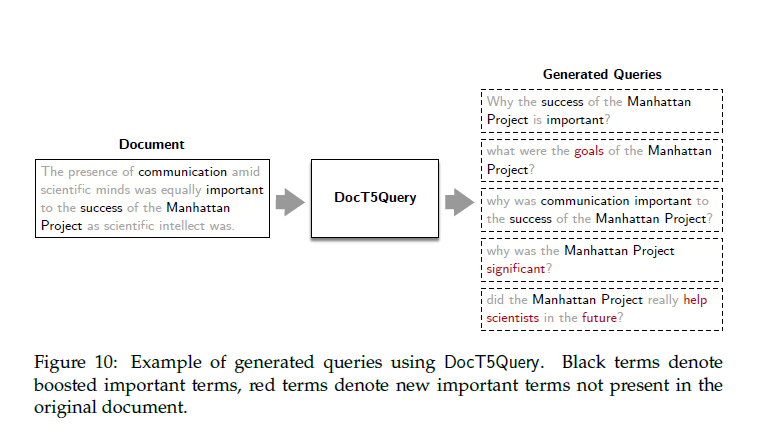

## 5.1.1 Abordagens Neurais para Expansão de Documentos: Superando o Desafio do Descompasso Vocabular

### Introdução
O problema do **descompasso vocabular** (*vocabulary mismatch problem*) em Information Retrieval (IR) surge quando as *queries* formuladas pelos usuários empregam termos semanticamente similares, mas lexicalmente distintos daqueles presentes nos documentos relevantes [^36]. Em outras palavras, a maneira como um usuário expressa sua necessidade de informação pode não corresponder diretamente à linguagem utilizada nos documentos que atendem a essa necessidade. As estratégias tradicionais para mitigar esse problema concentravam-se na **expansão da *query***, incorporando termos relacionados para aumentar a probabilidade de correspondência com os documentos relevantes. Exemplos notórios incluem a técnica de *relevance feedback* [^Gey1994] e *pseudo relevance feedback* [^Lavrenko and Croft 2001]. No entanto, o avanço das redes neurais e do Processamento de Linguagem Natural (NLP) abriu caminho para uma abordagem complementar: a **expansão do documento** (*document expansion*), que visa enriquecer o conteúdo dos documentos com novos termos aprendidos, tornando-os mais robustos e resilientes às variações vocabulares nas *queries*.

**Proposição 1.** *A expansão do documento é particularmente eficaz em cenários onde a linguagem utilizada nos documentos é mais técnica ou formal, enquanto as queries dos usuários tendem a ser mais coloquiais.*

*Prova.* Isso decorre do fato de que a expansão neural permite que o documento "aprenda" e incorpore termos mais comuns e informais que os usuários podem empregar, sem alterar a representação original do documento. Além disso, a expansão pode incluir sinônimos e variações de termos técnicos.

> 💡 **Exemplo Numérico:** Considere um documento técnico sobre "Otimização de Redes Neurais Convolucionais". Um usuário pode procurar por "melhorar CNN". A expansão do documento adicionaria termos como "aprimorar", "performance", "eficiência", e "redes convolucionais", aumentando a chance de correspondência.

### Superando o Descompasso Vocabular através da Expansão Neural de Documentos

A expansão neural de documentos se propõe a enriquecer o conteúdo dos documentos, adicionando novos termos aprendidos, tornando-os mais resilientes às variações vocabulares nas *queries* [^36]. Duas abordagens seminais que demonstraram o potencial das arquiteturas *transformer* para essa finalidade são o **Doc2Query** [^Nogueira et al. 2019b] e o **DocT5Query** [^Nogueira and Lin 2019]. Ambas as técnicas compartilham o objetivo comum de gerar novas *queries* para as quais um documento específico será relevante.

Em essência, Doc2Query e DocT5Query exploram a capacidade dos modelos *sequence-to-sequence* para sintetizar *queries* que capturam os aspectos essenciais do conteúdo de um documento. Através do treinamento em um *dataset* de pares *query*-documento relevantes, esses modelos aprendem a mapear um determinado documento para o espaço das *queries* relevantes. Uma vez *fine-tuned*, o modelo pode ser usado para predizer novas *queries* usando uma técnica de amostragem aleatória (*top k random sampling*) [^Fan et al. 2018a]. Essas *queries* preditas são, então, anexadas ao documento original antes da indexação, efetivamente expandindo seu vocabulário e aumentando suas chances de correspondência com *queries* futuras. A Figura 10 [^37] ilustra um exemplo desse processo.

> 💡 **Exemplo Numérico:** Um documento sobre "Doenças Cardiovasculares" poderia gerar queries como "problemas de coração", "saúde cardiovascular", "tratamento de doenças cardíacas" usando Doc2Query. Estas *queries* são então anexadas ao documento original, tornando-o mais fácil de encontrar quando um usuário pesquisa usando uma dessas variações.

Para complementar essas abordagens, podemos considerar estratégias de *data augmentation* no treinamento dos modelos Doc2Query e DocT5Query.

**Teorema 1.** O desempenho dos modelos Doc2Query e DocT5Query pode ser aprimorado através de técnicas de *data augmentation* que introduzem variações nas *queries* de treinamento, simulando o descompasso vocabular.

*Prova.* A prova repousa no princípio de que modelos treinados com um conjunto de dados mais diverso e representativo da variação linguística apresentarão melhor generalização. Técnicas como substituição de sinônimos, reformulação de frases e adição de ruído podem ser aplicadas às *queries* de treinamento para aumentar a robustez dos modelos em face do descompasso vocabular.

> 💡 **Exemplo Numérico:** Uma *query* de treinamento "Como baixar o TensorFlow" pode ser aumentada para "Instalar TensorFlow", "Guia de instalação TensorFlow", "TensorFlow download". O modelo aprende a associar estas diferentes *queries* ao mesmo documento, tornando-o mais robusto.

### TILDEv2 e SparTerm: Modelagem da Importância dos Termos no Documento

Uma abordagem alternativa, personificada pelo **TILDEv2** [^Zhuang and Zuccon 2021b], abandona a geração direta de *queries*. Em vez disso, o TILDEv2 se concentra em computar a importância de todos os termos no vocabulário com relação a um determinado documento, selecionando os termos mais importantes para enriquecer o documento. O TILDEv2 emprega o modelo BERT [^Devlin et al. 2019] para gerar um *embedding* do documento, representado pelo *token* especial [CLS]. Esse *embedding* é, então, linearmente projetado sobre todo o vocabulário BERT, produzindo uma distribuição de probabilidade sobre os termos. Os termos com as maiores probabilidades são adicionados ao documento.

**Lema 2.** *A eficácia do TILDEv2 depende criticamente da qualidade do embedding gerado pelo modelo BERT.*

*Prova.* Dado que a distribuição de probabilidade sobre os termos do vocabulário é diretamente derivada da projeção linear do *embedding* do documento, a capacidade do modelo em capturar as nuances semânticas do documento é fundamental. Um *embedding* de baixa qualidade ou que não represente adequadamente o conteúdo do documento resultará em uma distribuição de probabilidade imprecisa e, consequentemente, na seleção de termos irrelevantes para a expansão.

> 💡 **Exemplo Numérico:** Suponha que o BERT embedding do documento "Impacto da Inteligência Artificial na Medicina" seja o vetor $v = [0.1, 0.2, -0.1, 0.3, \ldots]$. A projeção linear deste vetor sobre o vocabulário resulta em scores para cada termo. Digamos que os termos "IA", "saúde", "diagnóstico", "tratamento" recebam os scores mais altos (e.g., 0.8, 0.7, 0.6, 0.5, respectivamente). Esses termos seriam então adicionados ao documento.

O **SparTerm** [^Bai et al. 2020] adota uma estratégia similar, modelando a importância dos termos no documento. No entanto, em vez de usar um único *embedding* [CLS], o SparTerm computa um modelo de linguagem para cada *token* de saída do BERT, incluindo o [CLS]. Esses modelos de linguagem individuais são somados para criar uma distribuição de importância de termos sobre o vocabulário para o documento. Finalmente, um mecanismo de *gating* aprendido seleciona um subconjunto esparso desses termos para compor o conteúdo do documento expandido.

**Teorema 2.1.** A utilização de múltiplos modelos de linguagem no SparTerm, em vez de um único *embedding* como no TILDEv2, permite uma representação mais rica e contextualizada da importância dos termos no documento.

*Prova.* Ao considerar o contexto de cada *token* individualmente, o SparTerm é capaz de capturar relações semânticas mais sutis e nuances contextuais que seriam perdidas em uma representação baseada em um único *embedding* global. A soma dos modelos de linguagem individuais permite ponderar a importância de cada termo com base em sua relevância em diferentes partes do documento, resultando em uma expansão mais precisa e relevante. Além disso, o mecanismo de *gating* esparso contribui para reduzir a inclusão de termos ruidosos ou irrelevantes, refinando ainda mais o processo de expansão.

> 💡 **Exemplo Numérico:** Considere a frase "Redes Neurais são usadas para Visão Computacional". SparTerm criaria embeddings para cada token ("Redes", "Neurais", "são", "usadas", "para", "Visão", "Computacional"). Cada embedding é então usado para prever uma distribuição de probabilidade sobre o vocabulário. Por exemplo, o embedding de "Visão" pode dar alta probabilidade para "reconhecimento", "imagem", "detecção". O mecanismo de gating esparso então seleciona os termos mais relevantes de todas as distribuições para adicionar ao documento.

<!-- END -->