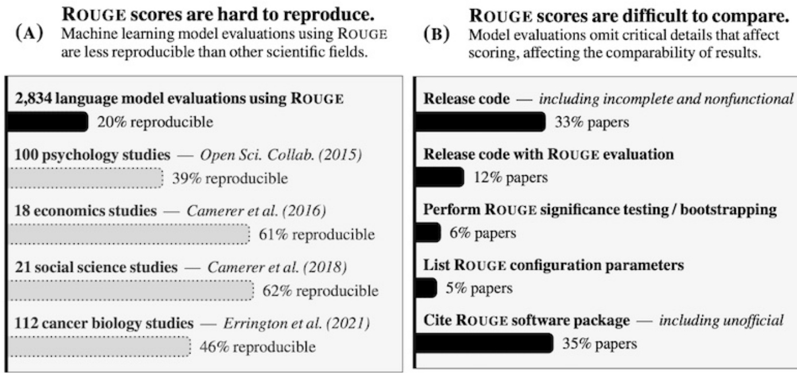

## Avaliações (Evals) na Quantificação do Desempenho em RAG

### Introdução

No contexto de sistemas de Neural Information Retrieval (NIR) e Retrieval-Augmented Generation (RAG) com Large Language Models (LLMs), a avaliação rigorosa do desempenho é fundamental para garantir a eficácia e a confiabilidade. As avaliações, ou *evals*, desempenham um papel crucial ao fornecer uma métrica quantitativa da capacidade do modelo em tarefas específicas. A necessidade de *evals* torna-se ainda mais evidente à medida que sistemas complexos evoluem, integrando componentes como LLMs, templates de prompts e parâmetros de inferência. Este capítulo detalha a importância das *evals*, seus benefícios e como elas permitem o rastreamento preciso e a detecção de regressões ao longo do tempo [^1].

Para complementar esta introdução, podemos observar que diferentes tipos de *evals* se concentram em diferentes aspectos do sistema RAG. Por exemplo, algumas *evals* podem focar na relevância dos documentos recuperados, enquanto outras podem se concentrar na qualidade da resposta gerada pelo LLM. A escolha da *eval* apropriada depende dos objetivos específicos da avaliação.

### Conceitos Fundamentais

**Importância da Quantificação do Desempenho:**

A quantificação do desempenho é essencial para entender como os LLMs se comportam em diversas tarefas dentro dos sistemas RAG. As *evals* fornecem uma base objetiva para a comparação de diferentes modelos, arquiteturas ou configurações [^1].

> 💡 **Exemplo Numérico:**
>
> Considere dois sistemas RAG, $S_1$ e $S_2$. Após *evals* em um conjunto de 100 perguntas, obtivemos as seguintes taxas de acerto (proporção de respostas corretas):
>
> *   $S_1$: 75 respostas corretas (75%)
> *   $S_2$: 85 respostas corretas (85%)
>
> Usando a métrica de taxa de acerto, podemos quantificar que $S_2$ supera $S_1$ em 10 pontos percentuais. Este número fornece uma base objetiva para comparar o desempenho dos dois sistemas.
>
> Podemos também aplicar um teste estatístico, como um teste t, para verificar se a diferença de 10% é estatisticamente significativa, ou se poderia ser devido ao acaso.

**Teorema 1** (Comparabilidade via Métricas): Dados dois sistemas RAG, $S_1$ e $S_2$, e um conjunto de *evals* $E = \{e_1, e_2, \ldots, e_n\}$ com métricas associadas $M = \{m_1, m_2, \ldots, m_n\}$, onde $m_i$ quantifica o desempenho em relação a $e_i$, então $S_1$ pode ser objetivamente comparado a $S_2$ se e somente se $M$ é bem definido e consistente.

*Prova (esboço):* A comparabilidade requer uma base comum de avaliação. As *evals* definem os aspectos a serem comparados, e as métricas fornecem a quantificação. Se as métricas são ambíguas ou inconsistentes, a comparação perde seu significado objetivo. A consistência implica que a mesma métrica aplicada em diferentes momentos ou em diferentes sistemas deve produzir resultados comparáveis, considerando as variações inerentes ao processo.

**Identificação de Regressões:**

Sistemas RAG estão em constante evolução. Mudanças nos LLMs subjacentes, nos templates de prompts ou nos parâmetros de inferência podem inadvertidamente introduzir regressões no desempenho. As *evals* permitem a identificação dessas regressões de forma rápida e eficiente, permitindo correções proativas [^1].

> 💡 **Exemplo Numérico:**
>
> Um sistema RAG tem um desempenho inicial de 80% de precisão. Após uma atualização do LLM subjacente, as *evals* revelam que a precisão caiu para 70%.
>
> Aqui, $\delta = 10\%$.  A regressão é evidente e indica a necessidade de investigar e corrigir a atualização. A equipe pode então analisar os dados das *evals* para identificar os tipos de perguntas onde a regressão ocorreu e ajustar o sistema de acordo.

**Proposição 1** (Detecção de Regressão): Seja $P_t$ o desempenho do sistema RAG no tempo $t$ avaliado por um conjunto de *evals* $E$. Uma regressão no desempenho é detectada se existe um $\delta > 0$ e um tempo $t' > t$ tal que $P_{t'} < P_t - \delta$, onde $P_t$ e $P_{t'}$ são vetores de métricas de desempenho.

*Prova (esboço):* Essa proposição formaliza a noção intuitiva de regressão. Ela estabelece que uma diminuição significativa no desempenho, maior que um limiar $\delta$, em relação a um ponto de referência anterior, indica uma regressão. A avaliação vetorial permite capturar regressões em múltiplos aspectos do sistema RAG.

**Mensuração Escalável de Mudanças no Sistema:**

A inspeção manual das saídas dos LLMs pode ser impraticável e demorada, especialmente em sistemas complexos. *Evals*, usando conjuntos representativos de dados, oferecem uma alternativa escalável, permitindo a avaliação rápida e automatizada do impacto das mudanças no sistema [^1].

> 💡 **Exemplo Numérico:**
>
> Um sistema RAG é avaliado usando 1000 perguntas. A avaliação manual levaria semanas, enquanto as *evals* automatizadas podem fornecer resultados em poucas horas. Se a taxa de custo para avaliação manual é de R\$50/hora e uma pessoa leva 1 hora por pergunta, enquanto uma *eval* automatizada custa R\$100 e leva 2 horas, o custo para avaliação manual seria de R\$50.000, enquanto o custo para *eval* automatizada seria de R\$100.
>
> Este exemplo ilustra a escalabilidade e a economia de tempo proporcionadas pelas *evals*.

**Avaliação Quantitativa e Qualitativa:**

As *evals* não se limitam apenas a métricas quantitativas. Elas também podem fornecer *insights* qualitativos sobre o comportamento do modelo, identificando padrões de erro ou áreas onde o modelo tem dificuldade. Esta combinação de avaliação quantitativa e qualitativa é essencial para um entendimento completo do desempenho do sistema [^1].

Para ilustrar a importância da avaliação qualitativa, considere um cenário onde a métrica quantitativa de precisão permanece constante após uma atualização do sistema RAG. Uma análise qualitativa pode revelar que, embora a precisão geral não tenha mudado, o sistema agora comete erros em categorias específicas de perguntas que antes respondia corretamente. Isso destacaria uma regressão sutil que não seria detectada apenas por métricas quantitativas.

> 💡 **Exemplo Numérico:**
>
> Suponha que um sistema RAG tenha uma precisão de 85% antes e depois de uma atualização. Uma análise qualitativa revela que antes da atualização, os erros eram distribuídos aleatoriamente entre diferentes tópicos. Após a atualização, todos os erros estão concentrados em perguntas sobre "história da arte". Embora a precisão geral seja a mesma, a análise qualitativa revela um problema específico que precisa ser abordado.

**Rastreamento e Detecção de Regressões ao Longo do Tempo:**

A capacidade de rastrear o desempenho ao longo do tempo é crucial para garantir a estabilidade do sistema. *Evals* regulares permitem a detecção precoce de regressões, permitindo que as equipes de desenvolvimento tomem medidas corretivas antes que problemas impactem os usuários [^1].

> 💡 **Exemplo Numérico:**
>
> Um sistema RAG é avaliado mensalmente usando um conjunto de *evals*. Os resultados são registrados em um *dashboard* de desempenho. Após 6 meses, o *dashboard* revela uma tendência de queda na precisão nas últimas duas avaliações. Isso alerta a equipe para investigar possíveis causas, como mudanças nos dados de treinamento ou nos parâmetros do LLM.
>
> Uma tabela pode representar essa evolução:
>
> | Mês   | Precisão | Recall |
> | :----- | :------- | :----- |
> | Jan    | 85%      | 70%    |
> | Fev    | 86%      | 72%    |
> | Mar    | 84%      | 71%    |
> | Abr    | 85%      | 70%    |
> | Maio   | 82%      | 68%    |
> | Jun    | 79%      | 65%    |
>
> A tabela mostra uma queda notável na precisão e no recall nos meses de Maio e Junho, indicando uma possível regressão.

**Benefícios das Evals:**

*   **Objetividade:** As *evals* fornecem uma medida objetiva do desempenho, livre de viéses subjetivos.
*   **Reprodutibilidade:** Os resultados das *evals* são reproduzíveis, permitindo a comparação consistente do desempenho ao longo do tempo.

*   **Escalabilidade:** As *evals* podem ser automatizadas e aplicadas a grandes conjuntos de dados, tornando-as escaláveis para sistemas complexos.
*   **Detecção Precoce de Problemas:** As *evals* permitem a identificação precoce de regressões, permitindo correções proativas.
*   **Melhoria Contínua:** Os resultados das *evals* podem ser usados para identificar áreas de melhoria, impulsionando o desenvolvimento contínuo do sistema.

Adicionalmente aos benefícios listados, as *evals* também facilitam a comunicação entre diferentes equipes (por exemplo, pesquisa, engenharia e produto) ao fornecer uma linguagem comum para discutir o desempenho do sistema. Elas também permitem a criação de *dashboards* de desempenho que podem ser monitorados por todas as partes interessadas.

> 💡 **Exemplo Numérico:**
>
> Uma equipe de desenvolvimento usa *evals* para comparar duas abordagens diferentes para a recuperação de documentos em um sistema RAG. A abordagem A tem uma precisão de 70% e um recall de 60%, enquanto a abordagem B tem uma precisão de 80% e um recall de 75%. Com base nesses resultados, a equipe decide implementar a abordagem B, pois ela oferece um melhor equilíbrio entre precisão e recall.
>
> | Abordagem | Precisão | Recall |
> | :-------- | :------- | :----- |
> | A         | 70%      | 60%    |
> | B         | 80%      | 75%    |
<!-- END -->