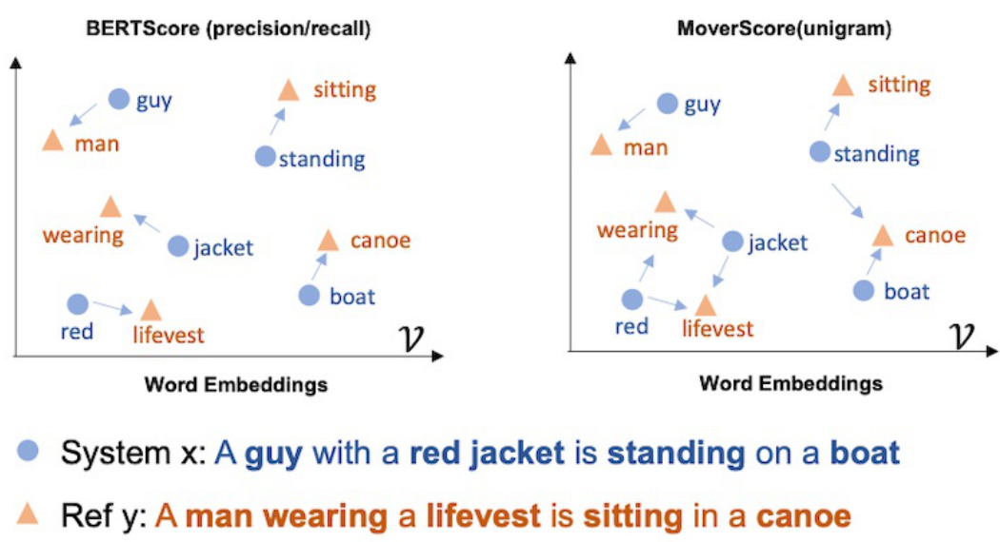

## BERTScore: Avaliação Semântica Profunda em RAG

### Introdução

A avaliação da performance de sistemas de Retrieval-Augmented Generation (RAG) e modelos de linguagem grandes (LLMs) é crucial para garantir a qualidade e relevância das respostas geradas. Métricas tradicionais como precisão e recall podem não capturar nuances semânticas e variações de linguagem. Nesse contexto, o BERTScore emerge como uma alternativa poderosa, oferecendo uma avaliação baseada em embeddings que leva em consideração a similaridade semântica entre o texto gerado e o texto de referência. Este capítulo explorará em detalhes o BERTScore, suas componentes, aplicações e vantagens na avaliação de sistemas RAG.

### Conceitos Fundamentais

O BERTScore é uma métrica de avaliação baseada em embeddings que utiliza a similaridade do cosseno para comparar tokens ou n-grams no output gerado com a sentença de referência [^5]. Diferentemente de métricas baseadas em sobreposição de tokens, como BLEU ou ROUGE, o BERTScore captura similaridades semânticas e parafraseamento, tornando-o particularmente útil em tarefas onde o significado é mais importante do que a correspondência literal.

**Arquitetura e Funcionamento:**

1.  **Embeddings Contextualizados:** O BERTScore utiliza modelos de linguagem pré-treinados, como BERT, para gerar embeddings contextualizados para cada token nas sentenças gerada e de referência. Isso significa que o embedding de um token é influenciado pelo contexto em que ele aparece, capturando melhor o seu significado.

2.  **Similaridade do Cosseno:** Para cada token na sentença gerada, o BERTScore encontra o token mais similar na sentença de referência, com base na similaridade do cosseno entre seus embeddings. A similaridade do cosseno é definida como:

    $$
    \text{cosine\_similarity}(u, v) = \frac{u \cdot v}{\|u\| \|v\|}
    $$

    onde $u$ e $v$ são os vetores de embedding dos tokens.

    > 💡 **Exemplo Numérico:**
    >
    > Suponha que o embedding do token "capital" na sentença gerada seja $u = [0.2, 0.3, 0.5]$ e o embedding do token "capital" na sentença de referência seja $v = [0.1, 0.4, 0.6]$.  Então a similaridade do cosseno é:
    >
    > $\text{cosine\_similarity}(u, v) = \frac{(0.2 \cdot 0.1) + (0.3 \cdot 0.4) + (0.5 \cdot 0.6)}{\sqrt{0.2^2 + 0.3^2 + 0.5^2} \cdot \sqrt{0.1^2 + 0.4^2 + 0.6^2}} = \frac{0.02 + 0.12 + 0.3}{\sqrt{0.38} \cdot \sqrt{0.53}} = \frac{0.44}{\sqrt{0.2014}} \approx \frac{0.44}{0.448} \approx 0.982$
    >
    > Uma similaridade de cosseno próxima de 1 indica que os tokens são semanticamente muito similares.

3.  **Recall, Precisão e F1-Score:** O BERTScore calcula métricas de recall, precisão e F1-score baseadas nas similaridades encontradas.

    *   *Precisão (P)*: Mede a proporção de tokens na sentença gerada que têm um correspondente semanticamente similar na sentença de referência. Formalmente,

        $$
        P = \frac{1}{|y|} \sum_{y_i \in y} \max_{x_j \in x} \text{cosine\_similarity}(y_i, x_j)
        $$

        onde $x$ é a sentença de referência e $y$ é a sentença gerada.

        > 💡 **Exemplo Numérico:**
        >
        > Seja a sentença de referência $x$ = "The cat sat" e a sentença gerada $y$ = "A feline sat". Suponha as seguintes similaridades de cosseno máximas entre os tokens de $y$ e $x$:
        >
        > *   "A" (y) com "The" (x): 0.6
        > *   "feline" (y) com "cat" (x): 0.8
        > *   "sat" (y) com "sat" (x): 1.0
        >
        > Então, a precisão é: $P = \frac{0.6 + 0.8 + 1.0}{3} = \frac{2.4}{3} = 0.8$
        >
        > Isso significa que, em média, os tokens na sentença gerada são 80% similares aos tokens na sentença de referência.

    *   *Recall (R)*: Mede a proporção de tokens na sentença de referência que têm um correspondente semanticamente similar na sentença gerada. Formalmente,

        $$
        R = \frac{1}{|x|} \sum_{x_i \in x} \max_{y_j \in y} \text{cosine\_similarity}(x_i, y_j)
        $$

        onde $x$ é a sentença de referência e $y$ é a sentença gerada.

        > 💡 **Exemplo Numérico:**
        >
        > Usando o mesmo exemplo, $x$ = "The cat sat" e $y$ = "A feline sat", suponha as seguintes similaridades de cosseno máximas entre os tokens de $x$ e $y$:
        >
        > *   "The" (x) com "A" (y): 0.6
        > *   "cat" (x) com "feline" (y): 0.8
        > *   "sat" (x) com "sat" (y): 1.0
        >
        > Então, o recall é: $R = \frac{0.6 + 0.8 + 1.0}{3} = \frac{2.4}{3} = 0.8$
        >
        > Isso significa que, em média, os tokens na sentença de referência são 80% similares aos tokens na sentença gerada.

    *   *F1-Score (F1)*: É a média harmônica entre precisão e recall, oferecendo um balanço entre as duas métricas. Formalmente,

        $$
        F_1 = 2 \cdot \frac{P \cdot R}{P + R}
        $$

        > 💡 **Exemplo Numérico:**
        >
        > Usando os valores de precisão e recall calculados anteriormente (P = 0.8 e R = 0.8), o F1-score é:
        >
        > $F_1 = 2 \cdot \frac{0.8 \cdot 0.8}{0.8 + 0.8} = 2 \cdot \frac{0.64}{1.6} = 2 \cdot 0.4 = 0.8$
        >
        > Neste caso, como a precisão e o recall são iguais, o F1-score também é 0.8.

    **Teorema 1:** *O F1-Score é sempre menor ou igual ao máximo entre a Precisão e o Recall, e maior ou igual ao mínimo entre a Precisão e o Recall.*

    *Prova:* Seja $P$ a precisão e $R$ o recall. Queremos mostrar que $\min(P, R) \leq F_1 \leq \max(P, R)$. Sem perda de generalidade, assuma $P \leq R$. Então, $\min(P, R) = P$ e $\max(P, R) = R$.

    $F_1 = \frac{2PR}{P + R}$.  Como $P \leq R$, $P + R \leq 2R$. Portanto, $F_1 = \frac{2PR}{P + R} \geq \frac{2PR}{2R} = P$.

    Similarmente, como $P \leq R$, $P + R \geq 2P$. Portanto, $F_1 = \frac{2PR}{P + R} \leq \frac{2PR}{2P} = R$.

    Assim, $P \leq F_1 \leq R$, o que implica $\min(P, R) \leq F_1 \leq \max(P, R)$.

**Vantagens do BERTScore:**

*   **Captura de Semântica:** Ao utilizar embeddings contextualizados, o BERTScore captura similaridades semânticas que métricas baseadas em sobreposição de tokens ignoram.

*   **Robustez ao Parafraseamento:** O BERTScore é menos sensível a variações na escolha de palavras e estrutura das frases, desde que o significado seja preservado.

*   **Aplicabilidade:** É útil em tarefas como image captioning e machine translation, onde a semântica é fundamental [^5].

**Limitações do BERTScore:**

*   **Dependência de Modelos Pré-Treinados:** O desempenho do BERTScore depende da qualidade do modelo de linguagem pré-treinado utilizado. Modelos inadequados para o domínio específico podem levar a avaliações imprecisas.

*   **Custo Computacional:** A geração de embeddings contextualizados pode ser computacionalmente intensiva, especialmente para textos longos.

Além dessas limitações, é importante notar que o BERTScore, assim como outras métricas de avaliação automática, pode não capturar completamente a qualidade subjetiva de um texto. Fatores como fluência, coerência e relevância contextual podem ser subestimados ou negligenciados. Portanto, é recomendável combinar o BERTScore com outras formas de avaliação, incluindo a avaliação humana, para obter uma visão mais completa e precisa da performance do sistema.

### Aplicações em Sistemas RAG

Em sistemas RAG, o BERTScore pode ser utilizado para avaliar tanto a qualidade do retrieval quanto a qualidade da geração.

*   **Avaliação do Retrieval:** Comparar o conteúdo recuperado com a consulta original para avaliar a relevância do retrieval.

*   **Avaliação da Geração:** Comparar a resposta gerada com o texto de referência ou com o contexto recuperado para avaliar a qualidade da geração. Isso pode ser especialmente útil para garantir que a resposta gerada seja coerente com o contexto e semanticamente precisa.

    > 💡 **Exemplo Numérico:**
    >
    > Considere um sistema RAG que recebe a consulta: "Quais são os benefícios do exercício físico?" e recupera os seguintes documentos:
    >
    > *   Documento 1: "O exercício físico regular melhora a saúde cardiovascular e reduz o risco de doenças cardíacas."
    > *   Documento 2: "A prática de atividades físicas contribui para o controle do peso e o fortalecimento muscular."
    >
    > O sistema gera a seguinte resposta: "Exercícios físicos fazem bem para o coração e ajudam a controlar o peso."
    >
    > Para avaliar a geração, o BERTScore pode comparar a resposta gerada com os documentos recuperados. Podemos calcular o BERTScore entre a resposta e cada documento separadamente e, em seguida, combinar os resultados (por exemplo, calculando a média). Um BERTScore alto indicaria que a resposta é semanticamente similar aos documentos recuperados, o que sugere uma boa qualidade da geração.
    >
    > Suponha que o BERTScore entre a resposta e o Documento 1 seja 0.85 e entre a resposta e o Documento 2 seja 0.90. A média dos BERTScore seria (0.85 + 0.90) / 2 = 0.875.
    >
    > Isso sugere que a resposta gerada pelo sistema RAG é altamente relevante e coerente com o contexto fornecido pelos documentos recuperados.

Para refinar ainda mais a avaliação da geração, podemos ponderar o BERTScore com base na importância dos diferentes trechos do contexto recuperado. Por exemplo, se um trecho específico do contexto é mais relevante para a resposta, podemos atribuir um peso maior ao BERTScore calculado em relação a esse trecho. Isso permite uma avaliação mais granular e sensível ao contexto, melhorando a precisão da métrica.

### Exemplo Prático

Considere um sistema RAG que recebe a consulta "Qual é a capital da França?" e recupera o seguinte contexto: "Paris é a capital e a cidade mais populosa da França." O sistema gera a resposta: "A capital da França é Paris."

Nesse caso, o BERTScore compararia a resposta gerada com o contexto recuperado ou com uma sentença de referência ("Paris é a capital da França."). A alta similaridade semântica entre a resposta e a referência resultaria em um alto BERTScore, indicando uma boa performance do sistema RAG.

Além disso, podemos utilizar o BERTScore para avaliar a diversidade das respostas geradas por um sistema RAG. Ao comparar as respostas geradas para consultas semelhantes, podemos verificar se o sistema está explorando diferentes aspectos do conhecimento ou se está repetindo as mesmas informações. Uma alta diversidade nas respostas pode indicar uma melhor capacidade do sistema de lidar com diferentes nuances e perspectivas.

> 💡 **Exemplo Numérico:**
>
> Suponha que para a consulta "Quais são os tipos de energia renovável?" um sistema RAG gere duas respostas diferentes em duas execuções:
>
> *   Resposta 1: "Energia solar e energia eólica são tipos de energia renovável."
> *   Resposta 2: "Fontes renováveis incluem a energia hidrelétrica e a energia geotérmica."
>
> Para medir a diversidade, podemos calcular o BERTScore entre as duas respostas. Um BERTScore baixo indicaria que as respostas são semanticamente diferentes e, portanto, o sistema está gerando respostas diversas. Por outro lado, um BERTScore alto indicaria que as respostas são semelhantes, o que pode ser um sinal de falta de diversidade.
>
> Se o BERTScore entre as Respostas 1 e 2 for 0.6, isso sugere uma diversidade razoável, pois as respostas abordam diferentes tipos de energia renovável. Se o BERTScore fosse 0.9, indicaria que as duas respostas são muito parecidas, e o sistema pode não estar explorando diferentes aspectos da consulta.

### Conclusão

O BERTScore oferece uma abordagem avançada e sensível à semântica para avaliar a performance de sistemas RAG e LLMs. Sua capacidade de capturar similaridades semânticas e robustez ao parafraseamento o tornam uma ferramenta valiosa em tarefas onde o significado é crucial. Apesar de suas limitações, o BERTScore representa um avanço significativo em relação às métricas tradicionais de avaliação, permitindo uma avaliação mais precisa e abrangente da qualidade dos sistemas de geração de texto.

### Referências

[^5]: BERTScore is an embedding-based evaluation metric that uses cosine similarity to compare tokens or n-grams in the generated output with the reference sentence. It captures semantic similarities and paraphrasing by incorporating recall, precision, and F1-score components. BERTScore is useful in tasks such as image captioning and machine translation, where semantics are crucial.
<!-- END -->