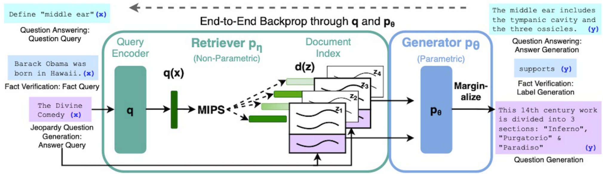
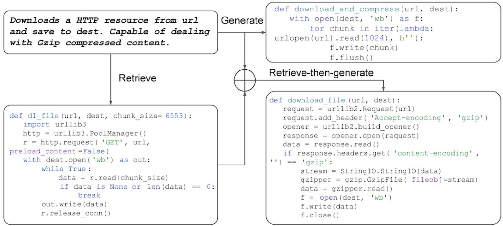
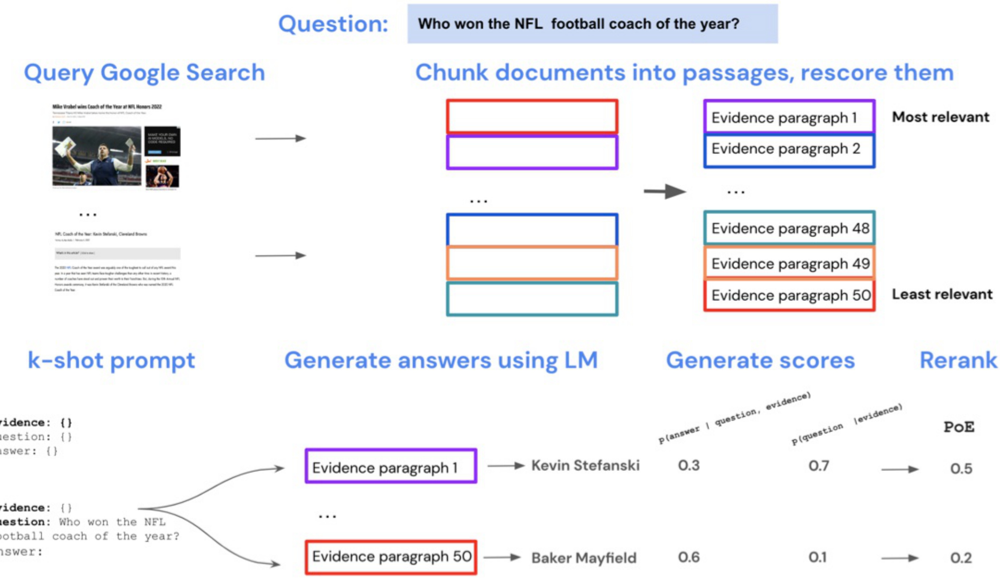

## Arquiteturas de Retrieval-Augmented Generation (RAG)

### Introdução

Este capítulo aprofunda-se nas arquiteturas de Retrieval-Augmented Generation (RAG), que representam uma classe de modelos *semi-paramétricos* que combinam a recuperação de vetores densos (o componente não-paramétrico) com um LLM pré-treinado (o componente paramétrico) [^1]. O objetivo é entender como essas arquiteturas integram o poder da recuperação de informação com a capacidade de geração de texto dos LLMs, explorando as sinergias e os desafios envolvidos.

### Conceitos Fundamentais

**Definição e Componentes:**

As arquiteturas RAG, em sua essência, buscam aprimorar a capacidade dos LLMs de gerar respostas informativas e contextualmente relevantes, fornecendo a eles um conhecimento externo recuperado dinamicamente. Esta abordagem se distingue dos LLMs puros, que dependem unicamente do conhecimento internalizado durante o treinamento. O paradigma RAG é composto por dois componentes principais [^1]:

1.  **Retriever:** Responsável por identificar e recuperar os documentos mais relevantes de um índice de conhecimento, dada uma consulta. Este componente frequentemente emprega técnicas de *dense vector retrieval*, utilizando representações vetoriais para capturar a semântica da consulta e dos documentos.
2.  **Generator:** Um LLM pré-treinado que recebe a consulta original juntamente com os documentos recuperados e gera uma resposta coerente e informativa.

> 💡 **Exemplo Numérico:** Suponha que temos uma consulta "O que é RAG?" e um índice com três documentos:
>
> *   Documento 1: "RAG é uma arquitetura que combina recuperação e geração."
> *   Documento 2: "LLMs são modelos de linguagem grandes."
> *   Documento 3: "DPR é usado para recuperação densa."
>
> O retriever codifica a consulta e os documentos em vetores. Digamos que as representações vetoriais resultantes sejam:
>
> *   Consulta: `[0.1, 0.8, 0.1]`
> *   Documento 1: `[0.2, 0.7, 0.1]`
> *   Documento 2: `[0.1, 0.2, 0.7]`
> *   Documento 3: `[0.6, 0.1, 0.3]`
>
> Usando a similaridade de cosseno:
>
> $\text{Cosine Similarity}(A, B) = \frac{A \cdot B}{||A|| \cdot ||B||}$
>
> $\text{Cosine Similarity(Consulta, Documento 1)} \approx 0.98$
> $\text{Cosine Similarity(Consulta, Documento 2)} \approx 0.32$
> $\text{Cosine Similarity(Consulta, Documento 3)} \approx 0.45$
>
> O retriever retornaria o Documento 1 como o mais relevante.  Isso ilustra como a similaridade de cosseno, aplicada aos vetores densos, é usada para determinar a relevância.

**Reutilização de Encoders DPR:**

Um aspecto notável das arquiteturas RAG é a reutilização de *encoders DPR* (Dense Passage Retrieval) para inicializar o retriever e construir o índice de documentos [^1]. O DPR é um modelo treinado para recuperar passagens relevantes de um conjunto de documentos, dada uma consulta. Ao aproveitar os encoders DPR, as arquiteturas RAG podem beneficiar-se de representações vetoriais de alta qualidade, previamente treinadas para a tarefa de recuperação.

**Modelo BART para Geração de Texto:**

O *BART* (Bidirectional and Auto-Regressive Transformer) é frequentemente empregado como o modelo de geração de texto nas arquiteturas RAG [^1]. BART é um modelo transformer *sequence-to-sequence* que é pré-treinado para reconstruir documentos corrompidos. Sua capacidade de gerar texto coerente e fluente o torna uma escolha natural para a tarefa de geração em RAG.

**Lema 1:** *A escolha do modelo de geração (e.g., BART) impacta diretamente a qualidade e estilo do texto gerado. Modelos com diferentes arquiteturas e dados de treinamento produzirão diferentes características na saída.*

*Prova:* Esta afirmação decorre diretamente da natureza dos LLMs. A arquitetura (e.g., transformer, RNN), a função de perda utilizada durante o treinamento, e os dados utilizados para o treinamento afetam diretamente a capacidade do modelo em modelar a distribuição da linguagem natural. Portanto, ao variar esses fatores, varia-se a qualidade e o estilo do texto gerado. $\blacksquare$

**Fluxo de Trabalho Detalhado:**

Para ilustrar o funcionamento de uma arquitetura RAG, considere o seguinte fluxo de trabalho:

1.  **Consulta do Usuário:** O processo inicia-se com uma consulta formulada pelo usuário.
2.  **Codificação da Consulta:** A consulta é codificada em um vetor denso utilizando o encoder do retriever (tipicamente um encoder DPR).
3.  **Recuperação de Documentos:** O vetor da consulta é utilizado para buscar os *k* documentos mais relevantes no índice de documentos, utilizando uma métrica de similaridade (por exemplo, *produto escalar* ou *similaridade de cosseno*).
4.  **Concatenação:** A consulta original e os documentos recuperados são concatenados em uma única sequência.
5.  **Geração de Resposta:** A sequência concatenada é alimentada ao LLM (por exemplo, BART), que gera a resposta final.

> 💡 **Exemplo Numérico:**  Continuando com o exemplo anterior, com a consulta "O que é RAG?" e o Documento 1 recuperado ("RAG é uma arquitetura que combina recuperação e geração."), a sequência concatenada poderia ser: `"O que é RAG? RAG é uma arquitetura que combina recuperação e geração."`.  Esta sequência é então alimentada ao modelo BART para gerar uma resposta mais completa, como por exemplo: "RAG é uma arquitetura que combina recuperação de informação e geração de texto, permitindo que modelos acessem conhecimento externo."

**Teorema 1:** *O desempenho de uma arquitetura RAG é limitado pela precisão do retriever e pela capacidade do generator de integrar o conhecimento recuperado.*

*Prova (Esboço):* Seja *$P(\text{resposta} \mid \text{consulta}, \text{documentos recuperados})$ a probabilidade da resposta dada a consulta e os documentos recuperados. Se o retriever falha em recuperar documentos relevantes, então $P(\text{documentos recuperados} = \text{relevantes} \mid \text{consulta})$ é baixo, limitando a capacidade do generator de produzir uma resposta correta. Além disso, mesmo com documentos relevantes, o generator pode falhar em integrar a informação de maneira coerente, o que reduz $P(\text{resposta} = \text{correta} \mid \text{consulta}, \text{documentos recuperados} = \text{relevantes})$. Portanto, ambos os componentes são cruciais para o desempenho geral. $\blacksquare$

**Teorema 1.1:** *Aumentar o número de documentos recuperados (k) não necessariamente melhora o desempenho do RAG, e pode até mesmo degradá-lo se a precisão do retriever for baixa.*

*Prova (Esboço):* Aumentar *$k$* aumenta a probabilidade de incluir documentos relevantes, mas também aumenta a probabilidade de incluir documentos irrelevantes. Se a precisão do retriever (i.e., a proporção de documentos relevantes entre os *$k$* recuperados) for baixa, adicionar mais documentos diminui a razão sinal-ruído na entrada do generator, tornando a tarefa de geração mais difícil. $\blacksquare$

> 💡 **Exemplo Numérico:** Suponha que para a consulta "O que é RAG?" e *$k=3$*, o retriever retorna:
>
> *   Documento 1: "RAG é uma arquitetura..." (Relevante)
> *   Documento 2: "LLMs são..." (Irrelevante)
> *   Documento 3: "DPR é usado..." (Parcialmente relevante)
>
> Se aumentarmos para *$k=5$* e os documentos adicionais forem completamente irrelevantes, a qualidade da resposta gerada pode diminuir, pois o generator tem que lidar com mais ruído.  O Teorema 1.1 enfatiza a importância de um retriever preciso para evitar sobrecarregar o generator com informação irrelevante.

**Vantagens e Desafios:**

As arquiteturas RAG oferecem diversas vantagens em relação aos LLMs puros:

*   **Acesso a Conhecimento Externo:** RAG permite que os LLMs acessem e incorporem informações de fontes externas, superando as limitações do conhecimento internalizado durante o treinamento.
*   **Atualização Facilitada:** A atualização do conhecimento em RAG é mais simples do que o *fine-tuning* de um LLM. Basta atualizar o índice de documentos com as novas informações.
*   **Interpretabilidade:** A capacidade de rastrear a origem da informação utilizada para gerar a resposta aumenta a interpretabilidade do modelo.

No entanto, as arquiteturas RAG também apresentam desafios:

*   **Qualidade da Recuperação:** A qualidade da resposta gerada depende criticamente da qualidade dos documentos recuperados. Documentos irrelevantes ou ruidosos podem degradar o desempenho do modelo.
*   **Eficiência:** A etapa de recuperação pode ser computacionalmente custosa, especialmente para índices de documentos grandes.
*   **Integração:** Integrar perfeitamente a informação recuperada com o conhecimento internalizado do LLM pode ser complexo.

**Proposição 1:** *A escolha da métrica de similaridade no retriever (e.g., produto escalar, similaridade de cosseno) afeta a relevância dos documentos recuperados.*

*Justificativa:* Diferentes métricas de similaridade capturam diferentes noções de similaridade semântica. O produto escalar favorece documentos com vetores de norma alta, enquanto a similaridade de cosseno normaliza os vetores, focando na similaridade angular. A escolha da métrica deve ser alinhada com a forma como os vetores são incorporados e com a noção de relevância desejada.

> 💡 **Exemplo Numérico:** Considere dois documentos e uma consulta com os seguintes vetores:
>
> *   Consulta: `A = [2, 2]`
> *   Documento 1: `B = [3, 3]`
> *   Documento 2: `C = [5, 0]`
>
> Calculando o produto escalar e a similaridade de cosseno:
>
> *   Produto Escalar(A, B) = (2 * 3) + (2 * 3) = 12
> *   Produto Escalar(A, C) = (2 * 5) + (2 * 0) = 10
> *   Cosseno(A, B) = $\frac{12}{\sqrt{8} \cdot \sqrt{18}} \approx 1$
> *   Cosseno(A, C) = $\frac{10}{\sqrt{8} \cdot \sqrt{25}} \approx 0.89$
>
> Neste caso, o produto escalar favoreceria o Documento 1, enquanto a similaridade de cosseno também favorece o Documento 1 (perfeitamente alinhado). Se Documento 2 fosse na verdade mais relevante semanticamente, a escolha do produto escalar poderia ser inadequada. Isso ilustra como a escolha da métrica afeta quais documentos são considerados mais similares.

### Conclusão

As arquiteturas RAG representam uma abordagem promissora para aprimorar os LLMs com conhecimento externo. A combinação da recuperação de vetores densos com a capacidade de geração de texto dos LLMs abre novas possibilidades para a criação de sistemas de inteligência artificial mais informativos, atualizados e interpretáveis. O uso de encoders DPR e modelos como BART é um padrão comum nessas arquiteturas [^1], mas a pesquisa continua a explorar novas técnicas e modelos para otimizar o desempenho e superar os desafios inerentes ao paradigma RAG.

### Referências

[^1]: 06. Retrieval-Augmented Generation (RAG) architectures are semi-parametric models that combine dense vector retrieval (non-parametric component) with a pre-trained LLM (parametric component). They often reuse DPR encoders to initialize the retriever and build the document index, using models like BART for text generation.
<!-- END -->