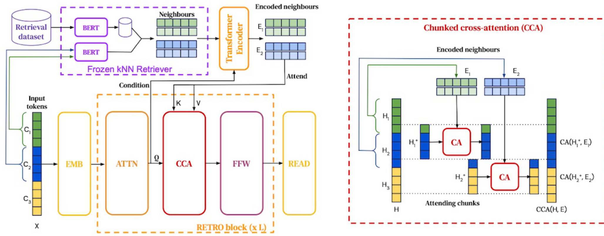

## Retrieval-Enhanced Transformer (RETRO): Integração de Recuperação e Geração

### Introdução
O Retrieval-Enhanced Transformer (RETRO) representa uma abordagem inovadora na arquitetura de modelos de linguagem, combinando a capacidade de **recuperação de informações** com a **geração de texto**. Diferentemente dos modelos tradicionais que dependem exclusivamente do conhecimento paramétrico armazenado em seus pesos, o RETRO aproveita um mecanismo de *retrieval* para buscar informações relevantes em um banco de dados externo durante a geração. Este capítulo explorará em detalhes a arquitetura, o processo de *retrieval* e a aplicação do RETRO, com foco nas suas vantagens e peculiaridades.

### Conceitos Fundamentais
O RETRO [^8] é composto por três componentes principais:

1.  **Frozen BERT Retriever:** Um modelo BERT pré-treinado e congelado, responsável por realizar a busca de documentos relevantes no banco de dados externo. O termo “frozen” indica que os pesos deste modelo não são atualizados durante o treinamento do RETRO.
2.  **Differentiable Encoder:** Um encoder diferenciável que codifica a entrada e os documentos recuperados. A diferenciabilidade deste componente é crucial para o treinamento end-to-end do modelo.
3.  **Chunked Cross-Attention:** Um mecanismo de atenção que permite ao modelo combinar a informação da entrada com a informação dos documentos recuperados. Este mecanismo é aplicado em *chunks* (pedaços) da sequência, permitindo um processamento mais eficiente.

O processo de funcionamento do RETRO pode ser resumido nos seguintes passos:

1.  **Chunking:** A sequência de entrada é dividida em *chunks*.
2.  **Retrieval:** Para cada *chunk*, o Frozen BERT Retriever busca documentos relevantes no banco de dados externo. A busca é baseada na similaridade entre o *chunk* atual e os documentos no banco de dados.
3.  **Encoding:** A entrada e os documentos recuperados são codificados pelo Differentiable Encoder.
4.  **Chunked Cross-Attention:** O Chunked Cross-Attention combina a informação da entrada codificada com a informação dos documentos recuperados codificados, gerando uma representação contextualizada da entrada.
5.  **Geração:** A representação contextualizada é utilizada para gerar a saída.

**Detalhamento do Processo de *Retrieval***

O processo de *retrieval* no RETRO [^8] é um aspecto central da sua arquitetura. A ideia principal é fornecer contexto adicional ao modelo durante a geração de texto, buscando informações relevantes que não estão presentes nos seus parâmetros internos.

1.  **Divisão em *Chunks***: A sequência de entrada é dividida em *chunks* de tamanho fixo. Esta divisão permite que o modelo busque documentos relevantes para cada segmento da entrada, em vez de considerar a sequência inteira como um todo.

> 💡 **Exemplo Numérico:** Suponha que a sequência de entrada seja "O RETRO combina recuperação e geração de texto." e o tamanho do chunk seja 3 tokens. A sequência seria dividida em: ["O RETRO combina", "recuperação e geração", "de texto."].

2.  **Busca de Textos Similares:** Para cada *chunk*, o Frozen BERT Retriever busca textos similares no banco de dados externo. A similaridade é medida através de uma função de distância, como a distância do cosseno, entre a representação vetorial do *chunk* e as representações vetoriais dos documentos no banco de dados.

> 💡 **Exemplo Numérico:**  Considere que o chunk "O RETRO combina" é representado pelo vetor $v_c = [0.2, 0.5, 0.1, 0.2]$.  No banco de dados, temos dois documentos, $d_1$ e $d_2$, com vetores $v_1 = [0.1, 0.4, 0.2, 0.3]$ e $v_2 = [0.8, 0.1, 0.0, 0.1]$, respectivamente.  A similaridade do cosseno é calculada como:
>
> $\text{Cosine Similarity}(v_c, v_1) = \frac{v_c \cdot v_1}{||v_c|| \cdot ||v_1||} = \frac{(0.2*0.1 + 0.5*0.4 + 0.1*0.2 + 0.2*0.3)}{\sqrt{0.2^2 + 0.5^2 + 0.1^2 + 0.2^2} \cdot \sqrt{0.1^2 + 0.4^2 + 0.2^2 + 0.3^2}} = \frac{0.3}{\sqrt{0.34} \cdot \sqrt{0.3}} \approx 0.97$
>
> $\text{Cosine Similarity}(v_c, v_2) = \frac{v_c \cdot v_2}{||v_c|| \cdot ||v_2||} = \frac{(0.2*0.8 + 0.5*0.1 + 0.1*0.0 + 0.2*0.1)}{\sqrt{0.34} \cdot \sqrt{0.66}} = \frac{0.23}{\sqrt{0.34} \cdot \sqrt{0.66}} \approx 0.49$
>
> Neste caso, o documento $d_1$ seria considerado mais similar ao chunk "O RETRO combina" do que o documento $d_2$.

3.  **Utilização de *Neighbor chunks* e *Continuation chunks***: O RETRO utiliza dois tipos de *chunks* para melhorar a precisão do *retrieval*:
    *   ***Neighbor chunks***: São *chunks* adjacentes ao *chunk* atual. A utilização de *neighbor chunks* ajuda a capturar o contexto local da entrada.
    *   ***Continuation chunks***: São *chunks* que continuam a sequência do *chunk* atual. A utilização de *continuation chunks* ajuda a prever o que vem a seguir na sequência.

A combinação de *neighbor chunks* e *continuation chunks* permite que o RETRO capture tanto o contexto local quanto o contexto global da entrada, resultando em um *retrieval* mais preciso e relevante.

Para complementar essa descrição, podemos formalizar a combinação de *neighbor chunks* e *continuation chunks*.

**Definição 1**
Seja $c_i$ o *chunk* atual. Definimos o conjunto de *neighbor chunks* $N(c_i)$ como $\{c_{i-l}, \ldots, c_{i-1}, c_{i+1}, \ldots, c_{i+l}\}$, onde $l$ é o tamanho da janela de vizinhança. Similarmente, definimos o conjunto de *continuation chunks* $C(c_i)$ como $\{c_{i+k_1}, c_{i+k_2}, \ldots, c_{i+k_p}\}$, onde $k_1 < k_2 < \ldots < k_p$ são os offsets que indicam quais *chunks* subsequentes serão considerados.

**Teorema 1**
A similaridade combinada $S_{comb}(c_i, d_j)$ entre um *chunk* $c_i$ e um documento $d_j$, considerando *neighbor chunks* e *continuation chunks*, pode ser expressa como uma média ponderada das similaridades individuais:

$$S_{comb}(c_i, d_j) = \alpha s(c_i, d_j) + \beta \frac{1}{|N(c_i)|} \sum_{c_k \in N(c_i)} s(c_k, d_j) + \gamma \frac{1}{|C(c_i)|} \sum_{c_l \in C(c_i)} s(c_l, d_j)$$

onde $\alpha$, $\beta$, e $\gamma$ são pesos que satisfazem $\alpha + \beta + \gamma = 1$, e $|\cdot|$ denota a cardinalidade do conjunto.

*Proof Strategy:* A prova decorre diretamente da definição de média ponderada. Os pesos $\alpha$, $\beta$, e $\gamma$ representam a importância relativa do *chunk* atual, dos *neighbor chunks*, e dos *continuation chunks*, respectivamente.

> 💡 **Exemplo Numérico:**  Considerando o exemplo anterior, e assumindo que o tamanho da janela de vizinhança $l = 1$ e temos um *continuation chunk* com offset $k_1 = 1$.  Sejam as similaridades:
>
> $s(c_i, d_j) = 0.97$ (similaridade do chunk atual com o documento j)
>
> $s(c_{i-1}, d_j) = 0.85$ (similaridade do neighbor chunk anterior com o documento j)
>
> $s(c_{i+1}, d_j) = 0.90$ (similaridade do neighbor chunk posterior com o documento j)
>
> $s(c_{i+k_1}, d_j) = s(c_{i+1}, d_j) = 0.90$ (similaridade do continuation chunk com o documento j, neste caso é o mesmo que o neighbor chunk posterior)
>
> E os pesos $\alpha = 0.5$, $\beta = 0.3$, $\gamma = 0.2$. Então:
>
> $S_{comb}(c_i, d_j) = 0.5 * 0.97 + 0.3 * \frac{0.85 + 0.90}{2} + 0.2 * 0.90 = 0.485 + 0.3 * 0.875 + 0.18 = 0.485 + 0.2625 + 0.18 = 0.9275$
>
> Este valor representa a similaridade combinada do chunk atual com o documento *j*, levando em consideração seus vizinhos e continuadores, ponderados pelos pesos $\alpha, \beta, \gamma$. A escolha desses pesos influencia a importância relativa de cada tipo de chunk no processo de retrieval.

**Vantagens do RETRO**

*   **Acesso a Conhecimento Externo:** O RETRO pode acessar informações que não estão presentes nos seus parâmetros internos, permitindo gerar textos mais informativos e precisos.
*   **Adaptabilidade:** O RETRO pode ser adaptado a diferentes domínios e tarefas simplesmente alterando o banco de dados externo utilizado para o *retrieval*.

> 💡 **Exemplo Numérico:** Considere um cenário onde o RETRO é inicialmente treinado para gerar textos sobre história. Ao mudar o banco de dados externo para um contendo informações sobre medicina, o RETRO pode ser adaptado para gerar textos na área médica, sem necessidade de um re-treinamento completo do modelo. Isso demonstra a adaptabilidade proporcionada pelo acesso a conhecimento externo.

*   **Eficiência:** O Chunked Cross-Attention permite um processamento mais eficiente da informação, tornando o RETRO mais rápido do que outros modelos que utilizam mecanismos de atenção mais complexos.

Para fortalecer o conceito de adaptabilidade, podemos adicionar o seguinte corolário:

**Corolário 1.1**
Seja $D_1$ e $D_2$ dois bancos de dados externos distintos. Um modelo RETRO treinado com $D_1$ pode ser adaptado para $D_2$ sem re-treinamento completo, ajustando-se os parâmetros da função de similaridade $s(c_i, d_{ij})$ e, possivelmente, os pesos $\alpha$, $\beta$, e $\gamma$ na similaridade combinada $S_{comb}(c_i, d_j)$.

*Proof Strategy:* A prova repousa sobre a modularidade do RETRO. Como o Frozen BERT Retriever é congelado, a adaptação para um novo banco de dados se resume a ajustar a função de similaridade para refletir melhor a relevância dos documentos em $D_2$ com relação aos *chunks* de entrada. Ajustar os pesos $\alpha$, $\beta$, e $\gamma$ permite refinar a importância relativa dos diferentes tipos de *chunks* (atual, vizinhos e continuadores) na determinação da similaridade.

**Considerações Matemáticas**

Seja $x = (x_1, x_2, \ldots, x_n)$ a sequência de entrada, onde $x_i$ representa o $i$-ésimo token da sequência. O RETRO divide a sequência em *chunks* de tamanho $k$, resultando em $m = \lceil \frac{n}{k} \rceil$ *chunks*: $c_1, c_2, \ldots, c_m$.

> 💡 **Exemplo Numérico:** Se a sequência de entrada tem 25 tokens e o tamanho do chunk é 5 ($n=25, k=5$), então o número de chunks será $m = \lceil \frac{25}{5} \rceil = 5$.

Para cada *chunk* $c_i$, o Frozen BERT Retriever busca $r$ documentos relevantes no banco de dados externo, denotados por $d_{i1}, d_{i2}, \ldots, d_{ir}$. A similaridade entre o *chunk* $c_i$ e o documento $d_{ij}$ é medida por uma função $s(c_i, d_{ij})$, que pode ser, por exemplo, a distância do cosseno entre as representações vetoriais dos dois textos.

O Chunked Cross-Attention combina a representação do *chunk* $c_i$ com as representações dos documentos recuperados $d_{i1}, d_{i2}, \ldots, d_{ir}$. A saída do Chunked Cross-Attention é uma representação contextualizada do *chunk* $c_i$, que é utilizada para gerar a saída correspondente.

Podemos adicionar uma análise sobre a complexidade computacional do processo de *retrieval*:

**Proposição 1**
A complexidade computacional do processo de *retrieval* para uma sequência de entrada de tamanho $n$, dividida em $m$ *chunks*, buscando $r$ documentos por *chunk* em um banco de dados de tamanho $N$, é $O(m \cdot (E + N))$, onde $E$ é a complexidade da função de similaridade $s(c_i, d_{ij})$ e assumindo que a busca exaustiva é utilizada.

*Proof Strategy:* Para cada um dos $m$ *chunks*, o Frozen BERT Retriever calcula a similaridade entre o *chunk* e todos os $N$ documentos no banco de dados externo. O cálculo da similaridade tem complexidade $E$. Portanto, a complexidade total é $O(m \cdot N \cdot E)$.  Se a similaridade utilizada for a distância do cosseno, e as representações vetoriais já estiverem pré-computadas, então $E$ será a complexidade do produto interno entre dois vetores. Se for utilizada indexação (e.g., usando estruturas como Faiss), a busca pelos $r$ documentos mais similares pode ser feita em tempo sublinear em $N$, alterando a complexidade total. Na ausência de indexação, considera-se a busca exaustiva.

> 💡 **Exemplo Numérico:**  Suponha que temos 10 chunks ($m=10$), um banco de dados com 1 milhão de documentos ($N = 1,000,000$), e a função de similaridade tem complexidade linear no tamanho do vetor de embedding ($E = d$, onde $d$ é a dimensionalidade do embedding). Sem indexação, a complexidade total do retrieval seria $O(10 * (d + 1,000,000))$.  Se $d$ for pequeno comparado a 1,000,000, a complexidade é essencialmente $O(10,000,000)$.  Com indexação eficiente, a complexidade pode ser reduzida significativamente.
>
> Agora, suponha que estamos usando BM25 como função de similaridade e queremos comparar com o uso de embeddings densos. Considere os seguintes parâmetros:
>
> *   Número de Chunks (m): 10
> *   Tamanho do Banco de Dados (N): 1,000,000 documentos
> *   Número de Documentos Recuperados por Chunk (r): 5
>
> **BM25 (Sparse Retrieval):**
>
> BM25 envolve operações sobre um vocabulário esparso (conjunto de termos). Assumindo que o cálculo do BM25 para um documento tem complexidade $E_{BM25}$, que depende do tamanho médio do documento e do vocabulário. A complexidade total é $O(m \cdot N \cdot E_{BM25})$.
>
> **Dense Retrieval (e.g., Cosine Similarity):**
>
> O Dense Retrieval envolve a comparação de embeddings densos. Se $d$ é a dimensão do embedding, a complexidade de calcular a similaridade do cosseno para um documento é $O(d)$. A complexidade total é $O(m \cdot N \cdot d)$.
>
> Vamos supor que $E_{BM25}$ é proporcional ao número médio de termos únicos por documento, que chamaremos de $V$. Neste cenário, $E_{BM25} \approx V$.
>
> Suponha que:
>
> *   $d = 768$ (dimensão do embedding BERT)
> *   $V = 200$ (número médio de termos únicos por documento)
>
> Sem indexação:
>
> *   Complexidade BM25: $O(10 \cdot 1,000,000 \cdot 200) = O(2,000,000,000)$
> *   Complexidade Dense: $O(10 \cdot 1,000,000 \cdot 768) = O(7,680,000,000)$
>
> A complexidade de Dense Retrieval, neste exemplo, é maior. No entanto, com indexação (e.g., usando FAISS para Dense Retrieval), a busca pelos $r$ documentos mais similares pode ser feita em tempo logarítmico ou sublinear em $N$. Portanto, a complexidade se torna $O(m \cdot (d + \log(N)))$, que é significativamente menor.
>
> Considerando a indexação para Dense Retrieval, a complexidade se torna:
>
> *   Complexidade Dense com indexação: $O(10 \cdot (768 + \log(1,000,000))) \approx O(10 \cdot (768 + 13.8)) \approx O(7,818)$
>
> **Tabela Comparativa:**
>
> | Método               | Complexidade (Sem Indexação) | Complexidade (Com Indexação para Dense) |
> | -------------------- | --------------------------- | --------------------------------------- |
> | BM25 (Sparse)       | $O(2,000,000,000)$          | N/A (Indexação padrão invertida)         |
> | Dense (Cosine)      | $O(7,680,000,000)$          | $O(7,818)$                               |
>
> *Interpretação:* A indexação para Dense Retrieval reduz drasticamente a complexidade computacional, tornando-o mais eficiente do que BM25, especialmente quando o tamanho do banco de dados é grande. BM25 usa indexação invertida por padrão, tornando a comparação direta complexa sem especificar a estrutura e complexidade da indexação.
>
> **Prompt Engineering Exemplo:**
>
> Suponha que queremos que o modelo RETRO gere um resumo conciso de um artigo científico.
>
> Prompt Inicial: "Resuma este artigo científico:" + Artigo
>
> Chunking: O artigo é dividido em chunks de 256 tokens.
>
> Retrieval: Para cada chunk, documentos relevantes são recuperados do banco de dados.
>
> Prompt Aprimorado (considerando o Retrieval): "Resuma este artigo científico, usando as seguintes informações de suporte: [Documento Recuperado 1], [Documento Recuperado 2]:" + Artigo
>
> Variações do Prompt:
>
> *   Prompt com Contexto Específico: "Resuma este artigo científico focando nos resultados experimentais, usando as seguintes informações de suporte: [Documento Recuperado 1 - Seção de Resultados], [Documento Recuperado 2 - Análise Estatística]:" + Artigo
> *   Prompt para Comparação: "Compare este artigo científico com [Outro Artigo], usando as seguintes informações de suporte: [Documento Recuperado 1 - Discussão de Trabalhos Relacionados], [Documento Recuperado 2 - Metodologias Similares]:" + Artigo
>
> A escolha do prompt influencia diretamente o conteúdo gerado, permitindo direcionar o modelo para aspectos específicos do artigo e integrar o conhecimento externo recuperado de forma mais eficaz.

### Conclusão

O RETRO representa uma abordagem promissora para combinar a capacidade de *retrieval* com a geração de texto. A sua arquitetura modular e o seu processo de *retrieval* eficiente permitem que o modelo acesse conhecimento externo, adapte-se a diferentes domínios e gere textos mais informativos e precisos. A utilização de *neighbor chunks* e *continuation chunks* melhora a precisão do *retrieval*, enquanto o Chunked Cross-Attention permite um processamento eficiente da informação. O RETRO demonstra o potencial da integração de *retrieval* e geração para aprimorar a capacidade dos modelos de linguagem.

### Referências
[^8]: Retrieval-Enhanced Transformer (RETRO) combines a frozen BERT retriever, a differentiable encoder, and chunked cross-attention to generate output. It performs retrieval throughout the pre-training stage, fetching relevant documents based on chunks of the input. The retrieval process involves splitting the input sequence into chunks, finding similar texts to the previous chunks to provide context, and using Neighbor chunks and Continuation chunks to compute similarity and assist in text generation.
<!-- END -->