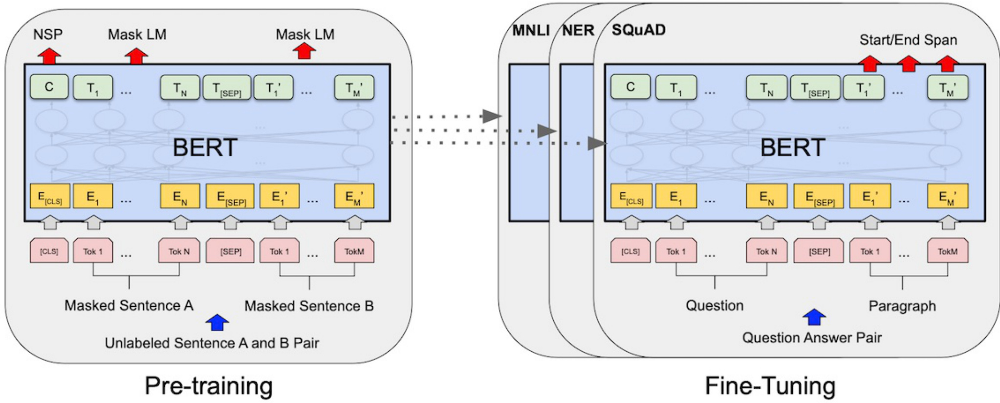

## Fine-Tuning com BERT: Uma Abordagem Detalhada

### Introdução

O processo de *fine-tuning* é crucial para adaptar modelos de linguagem pré-treinados, como o **Bidirectional Encoder Representations from Transformers (BERT)**, a tarefas específicas [^5]. Este capítulo explora em profundidade como o BERT, inicialmente pré-treinado em *masked language modeling* e *next sentence prediction* usando o corpus da Wikipedia em inglês e BooksCorpus [^5], pode ser subsequentemente ajustado (fine-tuned) para diversas aplicações, incluindo classificação de sentença única, classificação de pares de sentenças, tagging de sentença única e question answering [^5].

### Conceitos Fundamentais

**1. Pré-Treinamento do BERT:**

O BERT é pré-treinado em duas tarefas principais [^5]:

*   ***Masked Language Modeling (MLM):*** Uma porcentagem aleatória das palavras na entrada é mascarada, e o modelo deve prever as palavras mascaradas com base no contexto circundante. Essa tarefa permite que o modelo desenvolva uma compreensão profunda da linguagem e de suas nuances contextuais.
*   ***Next Sentence Prediction (NSP):*** O modelo recebe dois segmentos de texto e deve prever se o segundo segmento segue logicamente o primeiro no corpus original. Essa tarefa ajuda o modelo a entender as relações entre sentenças e a coerência do discurso.

**2. Arquitetura do BERT:**

O BERT se baseia na arquitetura **Transformer**, que utiliza mecanismos de atenção (attention mechanisms) para ponderar a importância de diferentes partes da entrada ao processar o texto [^5]. Existem duas versões principais do BERT:

*   **BERT-Base:** 12 camadas de Transformer, 12 cabeças de atenção e 110 milhões de parâmetros.
*   **BERT-Large:** 24 camadas de Transformer, 16 cabeças de atenção e 340 milhões de parâmetros.

**3. Fine-Tuning para Tarefas Específicas:**

O processo de *fine-tuning* envolve adaptar o modelo BERT pré-treinado a uma tarefa específica, usando um conjunto de dados rotulado para essa tarefa [^5]. As camadas do BERT, já treinadas para entender a linguagem, são ajustadas para otimizar o desempenho na tarefa alvo.

**4. Tarefas Comuns de Fine-Tuning:**

O BERT pode ser fine-tuned para uma variedade de tarefas [^5], incluindo:

*   **Classificação de Sentença Única:** Dada uma sentença, o modelo deve classificá-la em uma ou mais categorias (por exemplo, análise de sentimento).
*   **Classificação de Pares de Sentenças:** Dados dois segmentos de texto, o modelo deve prever a relação entre eles (por exemplo, entailment, contradiction ou neutral).
*   **Tagging de Sentença Única:** Dada uma sentença, o modelo deve atribuir um rótulo a cada palavra (por exemplo, part-of-speech tagging, named entity recognition).
*   **Question Answering:** Dado um parágrafo e uma pergunta, o modelo deve identificar a resposta à pergunta dentro do parágrafo.

**5. Detalhes do Fine-Tuning:**

O processo de fine-tuning normalmente envolve as seguintes etapas:

*   **Preparação dos Dados:** Os dados de treinamento para a tarefa específica são formatados de acordo com o formato de entrada esperado pelo BERT.
*   **Adição de uma Camada de Classificação:** Uma camada de classificação linear é adicionada no topo do modelo BERT para produzir as previsões da tarefa. Por exemplo, para classificação de sentimentos, uma camada linear pode mapear a saída do BERT para as classes "positivo", "negativo" ou "neutro".
*   **Treinamento:** O modelo completo (BERT + camada de classificação) é treinado usando os dados de treinamento rotulados. Durante o treinamento, os pesos das camadas do BERT são ajustados para otimizar o desempenho na tarefa específica.
*   **Avaliação:** O modelo fine-tuned é avaliado em um conjunto de dados de teste para medir seu desempenho.

**6. Aspectos Técnicos:**

*   **Função de Perda (Loss Function):** A função de perda apropriada é escolhida com base na tarefa. Por exemplo, *cross-entropy loss* é comumente usada para tarefas de classificação.
*   **Otimizador (Optimizer):** Algoritmos como *AdamW* são frequentemente utilizados para otimizar os pesos do modelo.
*   **Taxa de Aprendizagem (Learning Rate):** Uma taxa de aprendizado pequena é tipicamente usada para fine-tuning, para evitar a destruição do conhecimento pré-treinado. Valores típicos estão na ordem de $10^{-5}$ ou $10^{-4}$.
*   **Tamanho do Batch (Batch Size):** O tamanho do batch influencia a estabilidade e a velocidade do treinamento.
*   **Número de Épocas (Number of Epochs):** O número de épocas determina quantas vezes o modelo percorre todo o conjunto de dados de treinamento.

**7. Exemplo de Fine-Tuning para Classificação de Sentimentos:**

1.  **Dados:** Considere um conjunto de dados de avaliações de filmes, onde cada avaliação é rotulada como "positivo" ou "negativo".
2.  **Formatação da Entrada:** Cada avaliação é formatada como uma sequência de tokens, com tokens especiais `[CLS]` no início e `[SEP]` no final.
3.  **Camada de Classificação:** Uma camada linear é adicionada no topo da saída do token `[CLS]` do BERT, mapeando para duas classes (positivo/negativo).
4.  **Treinamento:** O modelo é treinado usando a função de perda *cross-entropy*, otimizador AdamW e uma taxa de aprendizado de $2 \times 10^{-5}$.
5.  **Avaliação:** O modelo treinado é avaliado em um conjunto de dados de teste para medir a precisão.

> 💡 **Exemplo Numérico: Classificação de Sentimentos**
>
> Suponha que temos um pequeno conjunto de dados de treinamento com 5 exemplos:
>
> | Avaliação                                  | Sentimento |
> | :----------------------------------------- | :--------- |
> | Este filme é incrível!                      | Positivo   |
> | Absolutamente terrível, não perca seu tempo. | Negativo   |
> | Um filme medíocre.                         | Negativo   |
> | Adorei cada minuto.                        | Positivo   |
> | Que decepção!                              | Negativo   |
>
> Após o fine-tuning, o modelo faz as seguintes previsões em um conjunto de teste com 3 exemplos:
>
> | Avaliação                   | Sentimento Real | Sentimento Predito |
> | :-------------------------- | :-------------- | :----------------- |
> | Uma obra-prima!             | Positivo        | Positivo           |
> | Horrível, atuação péssima. | Negativo        | Negativo           |
> | Filme ok.                   | Neutro          | Negativo           |
>
> Podemos calcular a precisão: $$\frac{\text{Número de previsões corretas}}{\text{Número total de previsões}} = \frac{2}{3} \approx 0.67$$
>
> Neste caso, a precisão é de 67%. Este valor seria então comparado com um benchmark ou com os resultados de outras abordagens para determinar se o fine-tuning foi bem-sucedido. Se usarmos o conjunto de treino para validar o modelo, corremos o risco de *overfitting*. Para evitar isso, devemos utilizar um conjunto de validação independente.
>
> Para um cálculo mais robusto, usaríamos métricas como Precision, Recall, F1-Score e AUC em um conjunto de teste maior e avaliaríamos a significância estatística das melhorias em relação a um modelo baseline.

**Teorema 1:** A escolha da taxa de aprendizado ($\eta$) no processo de fine-tuning do BERT impacta significativamente a convergência e o desempenho final do modelo. Uma taxa de aprendizado muito alta pode levar à instabilidade e divergência, enquanto uma taxa de aprendizado muito baixa pode resultar em uma convergência lenta e subótima.

> 💡 **Exemplo Numérico: Impacto da Taxa de Aprendizagem**
>
> Considere fine-tuning o BERT para classificação de sentimentos usando três taxas de aprendizado diferentes: $1 \times 10^{-3}$, $2 \times 10^{-5}$ e $1 \times 10^{-6}$. Após 3 épocas de treinamento, obtemos os seguintes resultados em um conjunto de validação:
>
> | Taxa de Aprendizagem | Precisão | F1-Score |
> | :-------------------- | :------- | :------- |
> | $1 \times 10^{-3}$   | 0.72     | 0.70     |
> | $2 \times 10^{-5}$   | 0.85     | 0.84     |
> | $1 \times 10^{-6}$   | 0.78     | 0.77     |
>
> Neste caso, a taxa de aprendizado de $2 \times 10^{-5}$ produz o melhor desempenho. Uma taxa de aprendizado muito alta ($1 \times 10^{-3}$) pode ter causado oscilações durante o treinamento, enquanto uma taxa de aprendizado muito baixa ($1 \times 10^{-6}$) pode não ter permitido que o modelo convergisse rapidamente o suficiente.
>
> A escolha da taxa de aprendizado ideal depende da tarefa, do conjunto de dados e da arquitetura do modelo. É importante realizar experimentos para encontrar a taxa de aprendizado que produz o melhor desempenho. O uso de *learning rate schedules*, como o *linear decay learning rate schedule*, pode melhorar o desempenho do fine-tuning.

**Proposição 1:** A utilização de *learning rate schedules*, como o *linear decay learning rate schedule*, pode melhorar o desempenho do fine-tuning em comparação com uma taxa de aprendizado constante.

*Prova*: O *linear decay learning rate schedule* inicia com uma taxa de aprendizado inicial e a diminui linearmente ao longo do tempo, permitindo que o modelo explore o espaço de parâmetros de forma mais ampla no início do treinamento e, em seguida, refine os pesos de forma mais precisa à medida que o treinamento avança. Isso ajuda a evitar oscilações e a convergir para um mínimo mais estável.

**7.1 Variações no Exemplo de Classificação de Sentimentos:**

Além do exemplo básico de classificação de sentimentos, podemos explorar algumas variações e técnicas adicionais para melhorar o desempenho.

1.  **Uso de Camadas de Pooling:** Em vez de usar apenas a saída do token `[CLS]`, podemos aplicar uma camada de *pooling* (por exemplo, *max pooling* ou *average pooling*) sobre todas as saídas do BERT para capturar informações de toda a sequência. Isso pode ser útil para sentenças longas, onde o token `[CLS]` pode não conter todas as informações relevantes.
2.  **Adição de Dropout:** Adicionar camadas de *dropout* antes da camada de classificação linear pode ajudar a regularizar o modelo e evitar o overfitting, especialmente quando o conjunto de dados de treinamento é pequeno.
3.  **Data Augmentation:** Aumentar o conjunto de dados de treinamento por meio de técnicas de *data augmentation* (por exemplo, substituir palavras por sinônimos, trocar a ordem das palavras) pode melhorar a robustez e a generalização do modelo.
4.  **Utilização de Embeddings de Palavras Específicas:** Em domínios específicos, a inicialização dos embeddings do BERT com embeddings de palavras pré-treinadas nesse domínio (usando Word2Vec, GloVe ou FastText) pode acelerar o treinamento e melhorar o desempenho.

> 💡 **Exemplo Numérico: Data Augmentation**
>
> Suponha que temos a seguinte sentença no nosso conjunto de dados: "Este filme é muito bom."
>
> Podemos aplicar data augmentation substituindo "bom" por sinônimos como "excelente", "ótimo" ou "fantástico", gerando novas sentenças:
>
> *   "Este filme é muito excelente."
> *   "Este filme é muito ótimo."
> *   "Este filme é muito fantástico."
>
> Isso aumenta o tamanho do conjunto de dados e ajuda o modelo a generalizar melhor. Outras técnicas incluem trocar a ordem das palavras (com cuidado para não alterar o significado) ou inserir pequenas variações gramaticais.
>
> A escolha das técnicas de data augmentation deve ser guiada pelo domínio da tarefa e pelo conhecimento da linguagem.

**Teorema 2:** O tamanho do batch e o número de épocas estão interligados e afetam o desempenho do fine-tuning. Um tamanho de batch menor geralmente requer um maior número de épocas para convergir, enquanto um tamanho de batch maior pode convergir mais rapidamente, mas pode exigir um ajuste mais cuidadoso da taxa de aprendizado.

> 💡 **Exemplo Numérico: Tamanho do Batch e Épocas**
>
> Suponha que estamos fine-tuning o BERT para classificação de texto com um conjunto de dados de 1000 exemplos. Comparamos dois cenários:
>
> *   **Cenário 1:** Tamanho do batch = 16, Número de épocas = 10
> *   **Cenário 2:** Tamanho do batch = 32, Número de épocas = 5
>
> | Cenário   | Tamanho do Batch | Épocas | Iterações por Época | Total de Iterações | Precisão (Validação) |
> | :-------- | :--------------- | :----- | :------------------ | :----------------- | :-------------------- |
> | Cenário 1 | 16               | 10     | 62.5               | 625              | 0.82                  |
> | Cenário 2 | 32               | 5      | 31.25               | 156.25             | 0.80                  |
>
> No Cenário 1, o modelo vê cada exemplo mais vezes (mais épocas) com um batch menor, o que pode resultar em um ajuste mais fino, mas também pode levar ao overfitting se não for monitorado cuidadosamente. No Cenário 2, o modelo vê menos iterações, o que pode ser mais rápido, mas pode não convergir tão bem.
>
> O número de iterações por época é calculado como $$\frac{\text{Tamanho do conjunto de dados}}{\text{Tamanho do batch}}$$.  O total de iterações é o produto do número de épocas pelo número de iterações por época.

**Lema 1:** O uso de *early stopping* baseado no desempenho em um conjunto de validação pode evitar o overfitting e melhorar a generalização do modelo.

*Prova*: O *early stopping* monitora o desempenho do modelo em um conjunto de validação durante o treinamento e interrompe o treinamento quando o desempenho começa a deteriorar, indicando que o modelo está começando a se ajustar demais aos dados de treinamento e a perder a capacidade de generalizar para novos dados.

> 💡 **Exemplo Numérico: Early Stopping**
>
> Monitoramos a precisão em um conjunto de validação durante o treinamento do BERT. Definimos um "pacience" de 2 épocas (o treinamento para se a precisão não melhorar por 2 épocas consecutivas).
>
> | Época | Precisão (Validação) | Melhor Precisão até agora |
> | :---- | :-------------------- | :----------------------- |
> | 1     | 0.75                  | 0.75                     |
> | 2     | 0.78                  | 0.78                     |
> | 3     | 0.79                  | 0.79                     |
> | 4     | 0.80                  | 0.80                     |
> | 5     | 0.81                  | 0.81                     |
> | 6     | 0.80                  | 0.81                     |
> | 7     | 0.79                  | 0.81                     |
>
> Neste caso, o treinamento seria interrompido na época 7, porque a precisão não melhorou nas últimas 2 épocas (pacience = 2). O melhor modelo (época 5) seria então usado para avaliação final no conjunto de teste.

### Conclusão

O *fine-tuning* do BERT é uma técnica poderosa para adaptar um modelo de linguagem pré-treinado a uma variedade de tarefas específicas [^5]. Ao aproveitar o conhecimento adquirido durante o pré-treinamento, o BERT pode alcançar um desempenho notável em diversas aplicações com relativamente poucos dados rotulados. Compreender os detalhes do processo de fine-tuning, incluindo a escolha da função de perda, otimizador, taxa de aprendizado e outros hiperparâmetros, é fundamental para obter os melhores resultados. Além disso, a utilização de técnicas como *learning rate schedules*, *pooling*, *dropout*, *data augmentation* e *early stopping* pode otimizar ainda mais o desempenho do modelo fine-tuned.

### Referências

[^5]: Bidirectional Encoder Representations from Transformers (BERT) is pre-trained on masked language modeling and next sentence prediction in English Wikipedia and BooksCorpus, then fine-tuned on task-specific inputs and labels for single sentence classification, sentence pair classification, single sentence tagging, and question answering.
<!-- END -->