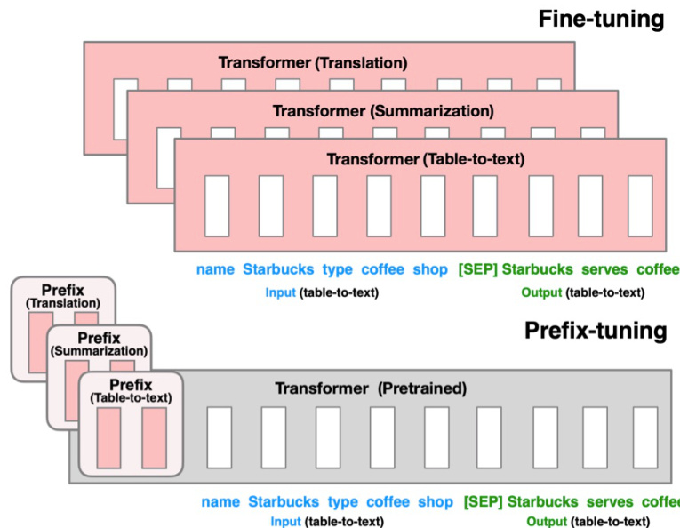

## Embeddings Populares via API para Retrieval em RAG: Facilidade de Uso vs. Performance

### Introdução

A etapa de **embedding** é crucial em sistemas de **Retrieval-Augmented Generation (RAG)**, transformando textos em representações vetoriais que capturam seu significado semântico. A escolha do modelo de embedding impacta diretamente a qualidade do retrieval e, consequentemente, a performance geral do sistema RAG. Uma abordagem popular é utilizar serviços de embedding via API, como o `text-embedding-ada-002` da OpenAI [^1]. Este capítulo explora as vantagens e desvantagens de usar embeddings populares via API em sistemas RAG, com foco na facilidade de uso e na comparação com alternativas potencialmente superiores.

### Conceitos Fundamentais

**Embeddings de Texto:** São representações vetoriais de textos, onde vetores semanticamente similares estão próximos no espaço vetorial. Modelos de embedding, como o `text-embedding-ada-002`, são treinados para capturar as relações semânticas entre palavras e frases, permitindo que o sistema RAG recupere documentos relevantes com base na similaridade semântica entre a query do usuário e os embeddings dos documentos [^1].

**Definição Formal:** Matematicamente, um embedding de texto pode ser definido como uma função $f: T \rightarrow \mathbb{R}^n$, onde $T$ é o conjunto de todos os textos possíveis, e $\mathbb{R}^n$ é um espaço vetorial de dimensão $n$. O objetivo é que, para textos $t_1, t_2 \in T$, a similaridade semântica entre $t_1$ e $t_2$ seja refletida pela similaridade (e.g., cosseno) entre seus embeddings $f(t_1)$ e $f(t_2)$.

**APIs de Embedding:** Oferecem acesso a modelos de embedding pré-treinados através de chamadas de API. A principal vantagem é a conveniência, pois elimina a necessidade de treinar e hospedar modelos de embedding localmente [^1].

**Retrieval-Augmented Generation (RAG):** É uma técnica que combina a capacidade de geração de modelos de linguagem grandes (LLMs) com a recuperação de informações relevantes de uma base de conhecimento externa. O processo geralmente envolve:

1.  **Embedding:** Converter a query do usuário e os documentos da base de conhecimento em embeddings.
2.  **Retrieval:** Recuperar os documentos mais relevantes com base na similaridade entre o embedding da query e os embeddings dos documentos.
3.  **Augmentation:** Combinar a query original com os documentos recuperados para fornecer contexto adicional ao LLM.
4.  **Generation:** O LLM gera uma resposta baseada na query original e no contexto recuperado.


**Métricas de Similaridade:** A etapa de retrieval se beneficia diretamente da escolha da métrica de similaridade. As métricas mais comuns são:

*   **Similaridade do Cosseno:** Mede o cosseno do ângulo entre dois vetores. É definida como:
    $$
    \text{cosine\_similarity}(u, v) = \frac{u \cdot v}{\|u\| \|v\|}
    $$
    onde $u$ e $v$ são os vetores de embedding, e $\|u\|$ denota a norma do vetor $u$.

    > 💡 **Exemplo Numérico:**
    >
    > Suponha que temos uma query com embedding $u = [0.2, 0.5, 0.1]$ e dois documentos com embeddings $v_1 = [0.6, 0.1, 0.3]$ e $v_2 = [0.1, 0.8, 0.2]$. Vamos calcular a similaridade do cosseno entre a query e cada documento.
    >
    > $\text{cosine\_similarity}(u, v_1) = \frac{(0.2*0.6 + 0.5*0.1 + 0.1*0.3)}{\sqrt{(0.2^2 + 0.5^2 + 0.1^2)} * \sqrt{(0.6^2 + 0.1^2 + 0.3^2)}} = \frac{0.2}{\sqrt{0.3}*\sqrt{0.46}} \approx \frac{0.2}{0.34*0.67} \approx 0.87$
    >
    > $\text{cosine\_similarity}(u, v_2) = \frac{(0.2*0.1 + 0.5*0.8 + 0.1*0.2)}{\sqrt{(0.2^2 + 0.5^2 + 0.1^2)} * \sqrt{(0.1^2 + 0.8^2 + 0.2^2)}} = \frac{0.44}{\sqrt{0.3}*\sqrt{0.69}} \approx \frac{0.44}{0.55} \approx 0.80$
    >
    > Neste exemplo, o documento $v_1$ é mais similar à query $u$ do que o documento $v_2$, com base na similaridade do cosseno.
    >
    > ```python
    > import numpy as np
    > import matplotlib.pyplot as plt
    >
    > # Dados dos embeddings
    > u = np.array([0.2, 0.5, 0.1])
    > v1 = np.array([0.6, 0.1, 0.3])
    > v2 = np.array([0.1, 0.8, 0.2])
    >
    > # Função para calcular a similaridade do cosseno
    > def cosine_similarity(u, v):
    >     return np.dot(u, v) / (np.linalg.norm(u) * np.linalg.norm(v))
    >
    > # Calcular a similaridade do cosseno
    > similarity_v1 = cosine_similarity(u, v1)
    > similarity_v2 = cosine_similarity(u, v2)
    >
    > # Plotar as similaridades
    > labels = ['Documento 1', 'Documento 2']
    > similarities = [similarity_v1, similarity_v2]
    >
    > plt.figure(figsize=(8, 6))
    > plt.bar(labels, similarities, color=['blue', 'green'])
    > plt.ylabel('Similaridade do Cosseno')
    > plt.title('Similaridade do Cosseno entre Query e Documentos')
    > plt.ylim(0, 1)
    > plt.grid(axis='y', linestyle='--')
    > plt.show()
    > ```

*   **Distância Euclidiana:** Mede a distância em linha reta entre dois vetores no espaço vetorial:
    $$
    \text{euclidean\_distance}(u, v) = \sqrt{\sum_{i=1}^{n} (u_i - v_i)^2}
    $$

    > 💡 **Exemplo Numérico:**
    >
    > Usando os mesmos embeddings da query e dos documentos do exemplo anterior: $u = [0.2, 0.5, 0.1]$, $v_1 = [0.6, 0.1, 0.3]$ e $v_2 = [0.1, 0.8, 0.2]$. Vamos calcular a distância euclidiana entre a query e cada documento.
    >
    > $\text{euclidean\_distance}(u, v_1) = \sqrt{(0.2-0.6)^2 + (0.5-0.1)^2 + (0.1-0.3)^2} = \sqrt{0.16 + 0.16 + 0.04} = \sqrt{0.36} = 0.6$
    >
    > $\text{euclidean\_distance}(u, v_2) = \sqrt{(0.2-0.1)^2 + (0.5-0.8)^2 + (0.1-0.2)^2} = \sqrt{0.01 + 0.09 + 0.01} = \sqrt{0.11} \approx 0.33$
    >
    > Neste caso, o documento $v_2$ está mais próximo da query $u$ do que o documento $v_1$, com base na distância euclidiana. Note que a interpretação é inversa à similaridade do cosseno: quanto menor a distância, maior a similaridade.
    >
    > ```python
    > import numpy as np
    > import matplotlib.pyplot as plt
    >
    > # Dados dos embeddings
    > u = np.array([0.2, 0.5, 0.1])
    > v1 = np.array([0.6, 0.1, 0.3])
    > v2 = np.array([0.1, 0.8, 0.2])
    >
    > # Função para calcular a distância euclidiana
    > def euclidean_distance(u, v):
    >     return np.linalg.norm(u - v)
    >
    > # Calcular a distância euclidiana
    > distance_v1 = euclidean_distance(u, v1)
    > distance_v2 = euclidean_distance(u, v2)
    >
    > # Plotar as distâncias
    > labels = ['Documento 1', 'Documento 2']
    > distances = [distance_v1, distance_v2]
    >
    > plt.figure(figsize=(8, 6))
    > plt.bar(labels, distances, color=['red', 'orange'])
    > plt.ylabel('Distância Euclidiana')
    > plt.title('Distância Euclidiana entre Query e Documentos')
    > plt.grid(axis='y', linestyle='--')
    > plt.show()
    > ```

*   **Produto Interno (Dot Product):** Simplesmente o produto interno dos dois vetores:
    $$
    \text{dot\_product}(u, v) = u \cdot v = \sum_{i=1}^{n} u_i v_i
    $$
    Para vetores normalizados, o produto interno é equivalente à similaridade do cosseno.

    > 💡 **Exemplo Numérico:**
    >
    > Usando os mesmos embeddings: $u = [0.2, 0.5, 0.1]$, $v_1 = [0.6, 0.1, 0.3]$ e $v_2 = [0.1, 0.8, 0.2]$.
    >
    > $\text{dot\_product}(u, v_1) = (0.2*0.6 + 0.5*0.1 + 0.1*0.3) = 0.12 + 0.05 + 0.03 = 0.2$
    >
    > $\text{dot\_product}(u, v_2) = (0.2*0.1 + 0.5*0.8 + 0.1*0.2) = 0.02 + 0.4 + 0.02 = 0.44$
    >
    > O documento $v_2$ tem um produto interno maior com a query $u$, indicando maior similaridade (assumindo que os vetores não são normalizados, se fossem normalizados, o resultado seria equivalente à similaridade do cosseno).
    >
    > ```python
    > import numpy as np
    > import matplotlib.pyplot as plt
    >
    > # Dados dos embeddings
    > u = np.array([0.2, 0.5, 0.1])
    > v1 = np.array([0.6, 0.1, 0.3])
    > v2 = np.array([0.1, 0.8, 0.2])
    >
    > # Função para calcular o produto interno
    > def dot_product(u, v):
    >     return np.dot(u, v)
    >
    > # Calcular o produto interno
    > dot_v1 = dot_product(u, v1)
    > dot_v2 = dot_product(u, v2)
    >
    > # Plotar os produtos internos
    > labels = ['Documento 1', 'Documento 2']
    > dots = [dot_v1, dot_v2]
    >
    > plt.figure(figsize=(8, 6))
    > plt.bar(labels, dots, color=['purple', 'pink'])
    > plt.ylabel('Produto Interno')
    > plt.title('Produto Interno entre Query e Documentos')
    > plt.grid(axis='y', linestyle='--')
    > plt.show()
    > ```

A escolha da métrica de similaridade pode influenciar a performance do retrieval, e deve ser considerada em conjunto com a escolha do modelo de embedding.

### Vantagens dos Embeddings via API

A principal vantagem de utilizar embeddings populares via API reside na **facilidade de uso** [^1].  Isso se traduz em:

*   **Redução da Complexidade Operacional:**  Não é necessário manter infraestrutura para hospedar e servir modelos de embedding. Isso simplifica o desenvolvimento e a implantação de sistemas RAG.
*   **Escalabilidade:** A escalabilidade é inerente à natureza da API. À medida que a demanda aumenta, a infraestrutura da API se ajusta automaticamente, garantindo que o sistema RAG permaneça responsivo.
*   **Acesso a Modelos Pré-treinados:** APIs oferecem acesso imediato a modelos de embedding de alta qualidade, treinados em grandes volumes de dados [^1]. Isso acelera o processo de desenvolvimento e permite que os desenvolvedores se concentrem na lógica principal do sistema RAG.
*   **Custos Iniciais Reduzidos:**  Em vez de investir em hardware e expertise para treinar e hospedar modelos, o custo se resume ao uso da API, geralmente baseado no número de chamadas ou tokens processados.

### Desvantagens e Alternativas Superiores

Apesar da conveniência, o uso de embeddings populares via API pode apresentar limitações em termos de performance de retrieval [^1]. A experiência prática e relatos indicam que alternativas podem oferecer resultados superiores. As possíveis razões para isso incluem:

*   **Generalização vs. Especialização:** Modelos de embedding genéricos, como o `text-embedding-ada-002`, são treinados em uma ampla gama de textos, o que pode limitar sua capacidade de capturar nuances específicas de um domínio ou aplicação particular. Modelos especializados, treinados em dados específicos do domínio, podem oferecer melhor performance em tarefas de retrieval [^1].
*   **Controle Limitado sobre o Treinamento:** Ao usar uma API, não há controle sobre o processo de treinamento do modelo de embedding. Isso significa que não é possível ajustar o modelo para atender às necessidades específicas da aplicação.
*   **Custo em Escala:** Embora os custos iniciais possam ser menores, o custo por token/chamada de API pode se tornar proibitivo em larga escala.
*   **Latência:** A latência das chamadas de API pode impactar o tempo de resposta do sistema RAG, especialmente em aplicações que exigem retrieval em tempo real.

**Teorema 1:** *Trade-off entre Latência e Precisão*. Existe um trade-off inerente entre a latência do serviço de embedding e a precisão do retrieval. APIs, embora convenientes, introduzem latência de rede que pode degradar a experiência do usuário em aplicações sensíveis ao tempo. Modelos locais, embora exijam mais configuração, podem reduzir a latência, potencialmente melhorando a experiência do usuário.

**Prova (Esboço):** A latência é afetada pelo tempo de transferência de dados e pelo tempo de processamento no servidor da API. A precisão depende da capacidade do modelo de embedding em capturar a semântica do texto. Modelos mais complexos podem oferecer maior precisão, mas também podem aumentar o tempo de processamento. Portanto, a escolha entre API e modelo local envolve equilibrar esses fatores.

**Alternativas a serem consideradas:**

*   **Fine-tuning de Modelos Existentes:** É possível fazer *fine-tuning* de um modelo de embedding pré-treinado (como um modelo da família BERT ou Sentence Transformers) nos dados específicos da aplicação. Isso permite adaptar o modelo para capturar melhor as nuances do domínio, melhorando a performance de retrieval.

    > 💡 **Exemplo Numérico:**
    >
    > Suponha que um modelo pré-treinado genérico resulta em uma precisão de 0.6 e um recall de 0.5 em um conjunto de dados específico de artigos científicos sobre física. Após o fine-tuning do mesmo modelo com um conjunto de dados relevante de artigos de física, a precisão aumenta para 0.75 e o recall para 0.65.
    >
    > | Modelo                     | Precisão | Recall |
    > | -------------------------- | -------- | ------ |
    > | Modelo Pré-treinado Genérico | 0.6      | 0.5    |
    > | Modelo Fine-tuned          | 0.75     | 0.65   |
    >
    > Este exemplo demonstra o benefício quantitativo do fine-tuning em um domínio específico. O aumento de 0.15 na precisão e 0.15 no recall indica uma melhoria significativa na capacidade do modelo de recuperar documentos relevantes.
    >



*   **Treinamento de Modelos Customizados:** Em cenários onde a performance é crítica e o volume de dados é suficiente, pode ser vantajoso treinar um modelo de embedding do zero. Isso oferece controle total sobre o processo de treinamento e permite otimizar o modelo para a aplicação específica.

**Proposição 1:** *Benefícios do Fine-tuning*. Fine-tuning de modelos de embedding pré-treinados com dados específicos do domínio resulta em um aumento mensurável na precisão do retrieval em comparação com o uso direto de modelos genéricos.

**Prova (Esboço):** O fine-tuning ajusta os pesos do modelo para melhor representar as relações semânticas presentes nos dados do domínio. Isso pode ser quantificado através de métricas como Precision@K e Recall@K, que medem a fração de documentos relevantes recuperados nos K primeiros resultados.

*   **Modelos de Embedding Open Source:** Utilizar modelos de embedding open source e auto-hospedados, como os da Hugging Face Transformers, oferece maior flexibilidade e controle sobre o processo de embedding, além de evitar custos de API em larga escala.

    > 💡 **Exemplo Numérico:**
    >
    > Comparação de custos entre usar uma API de embedding e auto-hospedar um modelo open source:
    >
    > Suponha que você tem 1 milhão de queries por mês. Uma API cobra \$0.0001 por 1000 tokens. Cada query tem em média 100 tokens. Auto-hospedar um modelo custa \$500 por mês (incluindo hardware e manutenção).
    >
    > Custo da API: (1,000,000 queries * 100 tokens/query) / 1000 * \$0.0001 = \$1000 por mês.
    >
    > Custo da auto-hospedagem: \$500 por mês.
    >
    > Neste exemplo, auto-hospedar o modelo open source é mais econômico do que usar a API em larga escala.
    >
    > | Cenário              | Custo Mensal |
    > | --------------------- | ------------- |
    > | API (1 milhão query) | \$1000        |
    > | Auto-hospedagem       | \$500         |
    >
    > ```python
    > import matplotlib.pyplot as plt
    >
    > # Dados dos custos
    > api_cost = 1000
    > self_hosting_cost = 500
    >
    > # Rótulos dos cenários
    > labels = ['API', 'Auto-hospedagem']
    >
    > # Custos
    > costs = [api_cost, self_hosting_cost]
    >
    > # Plotar o gráfico de barras
    > plt.figure(figsize=(6, 4))
    > plt.bar(labels, costs, color=['skyblue', 'lightgreen'])
    > plt.ylabel('Custo Mensal ($)')
    > plt.title('Comparação de Custos Mensais')
    > plt.ylim(0, 1200)
    > plt.grid(axis='y', linestyle='--')
    > plt.show()
    > ```

A escolha da melhor abordagem depende de vários fatores, incluindo a disponibilidade de dados, o orçamento, os requisitos de performance e a expertise técnica.

**Teorema 2:** *Custo-Benefício do Auto-Hospedagem*. Existe um ponto de inflexão no volume de consultas onde o custo total da auto-hospedagem de modelos de embedding open source se torna menor do que o custo do uso de APIs de embedding, dado um certo nível de performance desejado.

**Prova (Esboço):** O custo da API é geralmente linear com o número de consultas. O custo da auto-hospedagem envolve custos fixos (hardware, infraestrutura) e custos variáveis (energia, manutenção). A análise envolve modelar esses custos e determinar o ponto onde a curva de custo da auto-hospedagem cruza a curva de custo da API. A performance desejada entra como um fator, pois pode influenciar a escolha do hardware necessário para a auto-hospedagem.

**Corolário 1:** Aplicações com alto volume de consultas e requisitos de baixa latência se beneficiam mais da auto-hospedagem.

### Conclusão
<!-- END -->