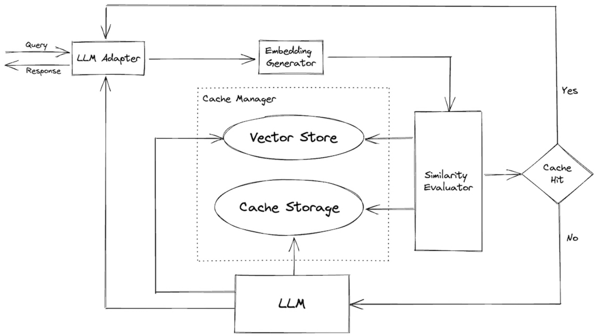

## Caching de Respostas de LLMs Baseado em Embeddings Semânticos

### Introdução

O caching é uma técnica fundamental para otimizar o desempenho e reduzir os custos em sistemas que utilizam Large Language Models (LLMs). No contexto específico de LLMs, o caching transcende o simples armazenamento de respostas para consultas exatas, passando a envolver o armazenamento de respostas com base na **similaridade semântica** entre as requisições [^2]. Este capítulo explora em profundidade essa abordagem, detalhando os mecanismos, as vantagens e as considerações práticas envolvidas. Como vimos anteriormente, a latência e o custo são fatores críticos na implementação de sistemas baseados em LLMs. O caching, portanto, emerge como uma estratégia essencial para mitigar esses desafios.

### Conceitos Fundamentais

O caching tradicionalmente envolve o armazenamento de resultados de computações para evitar a necessidade de recalcular esses resultados quando a mesma entrada é apresentada novamente. Em sistemas de LLMs, no entanto, a variedade e a sutileza das entradas textuais tornam improvável a ocorrência de consultas idênticas. É aqui que o caching baseado em embeddings semânticos se torna crucial.

A ideia central é a seguinte:

1.  **Embedding da Consulta:** Dada uma consulta textual do usuário, um modelo de embedding é utilizado para gerar um vetor que representa o significado semântico da consulta [^2]. Este vetor é o que chamamos de embedding.

2.  **Armazenamento do Embedding e Resposta:** Quando uma consulta é processada pela primeira vez, o embedding da consulta e a resposta correspondente do LLM são armazenados em um cache. Este cache pode ser implementado utilizando diversas tecnologias, desde bancos de dados chave-valor até sistemas de indexação vetorial especializados.

3.  **Busca por Similaridade Semântica:** Quando uma nova consulta chega, seu embedding é calculado e comparado com os embeddings já armazenados no cache [^2]. A comparação é geralmente realizada utilizando métricas de similaridade como a distância do cosseno (cosine distance) ou a distância euclidiana.

4.  **Servindo a Resposta em Cache:** Se a similaridade entre o embedding da nova consulta e o embedding de uma consulta armazenada no cache exceder um determinado limiar (threshold), a resposta em cache correspondente é servida ao usuário [^2]. Caso contrário, a consulta é enviada ao LLM para processamento, e o resultado é armazenado no cache, juntamente com o seu embedding.

**Matematicamente**, a similaridade entre duas consultas $q_1$ e $q_2$ pode ser representada como:

$$
\text{similarity}(q_1, q_2) = \text{cosine\_similarity}(\text{embedding}(q_1), \text{embedding}(q_2))
$$

Onde $\text{embedding}(q)$ representa o vetor de embedding da consulta $q$, e $\text{cosine\_similarity}(v_1, v_2)$ é o cosseno do ângulo entre os vetores $v_1$ e $v_2$, calculado como:

$$
\text{cosine\_similarity}(v_1, v_2) = \frac{v_1 \cdot v_2}{\|v_1\| \|v_2\|}
$$

O limiar (threshold) de similaridade, denotado por $\theta$, é um parâmetro crucial que afeta o desempenho do sistema de caching. Um valor de $\theta$ muito baixo pode resultar em um número excessivo de *cache misses*, enquanto um valor de $\theta$ muito alto pode levar a respostas em cache inadequadas. A escolha ideal de $\theta$ depende das características específicas do LLM, do domínio de aplicação e da distribuição das consultas dos usuários.

> 💡 **Exemplo Numérico:**
>
> Suponha que tenhamos duas consultas:
>
> *   $q_1$: "Qual a altura do Everest?"
> *   $q_2$: "Me diga a altura do Monte Everest."
>
> Após passarmos essas consultas por um modelo de embedding, obtemos os seguintes vetores (simplificados para ilustração):
>
> *   $\text{embedding}(q_1) = v_1 = [0.2, 0.8, 0.1, 0.3]$
> *   $\text{embedding}(q_2) = v_2 = [0.3, 0.7, 0.2, 0.2]$
>
> Vamos calcular a similaridade do cosseno entre esses vetores:
>
> $\text{Step 1: Calculate the dot product}$
>
> $v_1 \cdot v_2 = (0.2 * 0.3) + (0.8 * 0.7) + (0.1 * 0.2) + (0.3 * 0.2) = 0.06 + 0.56 + 0.02 + 0.06 = 0.70$
>
> $\text{Step 2: Calculate the magnitudes}$
>
> $\|v_1\| = \sqrt{0.2^2 + 0.8^2 + 0.1^2 + 0.3^2} = \sqrt{0.04 + 0.64 + 0.01 + 0.09} = \sqrt{0.78} \approx 0.883$
> $\|v_2\| = \sqrt{0.3^2 + 0.7^2 + 0.2^2 + 0.2^2} = \sqrt{0.09 + 0.49 + 0.04 + 0.04} = \sqrt{0.66} \approx 0.812$
>
> $\text{Step 3: Calculate the cosine similarity}$
>
> $\text{cosine\_similarity}(v_1, v_2) = \frac{0.70}{0.883 * 0.812} = \frac{0.70}{0.717} \approx 0.976$
>
> Se o limiar $\theta$ for, por exemplo, 0.95, então como 0.976 > 0.95, a consulta $q_2$ seria considerada similar a $q_1$, e a resposta em cache de $q_1$ seria retornada.
>
> A escolha do limiar é crucial. Um valor muito baixo aumentaria a taxa de "cache hits", mas poderia comprometer a precisão, enquanto um valor muito alto diminuiria a taxa de "cache hits".
>
> Abaixo, uma tabela comparando diferentes limiares:
>
> | Limiar ($\theta$) | Similaridade | Cache Hit? | Implicações                      |
> | :----------------: | :----------: | :--------: | :-------------------------------- |
> |        0.90        |    0.976     |    Sim     | Potencialmente mais impreciso    |
> |        0.95        |    0.976     |    Sim     | Equilíbrio                         |
> |        0.98        |    0.976     |    Não     | Mais preciso, menos "cache hits" |

**Exemplo:**

Considere as seguintes consultas:

*   $q_1$: "Qual é a capital da França?"
*   $q_2$: "Onde fica a capital francesa?"

Embora as consultas $q_1$ e $q_2$ não sejam textualmente idênticas, elas possuem um significado semântico muito similar. Um sistema de caching baseado em embeddings semânticos seria capaz de identificar essa similaridade e servir a mesma resposta em cache para ambas as consultas.

**Vantagens:**

*   **Redução da Latência:** Servir respostas em cache é significativamente mais rápido do que consultar o LLM diretamente [^2].
*   **Redução de Custos:** Evitar consultas desnecessárias ao LLM reduz os custos associados ao uso do modelo [^2].
*   **Escalabilidade:** O caching melhora a escalabilidade do sistema, permitindo atender a um maior número de requisições com os mesmos recursos.
*   **Melhora da Experiência do Usuário:** A redução da latência proporciona uma experiência do usuário mais fluida e responsiva.

**Considerações Práticas:**

*   **Escolha do Modelo de Embedding:** A qualidade do modelo de embedding é fundamental para o desempenho do caching. Modelos de embedding mais avançados, como Sentence-BERT, podem capturar nuances semânticas mais sutis.
*   **Tamanho do Cache:** O tamanho do cache deve ser adequadamente dimensionado para armazenar um número suficiente de embeddings e respostas.
*   **Estratégias de Descarte:** Quando o cache atinge sua capacidade máxima, é necessário aplicar estratégias de descarte para remover entradas antigas ou menos utilizadas. Estratégias comuns incluem Least Recently Used (LRU) e Least Frequently Used (LFU).
*   **Atualização do Cache:** É importante monitorar a precisão das respostas em cache e implementar mecanismos para atualizar ou invalidar entradas obsoletas.
*   **Segurança:** Em aplicações sensíveis, é preciso garantir que o cache não armazene informações confidenciais ou dados pessoais.

> 💡 **Exemplo Numérico:**
>
> Suponha que você tenha um cache com capacidade para 1000 entradas.  Você está usando uma estratégia LRU. As seguintes ações ocorrem:
>
> 1.  Consulta A é feita (cache miss). A resposta é armazenada no cache.
> 2.  Consulta B é feita (cache miss). A resposta é armazenada no cache.
> 3.  ... (várias consultas) ...
> 4.  O cache está cheio (1000 entradas).
> 5.  Consulta A é feita novamente (cache hit).  A é movida para o topo da lista LRU.
> 6.  Consulta C é feita (cache miss). Como o cache está cheio, a entrada menos recentemente usada (a que está no final da lista LRU) é descartada para dar lugar a C.
>
>  Uma estratégia LFU, por outro lado, manteria um contador de frequência para cada entrada. A entrada com a menor frequência seria descartada quando o cache estivesse cheio, independentemente de quando foi acessada pela última vez.
>
> A escolha entre LRU e LFU (ou uma combinação das duas) depende do padrão de acesso aos dados. Se algumas consultas são feitas repetidamente, LFU pode ser melhor. Se o padrão de acesso é mais aleatório, LRU pode ser mais eficaz.
>
> Considere a seguinte tabela comparando LRU e LFU em um cenário simplificado:
>
> | Consulta | Acessos LRU | Acessos LFU |
> | :------- | :----------: | :----------: |
> |    Q1    |       1      |       5      |
> |    Q2    |      10      |       2      |
> |    Q3    |       2      |       1      |
>
> Se o cache precisar descartar uma entrada, LRU descartaria Q3 (acessado menos recentemente), enquanto LFU descartaria Q3 também (acessado menos frequentemente).  Em um cenário onde Q1 é usado raramente mas recentemente, LRU manteria Q1, enquanto LFU descartaria Q1 se Q2 e Q3 fossem acessados mais vezes.

Para complementar as estratégias de descarte, podemos considerar uma abordagem probabilística, onde a probabilidade de descarte de uma entrada é inversamente proporcional à sua frequência de uso e diretamente proporcional à sua antiguidade.

**Teorema 1:** *Uma estratégia de descarte probabilística que considera tanto a frequência quanto a antiguidade das entradas no cache converge para uma taxa de "cache hit" ótima em um longo período de tempo.*

**Prova (Esboço):**
A prova baseia-se na ideia de que, ao longo do tempo, as entradas mais frequentemente usadas tendem a permanecer no cache, enquanto as entradas menos usadas e mais antigas são gradualmente descartadas. A estratégia probabilística permite um equilíbrio entre a exploração de novas consultas e a explotação de consultas já conhecidas, convergindo para um estado onde o cache contém as respostas mais relevantes para a distribuição de consultas do usuário. A otimalidade é relativa à distribuição de consultas e à capacidade do cache. $\blacksquare$

**Lemmas e Corolários:**

**Lemma 1:** *A probabilidade de um cache hit aumenta monotonicamente com o aumento do limiar de similaridade $\theta$ até um ponto de saturação, após o qual a precisão das respostas em cache diminui.*

**Corolário 1:** *Existe um valor ótimo de $\theta$ que maximiza o compromisso entre a taxa de cache hit e a precisão das respostas em cache.*

**Prova (Esboço):**

A probabilidade de um cache hit aumenta à medida que $\theta$ aumenta, pois mais consultas são consideradas similares o suficiente para serem servidas a partir do cache. No entanto, se $\theta$ for muito alto, consultas semanticamente diferentes podem ser erroneamente consideradas similares, resultando em respostas imprecisas. Portanto, existe um ponto de equilíbrio onde a taxa de cache hit é maximizada sem comprometer significativamente a precisão das respostas. $\blacksquare$

**Lemma 1.1:** *O valor ótimo de $\theta$ é dependente da qualidade do modelo de embedding utilizado.*

**Prova (Esboço):** Modelos de embedding de alta qualidade resultam em representações vetoriais mais precisas da semântica das consultas. Isso significa que consultas semanticamente similares estarão mais próximas no espaço vetorial, permitindo o uso de um $\theta$ maior sem comprometer a precisão das respostas. Por outro lado, modelos de embedding de baixa qualidade podem exigir um $\theta$ menor para evitar o casamento de consultas semanticamente distintas. $\blacksquare$

**Lemma 2:** *A taxa de "cache hit" é influenciada pela distribuição de frequência das consultas. Distribuições mais desiguais (onde algumas consultas são muito mais frequentes do que outras) tendem a resultar em taxas de "cache hit" mais altas.*

**Prova (Esboço):** Se algumas consultas são muito mais frequentes, o cache rapidamente aprenderá a armazenar as respostas para essas consultas, e a maioria das requisições subsequentes serão "cache hits". Em distribuições mais uniformes, onde todas as consultas são aproximadamente igualmente frequentes, o cache terá mais dificuldade em aprender e a taxa de "cache hit" será menor. $\blacksquare$

**Corolário 2:** *Em sistemas com distribuições de frequência de consultas altamente desiguais, uma pequena fração do cache pode ser responsável por uma grande porcentagem dos "cache hits".*

> 💡 **Exemplo Numérico:**
>
> Suponha que você esteja analisando o desempenho do cache após um dia de uso. Você coletou os seguintes dados:
>
> *   Total de requisições: 10000
> *   Cache hits: 7000
> *   Cache misses: 3000
>
> Taxa de "cache hit" = (Cache hits / Total de requisições) * 100 = (7000 / 10000) * 100 = 70%
>
> Agora, suponha que você tenha monitorado a frequência de cada consulta e descobriu que 10 consultas representam 50% dos cache hits. Isso demonstra o Corolário 2.
>
> Você também pode analisar o tempo de resposta:
>
> *   Tempo médio de resposta para cache hits: 5ms
> *   Tempo médio de resposta para cache misses (requerendo consulta ao LLM): 200ms
>
> Economia de tempo = (Número de cache hits * (Tempo de resposta cache miss - Tempo de resposta cache hit)) = (7000 * (200 - 5)) = 7000 * 195 = 1365000 ms = 1365 segundos = ~22.75 minutos.
>
> Isso mostra o benefício significativo do caching na redução da latência.

### Conclusão

O caching de respostas de LLMs baseado em embeddings semânticos é uma técnica poderosa para otimizar o desempenho, reduzir os custos e melhorar a escalabilidade de sistemas que utilizam LLMs [^2]. Ao armazenar respostas com base na similaridade semântica entre as requisições, é possível evitar consultas desnecessárias ao LLM e proporcionar uma experiência do usuário mais fluida e responsiva. A escolha adequada do modelo de embedding, o dimensionamento do cache, a aplicação de estratégias de descarte e a implementação de mecanismos de atualização são aspectos cruciais para o sucesso da implementação do caching.

### Referências
[^2]: Informação extraída do contexto fornecido: "In the context of LLMs, caching commonly involves storing the LLM's response based on the embedding of the input prompt, serving the cached response for semantically similar requests."
<!-- END -->