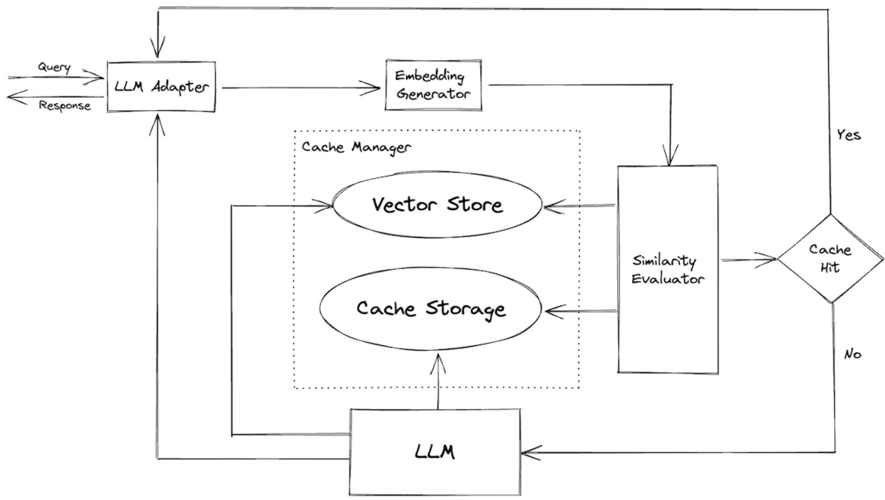

## Caching para Redução de Latência, Custos e Aceleração de Aplicações

### Introdução

Em sistemas de Retrieval-Augmented Generation (RAG) com Large Language Models (LLMs), a latência e os custos operacionais são desafios críticos. A busca por respostas rápidas e econômicas exige a implementação de estratégias eficientes de gerenciamento de recursos. O caching, ou armazenamento em cache, emerge como uma solução fundamental para mitigar esses problemas. Este capítulo explora como o caching pode reduzir significativamente a latência e os custos, além de habilitar casos de uso que demandam tempos de resposta extremamente rápidos.

### Conceitos Fundamentais

O caching, em sua essência, é uma técnica de armazenamento de dados frequentemente acessados em um local de acesso mais rápido. No contexto de sistemas RAG, isso significa armazenar os resultados de consultas, embeddings, documentos recuperados e até mesmo as respostas geradas pelos LLMs, para que possam ser reutilizados em consultas subsequentes idênticas ou semelhantes.

**Benefícios do Caching:**

1.  **Redução de Latência:** Ao evitar a repetição de computações dispendiosas, como a execução de consultas de similaridade ou a inferência em LLMs, o caching reduz drasticamente o tempo de resposta do sistema [^3].
2.  **Redução de Custos:** A diminuição da necessidade de recursos computacionais, como poder de processamento e acesso a bancos de dados, leva a uma redução direta nos custos operacionais [^3].
3.  **Habilitação de Novos Casos de Uso:** A capacidade de fornecer respostas em tempo real abre portas para aplicações que exigem interações rápidas e fluidas, como chatbots interativos, assistentes virtuais e sistemas de recomendação personalizados [^3].

**Estratégias de Caching:**

Diversas estratégias podem ser empregadas para implementar o caching em sistemas RAG. A escolha da estratégia ideal depende das características específicas da aplicação, como o padrão de acesso aos dados, a taxa de atualização dos dados e os requisitos de consistência.

1.  **Cache de Resultados de Consulta:** Armazenar os resultados de consultas de similaridade, permitindo que consultas idênticas sejam respondidas instantaneamente [^3].
2.  **Cache de Embeddings:** Armazenar os embeddings de documentos, evitando a necessidade de recalculá-los repetidamente [^3]. Isso é particularmente útil quando a base de conhecimento não sofre atualizações frequentes.
> 💡 **Exemplo Numérico:** Considere que calcular o embedding de um documento custa 0.01 segundos. Se temos 1000 consultas que envolvem o mesmo documento e o embedding é cacheado, economizamos 1000 * 0.01 = 10 segundos.
3.  **Cache de Documentos Recuperados:** Armazenar os documentos recuperados pelas consultas de similaridade, eliminando a necessidade de acessar o banco de dados original a cada consulta [^3].
4.  **Cache de Respostas Geradas:** Armazenar as respostas geradas pelos LLMs para consultas específicas, permitindo que respostas idênticas sejam fornecidas instantaneamente [^3]. Esta estratégia deve ser utilizada com cautela, considerando a possibilidade de o contexto ter mudado desde a geração original da resposta.
> 💡 **Exemplo Numérico:** Suponha que gerar uma resposta com o LLM custa 0.5 segundos. Se 50 consultas idênticas forem feitas em um curto intervalo de tempo, o cache da resposta economiza (50-1) * 0.5 = 24.5 segundos.
5. **Cache Semântico de Respostas Geradas:** Em vez de armazenar respostas apenas para consultas idênticas, armazenar respostas para consultas semanticamente similares. Isso pode ser alcançado usando embeddings de consultas para encontrar respostas preexistentes que são semanticamente próximas.

**Implementação do Caching:**

A implementação do caching pode ser realizada em diferentes camadas do sistema RAG, utilizando diversas tecnologias.

*   **Cache na Camada de Embedding:** Utilizar bibliotecas como FAISS ou Annoy com índices armazenados em memória para acelerar a busca por similaridade. Esses índices podem ser persistidos em disco e carregados em memória no início da aplicação.
> 💡 **Exemplo Numérico:** Imagine que FAISS reduz o tempo de busca de similaridade de 1 segundo para 0.05 segundos. Se executamos 1000 buscas, economizamos (1 - 0.05) * 1000 = 950 segundos.
*   **Cache na Camada de Recuperação:** Implementar um cache distribuído, como Redis ou Memcached, para armazenar documentos recuperados e resultados de consultas. A chave do cache pode ser um hash da consulta, e o valor pode ser o documento recuperado ou um identificador único do documento.
*   **Cache na Camada de Geração:** Utilizar um banco de dados chave-valor para armazenar as respostas geradas pelos LLMs. A chave pode ser um hash da consulta e do contexto, e o valor pode ser a resposta gerada.

Além das opções mencionadas, outra alternativa para implementar o cache, especialmente na camada de geração, envolve o uso de content-addressable storage:

*   **Cache com Content-Addressable Storage (CAS):** Utilizar um sistema CAS, como IPFS ou um sistema customizado, para armazenar as respostas geradas. Neste caso, o hash do conteúdo da resposta serve como a chave para o armazenamento e recuperação. Isso garante que respostas idênticas sejam armazenadas apenas uma vez e pode simplificar a gestão da coerência do cache.

**Considerações Importantes:**

*   **Invalidation Policies:** Definir políticas claras de invalidação do cache para garantir que os dados armazenados permaneçam relevantes e consistentes. As políticas podem ser baseadas em tempo (TTL - Time To Live), em eventos (atualização de um documento no banco de dados original) ou em número de acessos (LRU - Least Recently Used).
> 💡 **Exemplo Numérico:** Uma política TTL de 1 hora significa que a resposta é considerada válida por 1 hora. Após esse período, a resposta é removida do cache e precisa ser regenerada na próxima consulta.
*   **Cache Size:** Dimensionar adequadamente o tamanho do cache para equilibrar o desempenho e o consumo de recursos. Um cache muito pequeno pode resultar em uma alta taxa de "cache misses", enquanto um cache muito grande pode consumir recursos desnecessários.
*   **Cache Coherence:** Garantir a coerência do cache em sistemas distribuídos, utilizando mecanismos de sincronização e replicação.
*   **Trade-offs:** Avaliar os trade-offs entre consistência, latência e custo ao implementar o caching. Em alguns casos, pode ser aceitável tolerar um pequeno grau de inconsistência em prol de uma latência significativamente menor.

Para formalizar a relação entre tamanho do cache, taxa de acertos e latência, podemos introduzir o seguinte teorema:

**Teorema 1:** Seja $L_h$ a latência de um acerto no cache (cache hit latency), $L_m$ a latência de uma falha no cache (cache miss latency), e $H$ a taxa de acertos no cache (hit rate). A latência média $L_{avg}$ é dada por:

$L_{avg} = H \cdot L_h + (1 - H) \cdot L_m$

*Prova:* A latência média é uma média ponderada da latência de acertos e falhas, ponderada pelas suas respectivas probabilidades (hit rate e miss rate).

> 💡 **Exemplo Numérico:** Suponha que a latência de um acerto no cache ($L_h$) é de 0.01 segundos, a latência de uma falha no cache ($L_m$) é de 1 segundo e a taxa de acertos ($H$) é de 0.8 (80%).  Então, a latência média é:
> $L_{avg} = 0.8 * 0.01 + (1 - 0.8) * 1 = 0.008 + 0.2 = 0.208 \text{ segundos}$
> Se aumentarmos a taxa de acertos para 0.95 (95%) com um cache maior:
> $L_{avg} = 0.95 * 0.01 + (1 - 0.95) * 1 = 0.0095 + 0.05 = 0.0595 \text{ segundos}$
> Isso demonstra uma redução significativa na latência média ao aumentar a taxa de acertos.

Este teorema demonstra formalmente como a taxa de acertos no cache afeta diretamente a latência média do sistema. Aumentar o tamanho do cache geralmente aumenta a taxa de acertos, reduzindo assim a latência média.

### Conclusão

O caching é uma técnica poderosa para otimizar sistemas RAG, reduzindo a latência, os custos e habilitando novos casos de uso. A escolha da estratégia de caching e a sua implementação devem ser cuidadosamente consideradas, levando em conta as características específicas da aplicação e os trade-offs envolvidos. Uma implementação bem planejada do caching pode resultar em melhorias significativas no desempenho e na usabilidade do sistema RAG.

### Referências

[^3]: Caching can significantly reduce latency and costs, and enable use cases that require very fast response times.
<!-- END -->