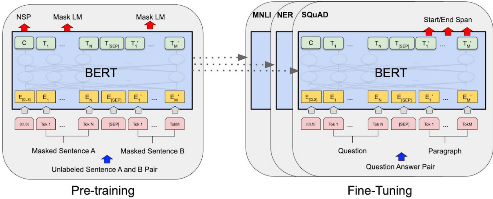
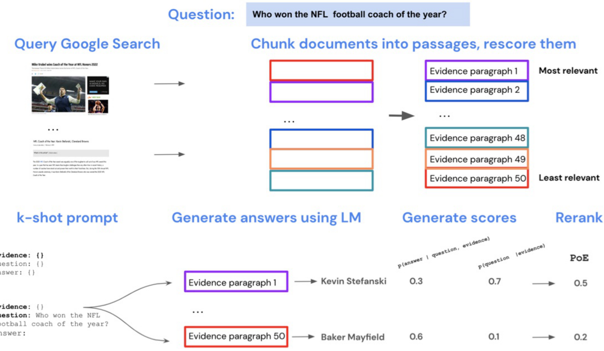
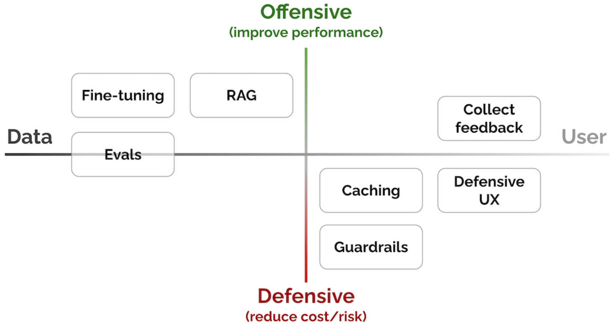

The image illustrates a process for training a reward model (RM) in the context of LLMs, as described on page 17 of the document. Initially, a prompt is given to an LLM, producing multiple outputs, which are then ranked by a labeler from best to worst based on human preference. This ranked data trains the reward model to accurately assess the quality of LLM outputs, using the resulting reward for proximal policy optimization (PPO) to refine the language model's policy.

This image (Figure 7 in the document) illustrates an example of code generation output, demonstrating how the CodeT5+ retrieval-augmented generation model can retrieve relevant code context to facilitate better code generation. The figure presents Python code snippets for downloading and compressing HTTP resources, comparing a standard generative approach with the retrieval-augmented approach. The image underscores the utility of RAG in providing context that enhances the accuracy of generated code, as discussed in the "Retrieval-Augmented Generation" section of the document.

This diagram illustrates the 'Caching' pattern for LLM-based systems, as discussed in the document. It details the process of caching LLM responses to reduce latency and cost by storing LLM responses and using embeddings for similarity checks. The flow involves an LLM Adapter, Embedding Generator, Cache Manager with Vector Store and Cache Storage, and a Similarity Evaluator to determine cache hits.

The image presents a comparison of prompts used across different implementations of the MMLU benchmark, specifically for evaluating how the 2008 financial crisis affected America's international reputation (as referenced on page 4 of the document). The side-by-side comparison highlights variations in the prompts utilized by the Original implementation (Ollmer PR), HELM commit cab5d89, and AI Harness commit e47e01b, showcasing how prompt engineering and choice of phrasing can impact LLM evaluations and benchmark consistency. Differences in question structure (e.g., 'How did' vs 'Question: How did') and answer presentation (e.g., inclusion of 'Choices:' prefix in AI Harness) demonstrate subtle variances in benchmark design. Evaluation approach and the specific eval for the same question across MMLU implementations can be found in the article.

The image illustrates the architecture of Retrieval-Enhanced Transformer (RETRO), a model that combines a frozen BERT retriever, a differentiable encoder, and chunked cross-attention to generate output, as described on page 8 and 9. The left side of the diagram depicts a simplified view of the RETRO architecture where an input sequence is split into chunks, each of which retrieves neighbors via a frozen kNN Retriever using BERT embeddings. The right side details the chunked cross-attention (CCA) operator, showing how the encoded neighbors influence the attended activations of the input chunk to condition the generation of the next chunk.

The image illustrates the overall framework of G-Eval, a method for evaluating Natural Language Generation (NLG) outputs as described in Section 5 of the document. It begins by inputting task instructions and evaluation criteria into a Large Language Model (LLM), prompting the generation of detailed evaluation steps using Chain-of-Thought (CoT). The resulting CoT and prompt are then used to evaluate NLG outputs in a form-filling paradigm, ultimately producing a probability-weighted summation of output scores as a final evaluation score.

The image shows a comparison of RETRO-fitting performance against a baseline transformer, as discussed in the section on fine-tuning. It illustrates how any transformer can be fine-tuned into a retrieval-enhanced version by initializing and training only the chunked cross-attention and retrieval encoder weights, showing improvements in perplexity (ppl) on C4, Curation Corpus, and Wikitext103, and accuracy on LAMBADA. The plots show that fine-tuning rapidly recovers performance and nearly matches a retrieval model trained from scratch.

A imagem ilustra o processo de treinamento de um modelo de linguagem usando aprendizado por reforço com feedback humano (RLHF), detalhado na seção sobre 'Fine-tuning' do documento. O diagrama descreve as três etapas principais: coleta de dados de demonstração para ajuste fino supervisionado (SFT), coleta de dados de comparação para treinamento do modelo de recompensa (RM) e otimização da política por meio de otimização de política proximal (PPO). O fluxo iterativo permite que o modelo aprenda a gerar respostas alinhadas com as preferências humanas.

A imagem compara a reprodutibilidade, comparabilidade e correção das avaliações de modelos de machine learning usando ROUGE (Recall-Oriented Understudy for Gisting Evaluation) em diferentes contextos. A parte (A) mostra a reprodutibilidade dos resultados em várias áreas científicas, evidenciando a baixa reprodutibilidade das avaliações de modelos de linguagem em comparação com estudos em psicologia, economia, ciências sociais e biologia do câncer, conforme discutido na seção sobre 'Evals' (páginas 2-4). A parte (B) indica fatores que afetam a comparabilidade dos scores ROUGE, incluindo a falta de código de release completo, testes de significância e parâmetros de configuração, além de citações imprecisas de pacotes de software, conforme mencionado na discussão sobre a dificuldade em comparar scores ROUGE.

The image illustrates the steps of supervised fine-tuning (SFT) for instruction following of a base LLM as part of a reward model (RM) training and proximal policy optimization (PPO). The graphic illustrates the refinement of prompts and responses from an initial instruction to the subsequent actions of fine-tuning. This process involves iterative adjustments to the model based on labelled data, as described in the "Fine-tuning: To get better at specific tasks" section.

A imagem ilustra o processo de pre-treinamento e fine-tuning do modelo BERT, conforme mencionado na página 15 do documento. O diagrama compara as arquiteturas utilizadas nessas duas etapas, destacando a utilização das mesmas arquiteturas, com exceção das camadas de saída. O pre-treinamento envolve tarefas como Next Sentence Prediction (NSP) e Masked Language Modeling (Mask LM), enquanto o fine-tuning é adaptado para tarefas específicas, como MNLI, NER e SQuAD, utilizando um par de pergunta e parágrafo para gerar um intervalo inicial e final.

The image, referenced as Figure 1 in the document, illustrates and contrasts how BERTScore (left) and MoverScore (right) map semantically related words from a generated sequence to their counterparts in a reference sequence. In BERTScore, alignment is one-to-one, while MoverScore allows for many-to-one matching, facilitating the measurement of semantic distance. The example sentences and word embeddings provide a visual representation of the scores' underlying alignment methodologies.

This bar graph, located on page 4 of the document, illustrates the results of a systematic review of ROUGE model evaluations, indicating that 76% of citations to ROUGE package software reference versions with scoring errors. This finding highlights a significant issue in the use of ROUGE within machine learning evaluations, specifically in the context of automated summarization tasks. The data emphasizes the importance of verifying and testing evaluation software implementations to ensure the correctness of research results.

This diagram categorizes several patterns used in building LLM-based systems, organizing them along two axes: "Data to User" and "Defensive to Offensive", as seen in the document. On the "Data to User" axis, patterns are positioned based on whether they primarily focus on improving the processing and quality of data or enhancing the user experience. On the "Defensive to Offensive" axis, patterns are classified by their aim of either reducing cost/risk (defensive) or improving performance (offensive). The patterns shown include Evals, Fine-tuning, RAG, Caching, Guardrails, Defensive UX, and Collect feedback. See document page 1 for more context.

The image illustrates different approaches to evaluation for the same question within MMLU (Massive Multitask Language Understanding), as described on page 4 of the document. It shows the variations in prompt structure and the evaluation method employed by 'Original implementation', 'HELM', and 'AI Harness' (as of Jan 2023), highlighting differences in how each system compares predicted probabilities or generates text to determine the answer.

The image illustrates the architecture of an Adapter module within a Transformer network, as discussed in the document section on "Fine-tuning: To get better at specific tasks." It shows how adapters, consisting of bottleneck layers and skip-connections, are integrated within Transformer blocks to enhance performance. The diagram contrasts a standard Transformer layer with an adapter-enhanced layer, highlighting the strategic insertion points of adapters after multi-headed attention and feed-forward layers, offering a parameter-efficient fine-tuning technique.

This image illustrates the architecture of a Retrieval Augmented Generation (RAG) model, a technique used to enhance language model outputs by incorporating external knowledge. It shows the process from query encoding to document retrieval and answer generation, including components like the Query Encoder, Retriever, Document Index, and Generator (see page 8). The diagram details how Maximum Inner Product Search (MIPS) is used to find relevant documents and how the model marginalizes over seq2seq predictions to produce a final answer.

A imagem ilustra duas abordagens distintas para ajuste fino de modelos Transformer, comparando 'Fine-tuning' tradicional com 'Prefix-tuning'. Na parte superior, o 'Fine-tuning' envolve a atualização de todos os parâmetros do modelo, enquanto na parte inferior, o 'Prefix-tuning' mantém os parâmetros originais congelados, otimizando apenas os prefixos adicionados. A imagem destaca a eficiência de espaço do 'Prefix-tuning', que requer armazenar apenas os prefixos para cada tarefa, conforme mencionado na página 17.

Esta imagem esquematiza a arquitetura de Internet-Augmented Language Models (IALMs), um conceito abordado na seção 3 do documento. O diagrama ilustra o processo desde a consulta inicial no Google Search até o reranking das respostas geradas pelo modelo de linguagem (LM), mostrando como evidências extraídas da web são incorporadas para aprimorar a qualidade e precisão das respostas. A imagem detalha as etapas de chunking de documentos, geração de escores e o uso de k-shot prompts, destacando a interação entre o LM e as informações recuperadas da web para otimizar a resposta final.

A imagem ilustra as diferentes etapas do ULMFiT (Universal Language Model Fine-tuning) para modelos de linguagem, detalhando o pre-treinamento do modelo de linguagem (LM), o ajuste fino do LM e o ajuste fino do classificador, cada um com camadas distintas, como camada de embedding, camadas intermediárias e camada softmax, adaptadas para tarefas específicas, conforme descrito na página 14 do documento.

The image provides a visual summary of guidelines for human-AI interaction across the user journey, as referenced throughout the document. It's divided into three phases: 'Initially', 'During Interaction', and 'Over Time', with each phase containing specific actionable guidelines related to AI system behavior and user experience, such as ensuring clarity, context, and adaptability. The guidelines are grouped into conceptual areas that describe how AI behavior should function to create a better user experience. The image also contains guidance for 'When Wrong', such as correcting errors.

This image illustrates the Hypothetical Document Embeddings (HyDE) model described in the document. It shows how HyDE uses a large language model (LLM), like InstructGPT, to generate a hypothetical document from a given query, and then encodes this document into an embedding vector using an unsupervised encoder, such as Contriever, as described on page 11 of the provided document. This embedding is then used to retrieve real documents for tasks such as question answering.

The image illustrates different finetuning methods and their associated memory requirements, as referenced in the "Fine-tuning" section. It presents a comparative visualization of Full Finetuning, LoRA (Low-Rank Adaptation), and QLoRA, emphasizing the reduction in memory footprint achieved by QLoRA through quantizing the transformer model to 4-bit precision and using paged optimizers. Parameter updates, gradient flow, and paging flow are visualized to show how the model parameters are updated during training for each method.

Este diagrama organiza sete padrões-chave para a construção de sistemas e produtos baseados em LLMs (Large Language Models), posicionando-os ao longo de dois eixos principais: do "Dado" ao "Usuário" e de estratégias "Defensivas" (reduzir custo/risco) a "Ofensivas" (melhorar o desempenho). Os padrões listados incluem "Fine-tuning", "RAG" (Retrieval-Augmented Generation) e "Evals" (para medição de desempenho) no lado dos dados e para estratégias ofensivas; "Collect feedback" para estratégias ofensivas e mais próximas do usuário; e "Caching", "Defensive UX" e "Guardrails" para estratégias defensivas. A imagem visa ilustrar como diferentes técnicas de LLM se relacionam em termos de seus objetivos e da parte do sistema em que atuam.

A imagem representa um diagrama do método Low-Rank Adaptation (LoRA), técnica que usa adaptadores projetados como produto de duas matrizes de baixa dimensão. Essa técnica, discutida na página 18 do documento, adapta modelos de linguagem pré-treinados a tarefas específicas de forma eficiente, minimizando a necessidade de ajustes em grande escala nos parâmetros do modelo original.

The image illustrates the architecture of a Transformer model and its training objectives for diverse tasks, as discussed in the document, particularly focusing on the fine-tuning methods. On the left, it shows the Transformer's internal structure, detailing components such as the "Text & Position Embed", "Masked Multi Self Attention", "Layer Norm", and "Feed Forward" networks, repeated twelve times, culminating in "Text Prediction" and a "Task Classifier". The right side displays input transformations for fine-tuning the model on tasks like classification, entailment, similarity, and multiple choice, converting structured inputs into token sequences for processing, potentially referenced in the section about fine-tuning methods.

The image illustrates the architecture of the Fusion-in-Decoder (FiD) method, which is described in the document under the "Fusion-in-Decoder (FiD)" section. It visually represents how the question and multiple passages are independently encoded, concatenated, and then processed by a decoder to produce the final answer. This architecture is a method of how to retrieve relevant documents with Generative Models for open-domain QA.

The image depicts the architecture of the T5 model, a text-to-text transformer, as referenced on page 16 of the provided document. It illustrates how T5 treats various tasks, such as translation, question answering, and summarization, by framing them as text input and text output. This architecture allows T5 to utilize the same model, loss function, and hyperparameters across a diverse set of tasks, establishing a standardized framework for different natural language processing methods.
