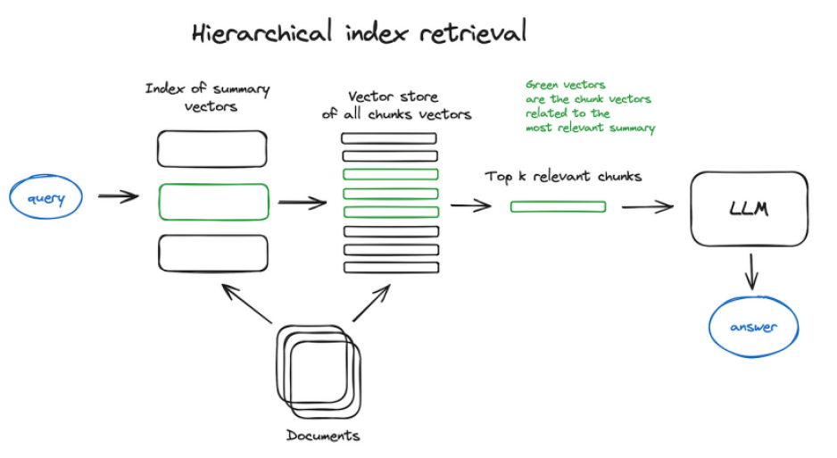

## RAG e Aplicações de Question Answering e Chat

### Introdução
A arquitetura Retrieval-Augmented Generation (RAG) emergiu como uma solução eficaz para aprimorar modelos de linguagem grandes (LLMs) com conhecimento externo e atualizado. Este capítulo explora como RAG capacita aplicações de *question answering* e *chat*, integrando motores de busca da web com LLMs e habilitando aplicações de *chat-with-your-data* [^2]. Além disso, discutiremos o papel crucial de bibliotecas de código aberto como LangChain e LlamaIndex, que fornecem as ferramentas necessárias para a construção de pipelines e aplicações baseadas em LLMs, facilitando a implementação de RAG [^2].

### Conceitos Fundamentais
O RAG aborda a limitação dos LLMs em relação ao conhecimento factual, permitindo que acessem e integrem informações externas no processo de geração de respostas [^2]. Isso é particularmente útil em cenários onde as informações necessárias não estão presentes nos dados de treinamento do LLM ou quando se deseja fornecer respostas baseadas em dados atualizados [^2].

**1. Question Answering (QA) com RAG:**
Em aplicações de *question answering*, o RAG permite que o LLM responda perguntas com base em um conjunto de documentos relevantes recuperados dinamicamente [^2]. O processo geralmente envolve as seguintes etapas:

1.  **Consulta:** O usuário faz uma pergunta.
2.  **Recuperação:** Um motor de busca (como um índice vetorial) recupera os documentos mais relevantes para a pergunta.
3.  **Aumento:** A pergunta original é aumentada com os documentos recuperados.
4.  **Geração:** O LLM usa a pergunta aumentada para gerar uma resposta.

Formalmente, seja $q$ a pergunta do usuário e $D = \{d_1, d_2, ..., d_n\}$ um conjunto de documentos. O objetivo é encontrar um subconjunto $D' \subseteq D$ de documentos relevantes para $q$. A relevância pode ser definida por uma função de similaridade $s(q, d_i)$ entre a pergunta $q$ e cada documento $d_i$. O conjunto $D'$ é então definido como:

$$D' = \{d_i \in D \mid s(q, d_i) > \theta\}$$

Onde $\theta$ é um limiar de relevância. A resposta $r$ é gerada pelo LLM com base em $q$ e $D'$:

$$r = LLM(q, D')$$

**Teorema 1** (Otimização do Limiar de Relevância): A escolha do limiar de relevância $\theta$ impacta diretamente a precisão e a revocação da resposta gerada.

*Prova*: Um valor de $\theta$ muito alto pode levar à exclusão de documentos relevantes (baixa revocação), enquanto um valor muito baixo pode incluir documentos irrelevantes, diminuindo a precisão. A otimização de $\theta$ envolve encontrar um equilíbrio entre esses dois fatores, frequentemente utilizando técnicas de validação cruzada em um conjunto de dados de perguntas e respostas conhecidas.

> 💡 **Exemplo Numérico:**
>
> Suponha que temos um conjunto de 5 documentos e uma pergunta. Calculamos a similaridade entre a pergunta e cada documento usando alguma métrica (e.g., similaridade de cossenos dos embeddings) obtendo os seguintes scores:
>
> | Documento | Similaridade |
> | --------- | ------------ |
> | $d_1$     | 0.85         |
> | $d_2$     | 0.70         |
> | $d_3$     | 0.92         |
> | $d_4$     | 0.60         |
> | $d_5$     | 0.78         |
>
> Se definirmos o limiar de relevância $\theta = 0.75$, então o conjunto de documentos relevantes $D'$ será {$d_1$, $d_3$, $d_5$}. Se diminuirmos o limiar para $\theta = 0.65$, $D'$ se torna {$d_1$, $d_2$, $d_3$, $d_5$}, aumentando o recall mas possivelmente diminuindo a precisão. A escolha ótima de $\theta$ depende do trade-off entre precisão e recall desejado para a aplicação.
>
> Para encontrar o melhor valor para $\theta$, podemos usar um conjunto de validação. Por exemplo, podemos testar diferentes valores de $\theta$ e medir a precisão e o recall da resposta gerada pelo LLM. Suponha que obtemos os seguintes resultados:
>
> | $\theta$ | Precisão | Recall |
> | -------- | -------- | ------ |
> | 0.60     | 0.70     | 0.90   |
> | 0.70     | 0.80     | 0.85   |
> | 0.80     | 0.90     | 0.75   |
> | 0.90     | 0.95     | 0.60   |
>
> Neste caso, $\theta = 0.80$ parece ser um bom compromisso entre precisão e recall.

**1.1 Relevância Ponderada:**
É importante notar que nem todos os documentos em $D'$ contribuem igualmente para a resposta. Introduzimos um peso $w_i$ para cada documento $d_i \in D'$ que reflete sua relevância relativa à pergunta $q$. A resposta $r$ é então gerada considerando esses pesos:

$$r = LLM(q, \{(d_i, w_i) \mid d_i \in D' \})$$

A função de similaridade $s(q, d_i)$ pode ser usada para derivar os pesos $w_i$. Por exemplo, podemos normalizar os valores de similaridade:

$$w_i = \frac{s(q, d_i)}{\sum_{d_j \in D'} s(q, d_j)}$$

Essa abordagem permite que o LLM foque nos documentos mais relevantes ao gerar a resposta.

> 💡 **Exemplo Numérico:**
>
> Usando o exemplo anterior com $D' = \{d_1, d_3, d_5\}$ e as similaridades 0.85, 0.92, e 0.78, podemos calcular os pesos normalizados:
>
> $\text{Total Similaridade} = 0.85 + 0.92 + 0.78 = 2.55$
>
> $w_1 = \frac{0.85}{2.55} \approx 0.33$
> $w_3 = \frac{0.92}{2.55} \approx 0.36$
> $w_5 = \frac{0.78}{2.55} \approx 0.31$
>
> O LLM agora recebe $q$ e $\{(d_1, 0.33), (d_3, 0.36), (d_5, 0.31)\}$.  Isso instrui o LLM a dar mais importância a $d_3$ (ligeiramente), pois ele tem a maior relevância ponderada.

**2. Chat Applications com RAG:**
Em aplicações de *chat*, o RAG permite que o LLM mantenha conversas informativas e contextuais, acessando e integrando informações externas em cada turno da conversa [^2]. Similar ao QA, o processo envolve a recuperação de informações relevantes, mas com a adição do histórico da conversa para manter o contexto.

Seja $H = \{h_1, h_2, ..., h_t\}$ o histórico da conversa, onde $h_i$ representa o i-ésimo turno da conversa. A pergunta atual $q_t$ é combinada com o histórico $H$ para formar uma consulta contextual $q'_t$:

$$q'_t = f(q_t, H)$$

Onde $f$ é uma função que combina a pergunta atual com o histórico da conversa. Os documentos relevantes $D'$ são recuperados com base em $q'_t$, e a resposta $r_t$ é gerada pelo LLM:

$$r_t = LLM(q'_t, D')$$

**Lema 2** (Preservação do Contexto): A função $f(q_t, H)$ deve preservar o contexto relevante do histórico da conversa $H$ para garantir a coerência e a relevância da resposta $r_t$.

*Prova*: A perda de contexto pode levar a respostas irrelevantes ou contraditórias. A função $f$ pode empregar técnicas como sumarização do histórico, seleção de turnos relevantes ou uso de vetores de embedding para representar o contexto. A escolha da técnica depende da complexidade da conversa e dos recursos computacionais disponíveis.

> 💡 **Exemplo Numérico:**
>
> Suponha o seguinte histórico de conversa:
>
> $h_1$: Usuário: "Qual é a capital da França?"
> $h_2$: LLM: "A capital da França é Paris."
> $h_3$: Usuário: "E qual é a população dessa cidade?" ($q_t$)
>
> Aqui, $q_t =$ "E qual é a população dessa cidade?". Se usarmos concatenação simples, $q'_t =$ "Qual é a capital da França? A capital da França é Paris. E qual é a população dessa cidade?". O motor de busca irá procurar por documentos relevantes para essa consulta completa. Se usarmos uma sumarização simples, podemos resumir o histórico para "Pergunta sobre Paris". Então $q'_t =$ "Qual é a população de Paris?". Essa última consulta é mais concisa e direcionada.

**2.1 Estratégias para Gerenciamento do Histórico:**
A função $f(q_t, H)$ pode ser implementada utilizando diferentes estratégias, cada uma com suas vantagens e desvantagens:

*   **Concatenação Simples:** Concatena a pergunta atual $q_t$ com todo o histórico $H$. Essa abordagem é simples, mas pode levar a consultas muito longas, afetando o desempenho do motor de busca e do LLM.

*   **Sumarização do Histórico:** Resume o histórico $H$ para um tamanho fixo antes de combiná-lo com a pergunta atual $q_t$. Isso reduz o tamanho da consulta, mas pode levar à perda de informações importantes.

*   **Seleção de Turnos Relevantes:** Seleciona apenas os turnos do histórico $H$ que são mais relevantes para a pergunta atual $q_t$. Isso pode ser feito utilizando técnicas de similaridade semântica entre a pergunta e cada turno do histórico.

A escolha da estratégia ideal depende das características da aplicação e dos recursos computacionais disponíveis.

> 💡 **Exemplo Numérico:**
>
> Considere uma conversa sobre diferentes modelos de carros.
>
> | Turno | Usuário/LLM                                   |
> | ----- | --------------------------------------------- |
> | 1     | Usuário: Fale sobre o Toyota Corolla.        |
> | 2     | LLM: O Toyota Corolla é um carro confiável... |
> | 3     | Usuário: E o Honda Civic?                   |
> | 4     | LLM: O Honda Civic é um carro popular...     |
> | 5     | Usuário: Qual deles é mais econômico?         |
>
> *   **Concatenação:** A consulta para o turno 5 seria "Fale sobre o Toyota Corolla. O Toyota Corolla é um carro confiável... E o Honda Civic? O Honda Civic é um carro popular... Qual deles é mais econômico?".

> *   **Sumarização:** O histórico poderia ser resumido para "Comparação entre Toyota Corolla e Honda Civic". A consulta para o turno 5 seria "Qual dos carros comparados (Toyota Corolla e Honda Civic) é mais econômico?".
>
> *   **Seleção:** A consulta para o turno 5 poderia manter apenas os turnos 1, 2, 3 e 4, focando nos carros específicos.

**3. Integração com Web Search Engines:**
O RAG pode ser integrado com motores de busca da web para acessar informações atualizadas e abrangentes [^2]. Isso permite que o LLM responda perguntas sobre eventos recentes, tendências atuais e outras informações que podem não estar presentes em seus dados de treinamento.

**4. Chat-with-your-data Applications:**
As aplicações de *chat-with-your-data* permitem que os usuários interajam com seus próprios dados usando linguagem natural [^2]. Isso é particularmente útil para acessar e analisar informações armazenadas em documentos, bancos de dados e outras fontes de dados. O RAG facilita essa interação, permitindo que o LLM recupere e integre informações relevantes dos dados do usuário para responder às suas perguntas.

**Proposição 3:** (Indexação Semântica para Dados Privados): A eficácia das aplicações *chat-with-your-data* depende crucialmente da construção de um índice semântico preciso sobre os dados privados do usuário.

*Prova*: Um índice semântico bem construído permite a recuperação eficiente de informações relevantes, mesmo quando as consultas do usuário não correspondem exatamente aos termos nos documentos. Técnicas como embeddings de documentos e indexação vetorial são essenciais para capturar o significado semântico dos dados e facilitar a busca por similaridade.

> 💡 **Exemplo Numérico:**
>
> Imagine um sistema de chat com seus documentos financeiros. O usuário pergunta: "Qual foi o meu lucro total no último trimestre?".
>
> O sistema precisa:
> 1.  **Entender a pergunta:** Identificar a intenção do usuário (calcular lucro total) e o período (último trimestre).
> 2.  **Recuperar documentos relevantes:** Buscar documentos financeiros do último trimestre, como balanços, demonstrativos de resultados e extratos bancários.
> 3.  **Extrair informações:** Analisar os documentos para identificar as receitas e despesas do período.
> 4.  **Calcular o lucro:** Subtrair as despesas das receitas.
> 5.  **Gerar a resposta:** "Seu lucro total no último trimestre foi de R\$ 150.000,00."
>
> A qualidade da resposta depende da capacidade do sistema em recuperar os documentos corretos e extrair as informações relevantes.

**5. Open-source Libraries: LangChain e LlamaIndex:**
Bibliotecas de código aberto como LangChain e LlamaIndex fornecem ferramentas e abstrações que simplificam a construção de pipelines e aplicações baseadas em LLMs [^2]. Essas bibliotecas oferecem funcionalidades como:

*   **Conectores de dados:** Permitem que o LLM acesse dados de diversas fontes.
*   **Índices vetoriais:** Facilitam a recuperação eficiente de documentos relevantes.
*   **Pipelines de RAG:** Simplificam a implementação de arquiteturas RAG.
*   **Ferramentas de avaliação:** Ajudam a avaliar e melhorar o desempenho de aplicações RAG.

### Conclusão
O RAG representa um avanço significativo na forma como os LLMs podem ser utilizados para responder perguntas, manter conversas e interagir com dados [^2]. Ao integrar motores de busca da web e bibliotecas de código aberto, o RAG capacita aplicações de *question answering* e *chat* com conhecimento externo e atualizado, abrindo novas possibilidades para a interação humano-computador. A facilidade de implementação proporcionada por bibliotecas como LangChain e LlamaIndex democratiza o acesso a essa tecnologia, permitindo que desenvolvedores de todos os níveis criem aplicações inovadoras baseadas em RAG.

### Referências
[^2]: Informações fornecidas no contexto.
<!-- END -->