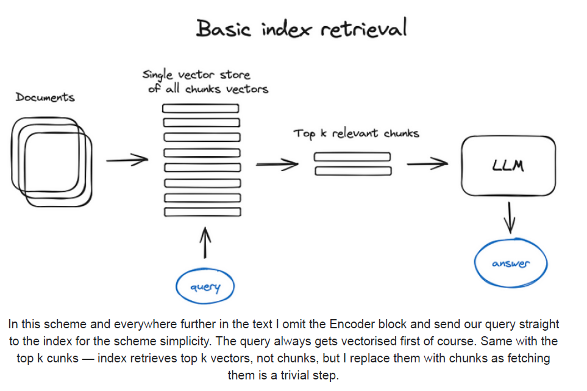

## Chunking para Recuperação Semântica Eficiente

### Introdução

Em sistemas de *Retrieval-Augmented Generation* (RAG) e *Neural Information Retrieval*, a etapa de **chunking** desempenha um papel fundamental na otimização da relevância e da eficiência da recuperação de informações [^1]. Dado que os modelos *transformer*, incluindo *Large Language Models* (LLMs), possuem um limite fixo no tamanho da sequência de entrada, torna-se imprescindível dividir documentos extensos em segmentos menores e mais manejáveis, denominados *chunks*. O objetivo primordial do chunking é garantir que cada chunk preserve o significado semântico essencial do texto original, ao mesmo tempo em que se ajusta às restrições de tamanho da janela de contexto do modelo [^1]. Este capítulo se aprofundará nas técnicas e considerações envolvidas no processo de chunking, com foco em implementações práticas e nas implicações para o desempenho do sistema RAG.

### Conceitos Fundamentais

O processo de **chunking** envolve a divisão de documentos iniciais em segmentos de tamanho apropriado, de forma a manter o significado semântico e se ajustar ao limite de comprimento da sequência de entrada dos modelos *transformer* [^1]. A escolha do tamanho ideal do chunk é crucial e depende de diversos fatores, incluindo a natureza do texto, a arquitetura do modelo *transformer* utilizado e a tarefa específica em questão. Chunks muito pequenos podem perder o contexto necessário para uma representação semântica precisa, enquanto chunks excessivamente grandes podem exceder o limite de tamanho da sequência do modelo ou introduzir ruído na recuperação.

**Text splitters** são implementações utilizadas para realizar o chunking, frequentemente empregando estratégias como separação por frases ou parágrafos [^1]. A escolha do text splitter adequado depende das características do texto e dos objetivos da tarefa. Por exemplo, para documentos com estrutura hierárquica bem definida, um text splitter que preserva a estrutura de parágrafos pode ser mais apropriado. Em outros casos, a separação por frases pode ser preferível para garantir que cada chunk contenha uma unidade semântica completa.

#### Tamanho do Chunk e Overlap

Um parâmetro importante no chunking é o **tamanho do chunk**, que define o número de tokens ou caracteres em cada segmento. Outro parâmetro relevante é o **overlap**, que especifica a quantidade de sobreposição entre chunks adjacentes. O overlap é utilizado para garantir que o contexto semântico seja preservado entre os chunks, especialmente em casos onde informações cruciais podem estar localizadas nas fronteiras entre os segmentos.

A definição dos parâmetros de tamanho do chunk e overlap envolve um *trade-off* entre a precisão semântica, a cobertura contextual e a eficiência computacional. Chunks menores com maior overlap podem capturar melhor o contexto local, mas aumentam o número total de chunks e, consequentemente, o custo computacional da indexação e da busca. Chunks maiores com menor overlap reduzem o custo computacional, mas podem comprometer a precisão semântica e a cobertura contextual.

> 💡 **Exemplo Numérico:** Considere um documento de 1000 tokens. Vamos comparar diferentes configurações de chunk size e overlap:
>
> | Chunk Size (c) | Overlap (o) | Número de Chunks (n) ≈ (1000 - o) / (c - o) |
> |----------------|-------------|---------------------------------------------|
> | 100            | 0           | (1000 - 0) / (100 - 0) = 10                |
> | 100            | 20          | (1000 - 20) / (100 - 20) = 12.25 ≈ 13      |
> | 50             | 0           | (1000 - 0) / (50 - 0) = 20                 |
> | 50             | 10          | (1000 - 10) / (50 - 10) = 24.75 ≈ 25      |
>
> Este exemplo ilustra como aumentar o overlap ou diminuir o chunk size resulta em um número maior de chunks. Um número maior de chunks aumenta o custo computacional, pois é preciso indexar e buscar em mais segmentos. Reduzir o chunk size sem aumentar o overlap pode levar à perda de contexto.

Para formalizar essa relação, podemos definir algumas métricas. Seja $N$ o tamanho total do documento em tokens, $c$ o tamanho do chunk, e $o$ o tamanho do overlap. O número total de chunks, $n$, pode ser estimado por:

$$n \approx \frac{N - o}{c - o}$$

Portanto, aumentar $o$ para um $c$ fixo aumentará $n$, refletindo o aumento no custo computacional.

#### Estratégias de Chunking

Existem diversas estratégias de chunking que podem ser aplicadas, dependendo das características do texto e dos objetivos da tarefa. Algumas estratégias comuns incluem:

*   **Chunking baseado em tamanho fixo:** Divide o texto em segmentos de tamanho predefinido, independentemente do conteúdo. Essa estratégia é simples e eficiente, mas pode resultar em chunks que não preservam a integridade semântica.
*   **Chunking baseado em separadores:** Utiliza separadores específicos, como quebras de linha, pontos finais ou outros delimitadores, para identificar os limites dos chunks. Essa estratégia é mais adaptável ao conteúdo do texto e pode preservar melhor a integridade semântica.
*   **Chunking semântico:** Emprega técnicas de processamento de linguagem natural (PLN) para identificar os limites dos chunks com base em critérios semânticos, como mudanças de tópico ou a ocorrência de entidades importantes. Essa estratégia é mais complexa e computacionalmente intensiva, mas pode resultar em chunks que representam unidades semânticas coesas.

> 💡 **Exemplo Numérico:**
>
> Considere o seguinte texto: *"O gato miava alto. O cachorro latiu em resposta. Ambos estavam no jardim. O dia estava ensolarado."*
>
> **Chunking baseado em tamanho fixo (chunk size = 15 caracteres):**
>
> *   Chunk 1: "O gato miava a"
> *   Chunk 2: "lto. O cachorr"
> *   Chunk 3: "o latiu em res"
> *   Chunk 4: "posta. Ambos es"
> *   Chunk 5: "tavam no jardi"
> *   Chunk 6: "m. O dia estava"
> *   Chunk 7: " ensolarado."
>
> **Chunking baseado em separadores (frases):**
>
> *   Chunk 1: "O gato miava alto."
> *   Chunk 2: "O cachorro latiu em resposta."
> *   Chunk 3: "Ambos estavam no jardim."
> *   Chunk 4: "O dia estava ensolarado."
>
> O chunking baseado em separadores preserva melhor a integridade semântica das frases.

É importante notar que a escolha da estratégia de chunking pode depender da linguagem do texto. Por exemplo, algumas linguagens são mais fáceis de segmentar em frases do que outras. Além disso, a presença de abreviações e acrônimos pode complicar a segmentação baseada em separadores.

**Proposição 1:** A eficácia do chunking baseado em separadores depende da qualidade e da consistência dos separadores no texto de entrada. Textos com separadores ambíguos ou inconsistentes podem levar a chunks mal formados e à perda de informação semântica.

*Proof Strategy:* Esta proposição é uma observação direta sobre a dependência do chunking baseado em separadores na estrutura do texto. Textos mal formatados ou com uso inconsistente de pontuação podem comprometer a capacidade do text splitter de identificar limites semânticos adequados.

Para melhorar a robustez do chunking baseado em separadores, podemos considerar o uso de expressões regulares para identificar padrões de separadores mais complexos.

#### Vectorization

Após a etapa de chunking, cada chunk é convertido em um vetor numérico, que representa a sua semântica. Esse processo, conhecido como **vectorization**, permite que os chunks sejam indexados e comparados de forma eficiente, utilizando técnicas de similaridade vetorial. Os modelos de *word embeddings* e *sentence embeddings*, como *Word2Vec*, *GloVe*, *BERT* e *SentenceBERT*, são frequentemente utilizados para gerar os vetores de representação dos chunks.

> 💡 **Exemplo Numérico:**
>
> Suponha que temos dois chunks:
>
> *   Chunk 1: "O gato está dormindo."
> *   Chunk 2: "O felino descansa."
>
> Usando um modelo de sentence embedding (como SentenceBERT), podemos obter vetores para esses chunks.  Suponha que após a vectorização, obtemos os seguintes vetores (simplificados para demonstração):
>
> *   Vetor 1 (Chunk 1): `[0.1, 0.2, 0.3, 0.4]`
> *   Vetor 2 (Chunk 2): `[0.15, 0.25, 0.35, 0.45]`
>
> Podemos calcular a similaridade do cosseno entre esses vetores:
>
> $$\text{Cosine Similarity} = \frac{V_1 \cdot V_2}{||V_1|| \cdot ||V_2||}$$
>
> $$\text{Cosine Similarity} = \frac{(0.1 * 0.15) + (0.2 * 0.25) + (0.3 * 0.35) + (0.4 * 0.45)}{\sqrt{0.1^2 + 0.2^2 + 0.3^2 + 0.4^2} \cdot \sqrt{0.15^2 + 0.25^2 + 0.35^2 + 0.45^2}}$$
>
> $$\text{Cosine Similarity} = \frac{0.015 + 0.05 + 0.105 + 0.18}{\sqrt{0.3} \cdot \sqrt{0.4375}} = \frac{0.35}{\sqrt{0.3} \cdot \sqrt{0.4375}} \approx \frac{0.35}{0.362} \approx 0.966$$
>
> Um valor de similaridade do cosseno próximo a 1 indica que os chunks são semanticamente similares, o que é consistente com o fato de que ambos os chunks descrevem um gato descansando.

A escolha do modelo de vectorization adequado depende das características do texto e dos objetivos da tarefa. Modelos como o *BERT* e o *SentenceBERT* são capazes de capturar o contexto semântico de forma mais precisa, mas são mais complexos e computacionalmente intensivos do que modelos mais simples como o *Word2Vec* e o *GloVe*.

**Teorema 1:** Para um dado chunk de texto $C$, a representação vetorial $V(C)$ gerada por um modelo de embedding semântico preserva a informação semântica de $C$ até um limite determinado pela capacidade do modelo e pela qualidade do treinamento.

*Proof Strategy:* Este teorema é uma afirmação geral sobre a capacidade dos modelos de embedding semântico de representar a semântica do texto. A prova formal exigiria definir métricas para quantificar a informação semântica e a capacidade do modelo, o que está além do escopo deste texto. No entanto, a ideia fundamental é que modelos mais avançados, como o *BERT*, tendem a preservar mais informação semântica do que modelos mais simples, como o *Word2Vec*, devido à sua arquitetura e aos dados de treinamento mais extensos.

**Corolário 1.1:** A similaridade entre dois chunks $C_1$ e $C_2$ pode ser estimada pela similaridade entre seus vetores de representação $V(C_1)$ e $V(C_2)$, calculada, por exemplo, pelo cosseno do ângulo entre os vetores.

Este corolário segue diretamente do Teorema 1. Se os vetores de representação preservam a informação semântica, então a similaridade entre os vetores deve refletir a similaridade entre os chunks.

**Lema 1:** O desempenho de um sistema RAG depende da qualidade da representação vetorial dos chunks. Representações vetoriais que capturam melhor o contexto semântico e as relações entre os chunks levam a resultados de recuperação mais relevantes.

*Proof Strategy:* Este lema estabelece uma ligação entre a qualidade da representação vetorial e o desempenho do sistema RAG. A prova é baseada na observação empírica de que sistemas RAG que utilizam modelos de embedding mais avançados geralmente apresentam um desempenho superior em termos de precisão e recall da recuperação.

### Conclusão

O chunking é um passo crucial no pipeline de sistemas RAG e *Neural Information Retrieval*. A escolha da estratégia de chunking e dos parâmetros de tamanho do chunk e overlap tem um impacto significativo no desempenho do sistema, influenciando a precisão semântica, a cobertura contextual e a eficiência computacional. A combinação de técnicas de chunking adequadas com modelos de vectorization eficazes é fundamental para a construção de sistemas de recuperação de informações robustos e eficientes.

Em trabalhos futuros, pretende-se explorar a aplicação de técnicas de *chunking adaptativo*, que ajustam dinamicamente o tamanho do chunk com base no conteúdo do texto e nas características da consulta. Essa abordagem pode levar a melhorias significativas no desempenho do sistema, especialmente em cenários onde os documentos apresentam uma grande variabilidade em termos de estrutura e conteúdo.

### Referências

[^1]: Chunking involves splitting initial documents into segments of appropriate size to maintain semantic meaning, while fitting within the fixed input sequence length of transformer models. Text splitter implementations are used for tasks like sentence or paragraph separation.
<!-- END -->