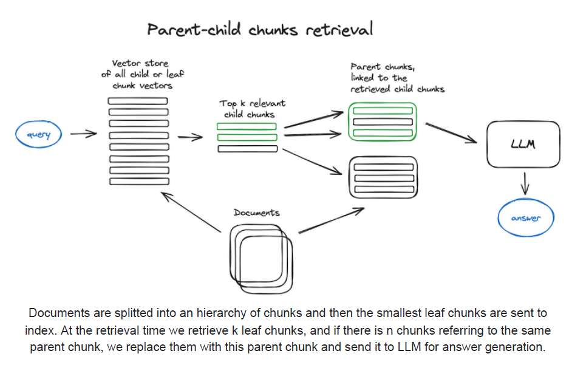

## Auto-Merging Retriever: Contexto Extendido para RAG

### Introdução

O *Retrieval-Augmented Generation* (RAG) tem se mostrado uma abordagem eficaz para integrar conhecimento externo em modelos de linguagem grandes (LLMs). Um dos desafios centrais no RAG é garantir que o LLM receba contexto suficiente e relevante para gerar respostas precisas e informativas. O Auto-merging Retriever, também conhecido como Parent Document Retriever, surge como uma solução para este desafio, explorando a ideia de buscar informações em granularidades menores e, em seguida, ampliar o contexto fornecido ao LLM [^3]. Este capítulo detalha o funcionamento e os benefícios do Auto-merging Retriever, focando em como ele supera as limitações dos métodos de recuperação tradicionais ao lidar com documentos complexos e informações inter-relacionadas.

### Conceitos Fundamentais

O Auto-merging Retriever endereça o problema da granularidade no contexto de RAG. Em abordagens de recuperação mais simples, os documentos são geralmente divididos em *chunks* (pedaços) menores para indexação e recuperação. No entanto, essa divisão pode levar à perda de contexto importante, pois as relações entre diferentes partes do documento podem não ser capturadas. O Auto-merging Retriever resolve este problema ao introduzir uma hierarquia de *chunks* pai e filho [^3].

A ideia central é:

1.  **Divisão em *Chunks* Filhos:** Inicialmente, os documentos são divididos em *chunks* menores, que são indexados e utilizados para a busca inicial. Estes são os *chunks* filhos, representando unidades de informação mais granulares.
2.  **Criação de *Chunks* Pais:** *Chunks* filhos são agrupados para formar *chunks* pais maiores, representando um contexto mais amplo. Cada *chunk* filho mantém uma referência ao seu *chunk* pai.
3.  **Recuperação Inicial:** A busca é realizada nos *chunks* filhos.
4.  **Expansão do Contexto:** Se um *chunk* filho relevante é encontrado, o sistema recupera o *chunk* pai correspondente. Isso permite que o LLM tenha acesso tanto à informação granular quanto ao contexto mais amplo [^3].
5.  **Auto-Merging (Opcional):** Em algumas implementações, *chunks* pais que são adjacentes e relevantes podem ser automaticamente combinados (*merged*) para formar um contexto ainda maior. Isso é particularmente útil quando a resposta à pergunta requer informações distribuídas em várias seções do documento.

Essa abordagem hierárquica permite que o sistema capture tanto a especificidade das informações contidas nos *chunks* filhos quanto o contexto mais amplo fornecido pelos *chunks* pais [^3].

**Proposição 1:** *A eficácia do Auto-merging Retriever depende criticamente da qualidade da relação semântica entre os chunks filhos e seus respectivos chunks pais. Se a relação não for forte, a recuperação do chunk pai pode introduzir ruído em vez de contexto relevante.*

*Prova (esboço):* A premissa do Auto-merging Retriever é que o chunk pai fornece um contexto relevante para o chunk filho. Se o chunk pai contiver informações não relacionadas ou fracamente relacionadas ao chunk filho, o LLM receberá informações desnecessárias que podem diluir o sinal relevante, prejudicando a geração da resposta. A qualidade da relação semântica pode ser medida por métricas de similaridade semântica entre os embeddings dos chunks filhos e pais. $\blacksquare$

**Vantagens do Auto-merging Retriever:**

*   **Melhor Contexto para o LLM:** Ao fornecer *chunks* pais, o LLM tem acesso a um contexto mais completo e relevante, o que pode levar a respostas mais precisas e informativas.
*   **Redução da Perda de Informação:** A hierarquia de *chunks* ajuda a preservar as relações entre diferentes partes do documento, evitando a perda de informação que pode ocorrer com a divisão em *chunks* independentes.
*   **Flexibilidade na Granularidade:** O sistema pode ajustar o tamanho dos *chunks* filhos e pais para otimizar o desempenho da recuperação e a qualidade das respostas.
*   **Capacidade de Lidar com Documentos Complexos:** O Auto-merging Retriever é particularmente útil para documentos longos e complexos, onde a informação relevante pode estar distribuída em várias seções [^3].

**Implementação e Considerações Práticas:**

A implementação do Auto-merging Retriever envolve várias etapas:

1.  **Definição da Estratégia de *Chunking*:** É crucial definir uma estratégia de *chunking* adequada, determinando o tamanho dos *chunks* filhos e pais. Essa escolha deve levar em consideração a estrutura dos documentos e a natureza das perguntas que serão feitas ao sistema.

> 💡 **Exemplo Numérico:**
>
> Suponha que temos um documento sobre "Fotossíntese". Podemos considerar duas estratégias de *chunking*:
>
> **Estratégia 1 (Chunks pequenos):**
> *   *Chunk* Filho 1: "A fotossíntese é um processo..." (10 palavras)
> *   *Chunk* Filho 2: "As plantas usam clorofila..." (8 palavras)
> *   *Chunk* Pai 1: "Introdução à Fotossíntese" (Contém Chunk Filho 1 e 2)
>
> **Estratégia 2 (Chunks maiores):**
> *   *Chunk* Filho 1: "A fotossíntese é um processo pelo qual as plantas, algas e algumas bactérias convertem energia luminosa em energia química..." (25 palavras)
> *   *Chunk* Filho 2: "As plantas usam clorofila e outros pigmentos para capturar a luz solar..." (20 palavras)
> *   *Chunk* Pai 1: "Introdução à Fotossíntese" (Contém Chunk Filho 1 e 2)
>
> | Estratégia | Tamanho Médio Chunk Filho | Contexto Granular | Contexto Amplo | Adequação para Perguntas Simples | Adequação para Perguntas Complexas |
> |------------|--------------------------|-------------------|---------------|---------------------------------|-----------------------------------|
> | 1          | 9 palavras               | Sim               | Não           | Boa                              | Ruim                              |
> | 2          | 22.5 palavras              | Moderado          | Sim           | Moderada                         | Boa                              |
>
> A Estratégia 1 é boa para perguntas diretas sobre definições. A Estratégia 2 é melhor para perguntas que requerem um entendimento mais profundo do processo.

2.  **Criação dos Índices:** Índices separados podem ser criados para os *chunks* filhos e pais, ou um único índice pode ser utilizado com metadados para identificar a relação entre eles.

**Teorema 1:** *Utilizar um único índice com metadados para chunks filhos e pais pode otimizar o uso da memória, mas introduz complexidade na lógica de busca. Criar índices separados simplifica a busca, mas aumenta o consumo de memória.*

*Prova (esboço):* Um único índice requer que cada entrada contenha informações sobre se é um chunk pai ou filho, bem como o relacionamento entre eles. A busca nesse índice requer filtragem baseada nesses metadados, aumentando a complexidade. Índices separados permitem buscas diretas, mas duplicam (parcialmente) os dados, aumentando o consumo de memória. A escolha depende das restrições de memória e dos requisitos de desempenho da busca. $\blacksquare$

> 💡 **Exemplo Numérico:**
>
> Vamos supor que temos 1000 *chunks* filhos e 100 *chunks* pais. Cada *chunk* filho tem um ID e um ponteiro para o ID do seu *chunk* pai.
>
> **Opção 1: Índice Único**
>
> *   Tamanho do índice: 1100 entradas.
> *   Cada entrada contém: Texto do *chunk*, ID do *chunk*, Tipo (*pai* ou *filho*), ID do *chunk* pai (se for filho).
> *   Complexidade da busca: Requer filtrar por tipo de *chunk* e potencialmente seguir o ponteiro para o *chunk* pai.
>
> **Opção 2: Índices Separados**
>
> *   Tamanho total dos índices: 1000 (filhos) + 100 (pais) = 1100 entradas.
> *   Índice dos filhos: Texto do *chunk*, ID do *chunk*, ID do *chunk* pai.
> *   Índice dos pais: Texto do *chunk*, ID do *chunk*.
> *   Complexidade da busca: Busca direta em um índice para *chunks* filhos, busca separada no índice dos pais se necessário.
>
> Se o tamanho do texto em cada *chunk* for grande, a diferença no uso da memória pode ser significativa se chunks pais e filhos tiverem textos muito similares (levando a duplicação). Caso contrário, a sobrecarga do índice em si é o fator determinante.

3.  **Implementação do Mecanismo de Recuperação:** O mecanismo de recuperação deve ser capaz de buscar nos *chunks* filhos e, em seguida, recuperar os *chunks* pais correspondentes.

> 💡 **Exemplo Numérico:**
>
> Uma consulta "Qual o papel da clorofila na fotossíntese?" é feita.
>
> $\text{Step 1: Busca nos chunks filhos}$
>
> Suponha que o sistema BM25 retorna os seguintes scores para 3 *chunks* filhos:
>
> *   *Chunk* Filho 1: "As plantas usam clorofila..." - Score: 0.8
> *   *Chunk* Filho 2: "A fotossíntese produz glicose..." - Score: 0.2
> *   *Chunk* Filho 3: "Clorofila absorve luz..." - Score: 0.75
>
> $\text{Step 2: Seleciona o chunk filho mais relevante (threshold = 0.5)}$
>
> *Chunk* Filho 1 é selecionado.
>
> $\text{Step 3: Recupera o chunk pai correspondente}$
>
> Suponha que o *Chunk* Filho 1 pertence ao *Chunk* Pai "Mecanismos da Fotossíntese".
>
> O LLM recebe o *Chunk* Filho 1 e o *Chunk* Pai "Mecanismos da Fotossíntese" como contexto.

4.  **Estratégia de Auto-Merging (Opcional):** Se o auto-merging for implementado, é necessário definir critérios para determinar quando *chunks* pais adjacentes devem ser combinados.

**Lema 1:** *A estratégia de auto-merging deve considerar a similaridade semântica entre chunks pais adjacentes para evitar a combinação de contextos não relacionados.*

*Prova (esboço):* Se dois chunks pais adjacentes forem combinados sem levar em consideração sua similaridade semântica, o contexto resultante pode ser incoerente ou irrelevante para a consulta original. Isso pode levar a respostas piores do LLM. A similaridade semântica pode ser medida usando embeddings e métricas de distância. Um limiar de similaridade deve ser definido para determinar quando a combinação é apropriada. $\blacksquare$

> 💡 **Exemplo Numérico:**
>
> Suponha que temos dois *chunks* pais adjacentes:
>
> *   *Chunk* Pai 1: "Mecanismos da Fotossíntese"
> *   *Chunk* Pai 2: "Fatores que afetam a Fotossíntese"
>
> $\text{Step 1: Calcula Embeddings}$
>
> Usamos um modelo de embedding para gerar vetores para cada *chunk* pai:
>
> *   Embedding(*Chunk* Pai 1) = $\vec{v_1}$
> *   Embedding(*Chunk* Pai 2) = $\vec{v_2}$
>
> $\text{Step 2: Calcula a similaridade de cossenos}$
>
> $\text{Cosine Similarity} = \frac{\vec{v_1} \cdot \vec{v_2}}{||\vec{v_1}|| \cdot ||\vec{v_2}||}$
>
> Suponha que a similaridade de cossenos seja 0.85.
>
> $\text{Step 3: Compara com o threshold}$
>
> Se o threshold de similaridade for 0.8, os *chunks* pais serão combinados, pois 0.85 > 0.8. Se o threshold fosse 0.9, eles não seriam combinados.

**Exemplo:**

Considere um longo documento sobre a história da computação.

1.  O documento é dividido em *chunks* filhos menores, cada um contendo um parágrafo ou seção específica (e.g., "A invenção do transistor," "O desenvolvimento da internet").
2.  Esses *chunks* filhos são agrupados em *chunks* pais maiores, cada um representando um capítulo ou seção do documento (e.g., "A Era dos Semicondutores," "A Ascensão da Internet").
3.  Quando um usuário pergunta "Quem inventou o transistor?", o sistema busca nos *chunks* filhos e encontra o *chunk* "A invenção do transistor".
4.  Em seguida, o sistema recupera o *chunk* pai correspondente, "A Era dos Semicondutores", fornecendo ao LLM um contexto mais amplo sobre a invenção do transistor [^3].

**Desafios e Limitações:**

Embora o Auto-merging Retriever ofereça várias vantagens, ele também apresenta alguns desafios:

*   **Complexidade da Implementação:** A implementação do Auto-merging Retriever é mais complexa do que a de abordagens de recuperação mais simples.
*   **Overhead Computacional:** A recuperação dos *chunks* pais adiciona um overhead computacional ao processo de recuperação.
*   **Escolha Adequada dos Tamanhos de *Chunk*:** A escolha dos tamanhos de *chunk* filhos e pais pode ser crucial para o desempenho do sistema.
*   **Complexidade da Estratégia de Auto-Merging:** Determinar quais *chunks* pais devem ser combinados pode ser um desafio, especialmente em documentos complexos e não estruturados.

**Teorema 2:** *O tamanho ótimo dos chunks filhos e pais é dependente da densidade informacional do documento e da complexidade das consultas esperadas.*

*Prova (esboço):* Um documento com alta densidade informacional requer chunks menores para evitar a diluição da informação relevante. Consultas complexas, que exigem um contexto amplo, se beneficiam de chunks pais maiores. Portanto, o tamanho ótimo é um compromisso entre esses dois fatores, podendo ser determinado empiricamente através de testes A/B com diferentes tamanhos de chunk e métricas de avaliação de resposta do LLM (e.g., precisão, relevância, completude). $\blacksquare$

> 💡 **Exemplo Numérico:**
>
> Suponha que estamos ajustando os parâmetros de chunking para um RAG que responde a perguntas sobre artigos científicos.
>
> | Tamanho Chunk Filho | Tamanho Chunk Pai | Precisão | Recall | Tempo de Resposta (s) |
> |----------------------|--------------------|----------|--------|------------------------|
> | 100 palavras        | 500 palavras       | 0.75     | 0.65   | 2.5                    |
> | 200 palavras        | 1000 palavras      | 0.80     | 0.70   | 3.0                    |
> | 50 palavras         | 250 palavras       | 0.70     | 0.60   | 2.0                    |
>
> Observamos que o tamanho de chunk filho de 200 palavras e pai de 1000 palavras oferece o melhor equilíbrio entre precisão, recall e tempo de resposta para este conjunto de dados e tipo de consulta.

### Conclusão

O Auto-merging Retriever representa um avanço significativo nas técnicas de RAG, permitindo que os LLMs acessem e utilizem informações de forma mais eficaz. Ao combinar a granularidade fina dos *chunks* filhos com o contexto mais amplo dos *chunks* pais, o Auto-merging Retriever ajuda a superar as limitações dos métodos de recuperação tradicionais e a gerar respostas mais precisas, informativas e contextualmente relevantes.  Embora a implementação possa ser mais complexa, os benefícios em termos de qualidade da resposta e capacidade de lidar com documentos complexos justificam o esforço. As considerações sobre estratégias de *chunking* adequadas e os trade-offs de desempenho são cruciais para otimizar o uso desta técnica.

### Referências

[^3]: Informações retiradas da descrição do tópico: "Auto-merging Retriever (also known as Parent Document Retriever) searches for granular pieces of information and extends the context window by splitting documents into smaller child chunks that reference larger parent chunks, feeding this extended context to the LLM for reasoning."
<!-- END -->