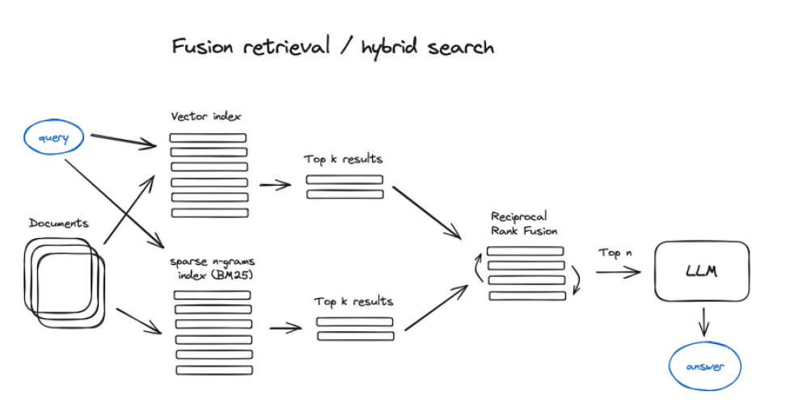

## Recuperação Fusionada com LangChain e LlamaIndex

### Introdução

A recuperação aprimorada (Retrieval Enhancement) busca otimizar o processo de busca e seleção de documentos relevantes para uma dada consulta, maximizando a precisão e abrangência das informações recuperadas. Um dos métodos para alcançar tal objetivo é a **recuperação fusionada**, que combina diferentes *retrievers* e emprega técnicas de reordenação para refinar os resultados. Este capítulo explora a implementação da recuperação fusionada utilizando as bibliotecas LangChain e LlamaIndex, focando no uso do *Rank Aggregation* Recíproco (RRF) para reordenação.

### Conceitos Fundamentais

**Recuperação Fusionada (Fusion Retrieval)**: Consiste em utilizar múltiplos *retrievers* (indexadores e mecanismos de busca) para obter um conjunto mais diversificado de documentos relevantes. A ideia central é que cada *retriever* pode capturar diferentes aspectos da relevância, e a combinação de seus resultados pode levar a uma melhor cobertura das informações relevantes.

**Rank Aggregation Recíproco (RRF)**: É um algoritmo de reordenação que combina as classificações de diferentes *retrievers* em uma única classificação final. O RRF atribui pontuações mais altas aos documentos que aparecem no topo da lista de vários *retrievers*. A pontuação RRF para um documento é calculada como a soma do inverso do seu rank em cada lista de *retriever*, ajustada por uma constante $k$.

> 💡 **Exemplo Numérico:** Imagine que temos dois retrievers. O Documento A está em primeiro lugar no Retriever 1 e em terceiro lugar no Retriever 2. O Documento B está em segundo lugar no Retriever 1 e em segundo lugar no Retriever 2. Usando k=10, o score RRF do Documento A é (1/(10+1)) + (1/(10+3)) = 0.091 + 0.077 = 0.168. O score RRF do Documento B é (1/(10+2)) + (1/(10+2)) = 0.083 + 0.083 = 0.166. Neste caso, o Documento A seria classificado ligeiramente acima do Documento B.

**LangChain e LlamaIndex**: São frameworks que facilitam a construção de aplicações de *Retrieval-Augmented Generation* (RAG). Ambos oferecem ferramentas e classes para implementar diversas técnicas de recuperação, incluindo a recuperação fusionada.

### Implementação com LangChain

A LangChain oferece a classe `EnsembleRetriever` para implementar a recuperação fusionada [^1]. Essa classe permite combinar múltiplos *retrievers* e aplicar um algoritmo de reordenação, como o RRF, para gerar uma lista final de documentos classificados.

**Passos para implementar a recuperação fusionada com LangChain:**

1.  **Criar múltiplos retrievers**: Inicialize diferentes *retrievers* com diferentes configurações ou usando diferentes fontes de dados. Por exemplo, você pode ter um *retriever* baseado em similaridade de cossenos e outro baseado em busca semântica.

    > 💡 **Exemplo Numérico:** Suponha que você tem um retriever baseado em TF-IDF e outro baseado em embeddings. O TF-IDF retriever retorna 5 documentos, enquanto o retriever de embeddings retorna outros 5. O EnsembleRetriever combinará esses resultados.

2.  **Instanciar o `EnsembleRetriever`**: Crie uma instância de `EnsembleRetriever`, passando uma lista de *retrievers* e o método de reordenação desejado.

3.  **Executar a busca**: Utilize o método `get_relevant_documents` do `EnsembleRetriever` para realizar a busca. O método combinará os resultados dos *retrievers* subjacentes e aplicará o algoritmo de reordenação para gerar a lista final de documentos relevantes.

**Exemplo de código (ilustrativo):**

```python
from langchain.retrievers import EnsembleRetriever
from langchain.retrievers import BM25Retriever, VectorDBRetriever
from langchain.embeddings import OpenAIEmbeddings
from langchain.document_loaders import TextLoader
from langchain.text_splitter import CharacterTextSplitter
from langchain.vectorstores import Chroma

# Carregar documentos de exemplo
loader = TextLoader("state_of_the_union.txt")  # Substitua pelo caminho do seu arquivo
documents = loader.load()

# Dividir os documentos em partes menores
text_splitter = CharacterTextSplitter(chunk_size=1000, chunk_overlap=0)
texts = text_splitter.split_documents(documents)

# Inicializar embeddings
embeddings = OpenAIEmbeddings()

# Criar um VectorDBRetriever
db = Chroma.from_documents(texts, embeddings)
vectorstore_retriever = VectorDBRetriever(vectorstore=db)

# Criar um BM25Retriever
bm25_retriever = BM25Retriever.from_documents(texts)
bm25_retriever.k = 3 # Número de documentos a serem retornados pelo BM25

vectorstore_retriever.k = 3 # Número de documentos a serem retornados pelo VectorDB


ensemble_retriever = EnsembleRetriever(retrievers=[bm25_retriever, vectorstore_retriever], weights=[0.5, 0.5])

docs = ensemble_retriever.get_relevant_documents("Qual o melhor método para...")
print(docs)
```

Neste exemplo, `bm25_retriever` e `vectorstore_retriever` representam dois *retrievers* distintos. O `EnsembleRetriever` combina seus resultados, ponderando-os igualmente (weights=[0.5, 0.5]). A função `get_relevant_documents` retorna os documentos mais relevantes, reordenados pelo algoritmo de RRF (ou outro especificado).

> 💡 **Exemplo Numérico:** Suponha que o `bm25_retriever` retorna os documentos D1, D2 e D3, enquanto o `vectorstore_retriever` retorna D2, D4 e D5. O `EnsembleRetriever` combinará esses resultados e aplicará o RRF. Se k=10, e as posições forem D1 (BM25=1), D2 (BM25=2, VectorDB=1), D3 (BM25=3), D4 (VectorDB=2), D5 (VectorDB=3), os scores RRF seriam: D1: 1/(10+1) = 0.091, D2: 1/(10+2) + 1/(10+1) = 0.083 + 0.091 = 0.174, D3: 1/(10+3) = 0.077, D4: 1/(10+2) = 0.083, D5: 1/(10+3) = 0.077. Portanto, a ordem final seria D2, D1, D4, D3, D5.

**Reordenação com RRF:**

O RRF é um método eficaz para combinar resultados de diferentes *retrievers* devido à sua capacidade de dar maior peso aos documentos que são considerados relevantes por múltiplos *retrievers*. A fórmula geral para o RRF é:

$$
RRF\_score(d) = \sum_{i=1}^{N} \frac{1}{k + rank_i(d)}
$$

Onde:

*   $RRF\_score(d)$ é a pontuação RRF do documento *d*.
*   $N$ é o número de *retrievers*.
*   $rank_i(d)$ é a posição do documento *d* na lista de resultados do *retriever* *$i$*.
*   $k$ é uma constante de ajuste (tipicamente 10).

A constante $k$ serve para atenuar o impacto de *retrievers* que classificam documentos irrelevantes no topo da lista.

> 💡 **Exemplo Numérico:** Se k=10, um documento classificado em primeiro lugar tem um score de 1/(10+1) = 0.091. Se k=100, o score seria 1/(100+1) = 0.0099. Um valor maior de k suaviza a importância dos ranks mais altos.

**Teorema 1** [Ponderação Ótima de Retrievers]: A escolha dos pesos para cada retriever no `EnsembleRetriever` impacta diretamente na qualidade dos resultados. A determinação dos pesos ótimos pode ser formulada como um problema de otimização, buscando maximizar uma métrica de avaliação (e.g., precision@k, recall@k, MAP) em um conjunto de dados de validação.

*Estratégia de Prova:* A prova envolve formular o problema de otimização, definir uma função objetivo baseada em uma métrica de avaliação, e aplicar algoritmos de otimização (e.g., gradiente descendente, algoritmos genéticos) para encontrar os pesos que maximizam a função objetivo. A validação é crucial para evitar overfitting aos dados de treinamento.

> 💡 **Exemplo Numérico:** Suponha que temos dois retrievers, A e B. Para otimizar os pesos, podemos testar combinações como (0.1, 0.9), (0.2, 0.8), (0.3, 0.7)... (0.9, 0.1) e medir a precisão@5 para cada combinação. A combinação que resultar na maior precisão@5 será considerada a ideal.

### Implementação com LlamaIndex

LlamaIndex também oferece funcionalidades para implementar a recuperação fusionada, embora a implementação específica possa variar em comparação com LangChain. A ideia geral é similar: combinar os resultados de diferentes *retrievers* e usar um algoritmo de reordenação para refinar os resultados.

**Passos para implementar a recuperação fusionada com LlamaIndex:**

1.  **Criar múltiplos Indexadores e Query Engines**: Construa diferentes indexadores (e.g., `VectorStoreIndex`, `KeywordTableIndex`) e *query engines* com diferentes configurações ou usando diferentes fontes de dados.

    > 💡 **Exemplo Numérico:** Podemos criar um `VectorStoreIndex` usando embeddings de sentenças e um `KeywordTableIndex` que indexa documentos com base em palavras-chave.

2.  **Combinar os resultados**: LlamaIndex oferece diferentes estratégias para combinar os resultados dos *query engines*, incluindo a agregação simples, a ponderação por confiança e o uso de modelos de *reranking*.

3.  **Executar a busca**: Execute a busca utilizando os *query engines* combinados. LlamaIndex irá combinar os resultados e aplicar a estratégia de reordenação escolhida.

**Exemplo de código (ilustrativo):**

```python
from llama_index import VectorStoreIndex, KeywordTableIndex, SimpleDirectoryReader
from llama_index.query_engine import SubQuestionQueryEngine
from llama_index.tools import QueryEngineTool, ToolMetadata
from llama_index import Document

# Suponha que você já tenha criado dois indexadores: vector_index e keyword_index
# Criar documentos de exemplo
documents = [
    Document(text="O céu é azul."),
    Document(text="A grama é verde."),
    Document(text="O sol é amarelo."),
    Document(text="A lua é branca.")
]

vector_index = VectorStoreIndex.from_documents(documents)
keyword_index = KeywordTableIndex.from_documents(documents)

# Crie QueryEngineTools para cada indexador
vector_tool = QueryEngineTool(
    query_engine=vector_index.as_query_engine(),
    metadata=ToolMetadata(name="vector_tool", description="Útil para encontrar informações com base em similaridade semântica."),
)

keyword_tool = QueryEngineTool(
    query_engine=keyword_index.as_query_engine(),
    metadata=ToolMetadata(name="keyword_tool", description="Útil para encontrar informações com base em palavras-chave."),
)

# Combine os QueryEngineTools usando SubQuestionQueryEngine
from llama_index.retrievers import ToolRetriever
from llama_index.query_engine import RouterQueryEngine

tool_retriever = ToolRetriever(tools=[vector_tool, keyword_tool])
query_engine = RouterQueryEngine.from_defaults(retriever=tool_retriever)


response = query_engine.query("Qual a cor do céu?")
print(response)
```

Neste exemplo, `vector_index` e `keyword_index` representam dois indexadores distintos. Os `QueryEngineTool`s encapsulam os *query engines* associados a cada indexador. O `SubQuestionQueryEngine` combina os resultados, dividindo a consulta em sub-perguntas e roteando-as para os *query engines* apropriados.

> 💡 **Exemplo Numérico:** Se a consulta for "Cor do céu e da grama?", o `SubQuestionQueryEngine` pode dividir a consulta em "Qual a cor do céu?" e "Qual a cor da grama?". A primeira sub-pergunta pode ser roteada para o `vector_tool`, enquanto a segunda pode ser roteada para o `keyword_tool`, dependendo da descrição no `ToolMetadata`.

**Proposição 1** [Relevância da Descrição da Ferramenta (ToolMetadata)]: A descrição fornecida no `ToolMetadata` tem um impacto significativo no roteamento de consultas pelo `SubQuestionQueryEngine`. Descrições mais precisas e informativas resultam em um roteamento mais eficaz das sub-perguntas para as ferramentas apropriadas.

*Estratégia de Prova:* A prova pode ser realizada empiricamente, comparando o desempenho do `SubQuestionQueryEngine` com diferentes descrições para as mesmas ferramentas em um conjunto de dados de avaliação. Métricas como a precisão do roteamento e a qualidade das respostas geradas podem ser utilizadas para quantificar o impacto da descrição.

> 💡 **Exemplo Numérico:** Se a descrição do `vector_tool` for alterada para "Útil para encontrar informações gerais", o roteamento da consulta "Qual a cor do céu?" pode se tornar menos preciso.





### Vantagens e Desafios

**Vantagens:**

*   **Melhoria da Precisão**: Combinar múltiplos *retrievers* pode aumentar a precisão da busca, reduzindo o número de falsos positivos.
*   **Aumento da Cobertura**: A recuperação fusionada pode aumentar a cobertura das informações relevantes, garantindo que todos os aspectos importantes da consulta sejam abordados.
*   **Robustez**: A combinação de diferentes *retrievers* torna o sistema mais robusto a ruídos e variações nos dados.

**Desafios:**

*   **Complexidade**: A implementação da recuperação fusionada pode ser mais complexa do que a utilização de um único *retriever*.
*   **Custo Computacional**: A execução de múltiplos *retrievers* pode aumentar o custo computacional da busca.
*   **Ajuste de Parâmetros**: A escolha dos *retrievers* a serem combinados e o ajuste dos parâmetros do algoritmo de reordenação (e.g., o valor de $k$ no RRF) podem ser desafiadores.

> 💡 **Exemplo Numérico:** Se o BM25 é muito mais rápido do que o retriever vetorial, o tempo total de resposta pode ser limitado pelo retriever vetorial. O custo computacional é aditivo.

**Teorema 2** [Complexidade do RRF]: A complexidade computacional do algoritmo RRF é O(N*M), onde N é o número de retrievers e M é o número máximo de documentos retornados por cada retriever.

*Estratégia de Prova:* A prova segue diretamente da análise do algoritmo RRF. Para cada documento retornado por cada retriever, o algoritmo calcula a pontuação RRF, o que requer O(1) operações. Como há N retrievers e cada um retorna no máximo M documentos, a complexidade total é O(N*M).

> 💡 **Exemplo Numérico:** Se temos 3 retrievers (N=3) e cada um retorna no máximo 10 documentos (M=10), então a complexidade do RRF é O(3*10) = O(30).

### Conclusão

A recuperação fusionada, implementada com LangChain e LlamaIndex, representa uma abordagem avançada para melhorar o desempenho de sistemas de RAG. Ao combinar os pontos fortes de diferentes *retrievers* e utilizar técnicas de reordenação como o RRF, é possível obter resultados de busca mais precisos, abrangentes e robustos. A escolha da biblioteca e da estratégia de implementação dependerá das necessidades específicas da aplicação e dos recursos disponíveis.

### Referências
[^1]: Adaptação do conhecimento geral sobre a biblioteca LangChain, focando na classe `EnsembleRetriever` e seus componentes para recuperação fusionada.
<!-- END -->