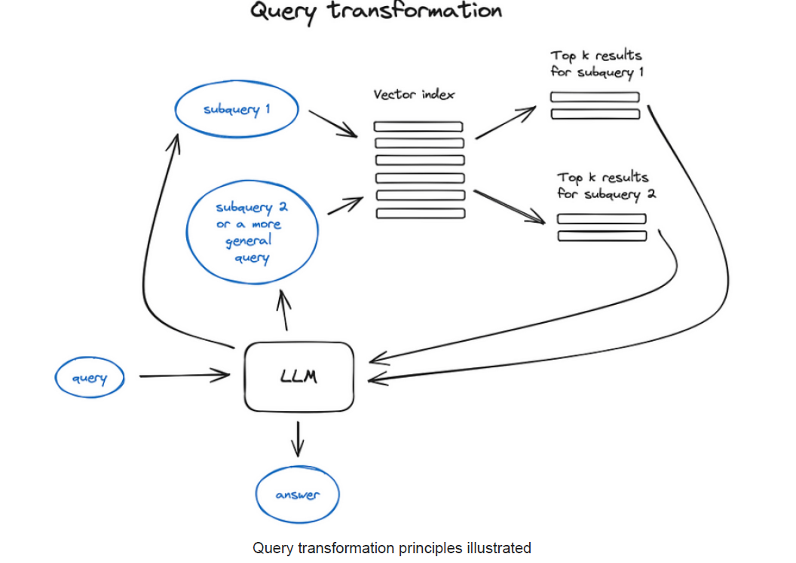

## Transformações de Query com LLMs para Recuperação de Informação Neural

### Introdução

A Recuperação de Informação Neural (NIR) tem evoluído significativamente com a incorporação de Large Language Models (LLMs). Uma área promissora é a transformação de *queries*, que utiliza LLMs para refinar a entrada do usuário, visando melhorar a qualidade da recuperação [^1]. Este capítulo explora as técnicas de transformação de query, incluindo decomposição de query, *step-back prompting* e reescrita de query.

### Conceitos Fundamentais

A necessidade de transformar *queries* surge da complexidade inerente à linguagem natural e das limitações dos modelos de recuperação em lidar diretamente com a ambiguidade ou falta de especificidade nas *queries* originais. LLMs, com sua capacidade de compreender e gerar texto, oferecem um meio poderoso para contornar essas limitações.

**Teorema 1:** A transformação de query, se bem aplicada, pode aumentar a precisão e revocação da recuperação de informação neural, dado que as *queries* transformadas representem melhor a intenção do usuário e se alinhem com a estrutura do índice de documentos.

**1. Decomposição de Query:**

A decomposição de *query* envolve a divisão de uma *query* complexa em sub-*queries* mais simples e focadas [^1]. O raciocínio por trás dessa técnica é que a recuperação separada de informações relevantes para cada sub-*query* e, posteriormente, a combinação dos resultados, pode levar a uma recuperação mais precisa e abrangente.

*   **Processo:**
    1.  O LLM recebe a *query* original como entrada.
    2.  O LLM decompõe a *query* em um conjunto de sub-*queries*. A estratégia de decomposição pode variar dependendo da complexidade da *query* e do conhecimento do domínio.
    3.  Cada sub-*query* é usada para recuperar documentos relevantes.
    4.  Os resultados recuperados para cada sub-*query* são combinados (e.g., por meio de interseção, união ou ranking ponderado) para gerar o conjunto final de documentos recuperados.

*   **Exemplo:**
    Uma *query* como *"Quais foram os impactos econômicos e sociais da pandemia de COVID-19 na indústria do turismo?"* pode ser decomposta em:

    *   Sub-*query* 1: *"Impactos econômicos da pandemia de COVID-19 na indústria do turismo"*
    *   Sub-*query* 2: *"Impactos sociais da pandemia de COVID-19 na indústria do turismo"*

    A recuperação é realizada separadamente para cada sub-*query*, e os resultados são combinados para fornecer uma resposta abrangente.

*   **Vantagens:**
    *   Lida melhor com *queries* complexas e multifacetadas.
    *   Permite a recuperação de informações de diferentes perspectivas ou aspectos da *query* original.

*   **Desafios:**
    *   A qualidade da decomposição depende fortemente da capacidade do LLM de interpretar a *query* original.
    *   A combinação dos resultados das sub-*queries* pode ser complexa e exigir técnicas de ranking sofisticadas.

> 💡 **Exemplo Numérico:**
>
> Suponha que temos 3 documentos e 2 sub-queries geradas pela decomposição da query original. Após executar cada sub-query, obtemos os seguintes scores de relevância para cada documento:
>
> | Documento | Sub-query 1 Score | Sub-query 2 Score |
> | --------- | ----------------- | ----------------- |
> | 1         | 0.8               | 0.2               |
> | 2         | 0.5               | 0.7               |
> | 3         | 0.1               | 0.9               |
>
> Uma simples combinação linear, dando pesos iguais às sub-queries, resulta em:
>
> $\text{Final Score (Document i)} = 0.5 \times \text{Sub-query 1 Score (Document i)} + 0.5 \times \text{Sub-query 2 Score (Document i)}$
>
> Aplicando isso, obtemos:
>
> | Documento | Final Score |
> | --------- | ----------- |
> | 1         | 0.5         |
> | 2         | 0.6         |
> | 3         | 0.5         |
>
> Neste exemplo, o documento 2 seria classificado como o mais relevante após a combinação dos resultados das sub-queries.  Se atribuirmos pesos diferentes (por exemplo, 0.7 para sub-query 1 e 0.3 para sub-query 2), os resultados mudariam, demonstrando a importância da ponderação na combinação dos resultados.

**Lema 1:** A eficácia da decomposição de query é maximizada quando as subqueries são ortogonais entre si, minimizando a redundância na recuperação de documentos e aumentando a diversidade dos resultados.

*Prova (Esboço):* A ortogonalidade das subqueries garante que cada subquery explore um aspecto diferente da query original. A redundância é reduzida porque cada subquery tende a recuperar um conjunto de documentos distintos. A combinação dos resultados, portanto, abrange uma gama mais ampla de informações relevantes.

**1.1 Otimização da Decomposição de Query:**

Para otimizar a decomposição de query, podemos considerar abordagens que envolvem a ponderação das sub-*queries* com base em sua relevância percebida para a *query* original. Além disso, técnicas de *clustering* podem ser aplicadas aos resultados das sub-*queries* para identificar e remover informações redundantes antes da combinação final.

**2. *Step-Back Prompting***

*Step-back prompting* é uma técnica que envolve a utilização de um LLM para gerar uma *query* mais genérica e conceitual, retrocedendo a partir da *query* original [^1]. O objetivo é capturar o contexto de alto nível e os princípios subjacentes à *query* original, o que pode auxiliar na recuperação de informações relevantes que podem não ser diretamente relacionadas à *query* original, mas que fornecem um contexto importante.

*   **Processo:**
    1.  O LLM recebe a *query* original como entrada.
    2.  O LLM gera uma *query* de "nível superior" que representa o conceito fundamental por trás da *query* original.
    3.  A *query* de "nível superior" é usada para recuperar documentos relevantes.
    4.  Os documentos recuperados são combinados com os resultados da *query* original ou usados para refinar a resposta final.

*   **Exemplo:**
    *Query* original: *"Quais são os tratamentos mais recentes para a doença de Alzheimer?"*

    *Query* de "nível superior" gerada pelo LLM: *"Pesquisa recente sobre tratamento de doenças neurodegenerativas"*

    Ao recuperar informações sobre pesquisas recentes em doenças neurodegenerativas, podemos obter *insights* que também são relevantes para o tratamento da doença de Alzheimer, mesmo que não mencionem diretamente a doença.

*   **Vantagens:**
    *   Auxilia na recuperação de informações contextuais e de conhecimento de base.
    *   Ajuda a identificar informações relevantes que podem não ser encontradas apenas com a *query* original.

*   **Desafios:**
    *   Requer que o LLM tenha um bom entendimento do domínio e da relação entre diferentes conceitos.
    *   A geração de *queries* de "nível superior" relevantes pode ser difícil para *queries* muito específicas ou complexas.

> 💡 **Exemplo Numérico:**
>
> Suponha que executamos a query original e a query de "nível superior" e obtivemos os seguintes resultados para os top-3 documentos:
>
> | Documento | Score (Query Original) | Score (Step-Back Query) |
> | --------- | ---------------------- | ----------------------- |
> | 1         | 0.9                    | 0.3                     |
> | 2         | 0.7                    | 0.6                     |
> | 3         | 0.6                    | 0.8                     |
>
> Para combinar esses resultados, podemos usar uma média ponderada:
>
> $\text{Final Score (Document i)} = \alpha \times \text{Score Original (Document i)} + (1 - \alpha) \times \text{Score Step-Back (Document i)}$
>
> Se $\alpha = 0.6$ (mais peso para a query original), então:
>
> | Documento | Final Score |
> | --------- | ----------- |
> | 1         | 0.66        |
> | 2         | 0.64        |
> | 3         | 0.68        |
>
> Neste caso, o Documento 3, que tinha um score mais alto na query de "nível superior", se torna o mais relevante após a combinação, demonstrando como o *step-back prompting* pode alterar a ordem dos resultados.

**Lema 2:** A escolha do nível de abstração na query gerada por *step-back prompting* influencia diretamente no balanço entre precisão e revocação. Um nível muito abstrato pode aumentar a revocação, mas diminuir a precisão, e vice-versa.

*Prova (Esboço):* Queries de nível superior muito genéricas podem recuperar muitos documentos irrelevantes (aumentando a revocação mas diminuindo a precisão), enquanto queries excessivamente específicas podem perder informações contextuais importantes (diminuindo a revocação).

**2.1 Adaptação Iterativa do *Step-Back Prompting***

Uma extensão do *step-back prompting* é a adaptação iterativa.  Nesta abordagem, a *query* de "nível superior" gerada inicialmente é refinada em iterações subsequentes, com base nos resultados da recuperação inicial. O LLM pode analisar os documentos recuperados e ajustar a *query* de "nível superior" para melhor focar em aspectos relevantes do contexto.

**3. Reescrita de Query:**

A reescrita de *query* envolve a modificação da *query* original usando um LLM para melhorar sua clareza, especificidade ou adequação ao modelo de recuperação subjacente [^1]. Isso pode incluir a expansão da *query* com sinônimos, a correção de erros gramaticais, a remoção de termos irrelevantes ou a reformulação da *query* para melhor corresponder à estrutura dos documentos no índice.

*   **Processo:**
    1.  O LLM recebe a *query* original como entrada.
    2.  O LLM analisa a *query* e identifica possíveis melhorias.
    3.  O LLM reescreve a *query* com base nas melhorias identificadas.
    4.  A *query* reescrita é usada para recuperar documentos relevantes.

*   **Exemplo:**
    *Query* original: *"melhor hotel paris"*

    *Query* reescrita pelo LLM: *"melhores hotéis em Paris com boa avaliação dos clientes e localização central"*

    A *query* reescrita é mais específica e inclui critérios importantes para a seleção de um hotel, o que deve levar a resultados de pesquisa mais relevantes.

*   **Vantagens:**
    *   Melhora a precisão e a relevância dos resultados da pesquisa.
    *   Pode corrigir erros e ambiguidades na *query* original.
    *   Adapta a *query* para melhor corresponder ao modelo de recuperação subjacente.

> 💡 **Exemplo Numérico:**
>
> Vamos considerar um pequeno exemplo para ilustrar como a reescrita de query pode impactar o TF-IDF. Suponha que temos os seguintes:
>
> *   **Query Original:** "maçã"
> *   **Query reescrita:** "receitas com maçã"
> *   **Documento:** "Esta receita usa maçã Fuji. É uma deliciosa receita de outono."
>
> Vamos calcular o TF-IDF para ambas as queries. Primeiro, definimos um vocabulário simplificado: {"maçã", "receita", "com", "fuji", "esta", "usa", "é", "uma", "de", "outono", "deliciosa"}.
>
> **Cálculo TF (Term Frequency):**
>
> *   **TF (Query Original, "maçã")**: 1/1 = 1
> *   **TF (Query Reescrita, "maçã")**: 1/3 = 0.33
> *   **TF (Query Reescrita, "receitas")**: 1/3 = 0.33
> *   **TF (Query Reescrita, "com")**: 1/3 = 0.33
> *   **TF (Documento, "maçã")**: 1/11 = 0.09
> *   **TF (Documento, "receita")**: 2/11 = 0.18
>
> **Cálculo IDF (Inverse Document Frequency):**
>
> Assumindo que temos 10 documentos no total, e:
>
> *   "maçã" aparece em 5 documentos.  $\text{IDF("maçã")} = log(10/5) = 0.30$
> *   "receita" aparece em 3 documentos.  $\text{IDF("receita")} = log(10/3) = 0.52$
> *   "com" aparece em 8 documentos.  $\text{IDF("com")} = log(10/8) = 0.09$
>
> **Cálculo TF-IDF:**
>
> *   **TF-IDF (Query Original, "maçã")**: 1 * 0.30 = 0.30
> *   **TF-IDF (Query Reescrita, "maçã")**: 0.33 * 0.30 = 0.10
> *   **TF-IDF (Query Reescrita, "receitas")**: 0.33 * 0.52 = 0.17
> *   **TF-IDF (Query Reescrita, "com")**: 0.33 * 0.09 = 0.03
>
> **Score do Documento:** (Considerando apenas os termos da query)
>
> *   **Score (Query Original)**:  0.09 (TF da "maçã" no documento) * 0.30 (IDF da "maçã") = 0.027
> *   **Score (Query Reescrita)**: (0.09 * 0.30) + (0.18 * 0.52) = 0.027 + 0.094 = 0.121
>
> Neste exemplo simplificado, a *query* reescrita, ao incluir termos adicionais como "receitas", aumentou o score do documento porque o documento continha a palavra "receita" com uma frequência relativamente alta. Isto demonstra como a reescrita de query, mesmo com técnicas simples como TF-IDF, pode impactar a relevância dos documentos recuperados.

**Proposição 1:** A eficácia da reescrita de query depende criticamente da qualidade e cobertura do vocabulário utilizado pelo LLM, especialmente em domínios específicos onde a terminologia pode ser especializada.

*Prova (Esboço):* Um LLM com vocabulário limitado pode não ser capaz de expandir a query original com sinônimos relevantes ou corrigir ambiguidades de forma precisa, resultando em uma query reescrita que não melhora (ou até piora) os resultados da recuperação.

**3.1 Reescrita de Query Sensível ao Contexto do Usuário:**

Uma abordagem promissora é a reescrita de query sensível ao contexto do usuário. Isso envolve a utilização do histórico de pesquisa do usuário, suas preferências declaradas e outras informações contextuais para personalizar a reescrita da query. Por exemplo, se um usuário pesquisa frequentemente sobre "energia solar", o LLM pode reescrever queries relacionadas a "energia" para incluir explicitamente o termo "solar", mesmo que a query original não o mencione.

### Conclusão

As transformações de *query* utilizando LLMs representam uma abordagem poderosa para melhorar a eficácia da Recuperação de Informação Neural [^1]. Através da decomposição de *queries*, do *step-back prompting* e da reescrita de *queries*, os LLMs podem ajudar a superar as limitações dos modelos de recuperação tradicionais e a fornecer resultados de pesquisa mais precisos e abrangentes. No entanto, é crucial considerar os desafios associados a cada técnica, como a dependência da capacidade do LLM, a complexidade da combinação de resultados e o risco de introduzir viés. O desenvolvimento contínuo de técnicas de transformação de *query* e a avaliação rigorosa de seu impacto na qualidade da recuperação são essenciais para o avanço da área de NIR.

### Referências

[^1]: Informação retirada do contexto fornecido: "Query transformations utilize LLMs to modify user input and improve retrieval quality. Techniques include query decomposition, step-back prompting, and query re-writing."
<!-- END -->