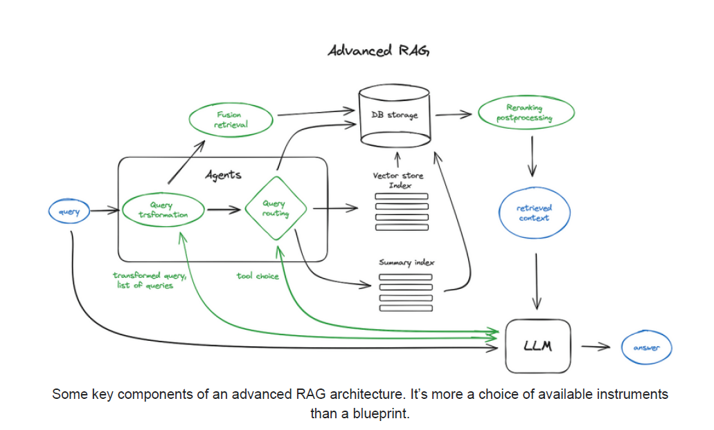
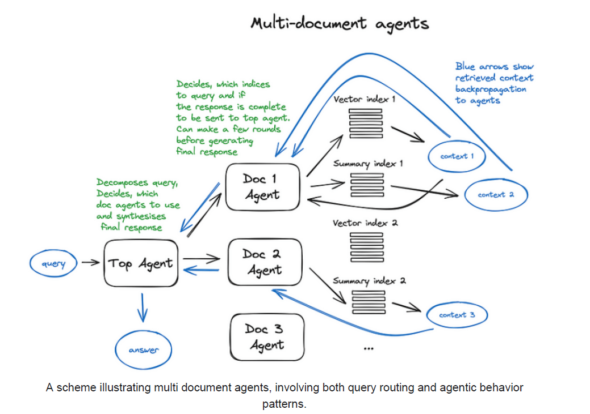

## RAG com Agentes: Aprimorando LLMs com Raciocínio e Ferramentas

### Introdução

O capítulo anterior focou em diversas estratégias para aprimorar o processo de Retrieval-Augmented Generation (RAG). Neste capítulo, exploraremos uma abordagem avançada que integra **agentes** para expandir as capacidades das LLMs (Large Language Models). Agentes, no contexto de RAG, representam uma extensão poderosa das LLMs, capacitando-as com habilidades de raciocínio, acesso a ferramentas e a capacidade de executar tarefas determinísticas usando código, APIs externas ou outros agentes [^1]. Este conceito forma a base do LLM chaining, permitindo a construção de fluxos de trabalho complexos e adaptáveis.

Para solidificar a compreensão, podemos formalizar a definição de um agente em um sistema RAG.

**Definição:** Um agente em um sistema RAG é um módulo computacional que aumenta as capacidades de uma LLM, permitindo a interação estruturada com o ambiente externo através de ferramentas e a execução de tarefas complexas.

### Conceitos Fundamentais

**Agentes e suas Capacidades:**

Agentes são essencialmente módulos de software que aumentam as LLMs com funcionalidades adicionais. Eles permitem que a LLM interaja com o mundo exterior de maneira estruturada e controlada. As principais capacidades que um agente pode adicionar a uma LLM incluem [^1]:

*   **Raciocínio:** Capacidade de analisar um problema, decompor em subproblemas e planejar uma sequência de ações para resolvê-lo.
*   **Ferramentas:** Acesso a funções determinísticas, como código Python, APIs externas (e.g., pesquisa na web, cálculo matemático) ou outros agentes especializados.
*   **Tarefas:** Capacidade de executar tarefas complexas que exigem interação com o ambiente e coordenação de múltiplas ferramentas.

**Teorema 1:** A capacidade de um agente de decompor problemas complexos em subproblemas menores (Raciocínio) e coordenar o uso de diversas ferramentas para resolvê-los (Tarefas) é diretamente proporcional à complexidade dos problemas que o sistema RAG pode abordar.

*Proof Sketch:* A decomposição de problemas permite que cada subproblema seja tratado de forma mais eficiente, muitas vezes por ferramentas especializadas. A coordenação garante que as soluções dos subproblemas sejam integradas para resolver o problema original. Sem raciocínio e coordenação, o sistema RAG fica limitado a problemas que podem ser resolvidos diretamente com as informações recuperadas.

**LLM Chaining:**

O conceito de LLM chaining refere-se à construção de fluxos de trabalho complexos onde a saída de uma LLM (ou agente) serve como entrada para outra LLM (ou agente) [^1]. Isso permite a criação de pipelines de processamento que podem realizar tarefas que seriam impossíveis para uma única LLM. Por exemplo, um agente pode ser responsável por extrair informações relevantes de um documento, outro por realizar uma análise de sentimentos e um terceiro por gerar um resumo baseado nas informações extraídas e na análise de sentimentos.

Para ilustrar a flexibilidade do LLM chaining, considere o seguinte cenário:

*   **Agente de Tradução:** Traduz um documento de um idioma para outro.
*   **Agente de Correção Gramatical:** Corrige erros gramaticais e ortográficos no documento traduzido.
*   **Agente de Estilização:** Melhora o estilo de escrita do documento corrigido.

Este exemplo mostra como o LLM chaining pode ser usado para criar pipelines de processamento de linguagem natural complexos e personalizados.

**Arquitetura de um Sistema RAG com Agentes:**

Um sistema RAG com agentes tipicamente envolve os seguintes componentes:

1.  **LLM:** O modelo de linguagem principal responsável por gerar a resposta final.
2.  **Agentes:** Módulos que aumentam a LLM com raciocínio, ferramentas e tarefas.
3.  **Ferramentas:** Funções determinísticas que os agentes podem usar para interagir com o mundo exterior.
4.  **Base de Conhecimento (Knowledge Base):** A fonte de informações usada para aumentar a LLM.
5.  **Módulo de Recuperação (Retrieval Module):** Responsável por buscar informações relevantes na base de conhecimento.

O fluxo de trabalho típico de um sistema RAG com agentes é o seguinte:

1.  O usuário faz uma pergunta à LLM.
2.  A LLM (ou um agente especializado) analisa a pergunta e determina se precisa de informações adicionais.
3.  Se necessário, a LLM (ou um agente) usa o módulo de recuperação para buscar informações relevantes na base de conhecimento.
4.  A LLM (ou um agente) utiliza as informações recuperadas e as ferramentas disponíveis para gerar uma resposta.
5.  A resposta é apresentada ao usuário.

**Teorema 2:** A eficiência de um sistema RAG com agentes depende criticamente da precisão e relevância das informações recuperadas pelo Módulo de Recuperação e da capacidade dos agentes de utilizar efetivamente essas informações e as ferramentas disponíveis.

*Proof Sketch:* Se o Módulo de Recuperação fornecer informações irrelevantes ou imprecisas, os agentes não conseguirão gerar uma resposta precisa e útil. Da mesma forma, se os agentes não forem capazes de utilizar as informações recuperadas e as ferramentas disponíveis de forma eficaz, a resposta gerada será subótima.

> 💡 **Exemplo Numérico: Impacto da Precisão do Módulo de Recuperação**
>
> Suponha que temos uma base de conhecimento com 100 documentos relevantes para um determinado conjunto de consultas.  Consideremos dois Módulos de Recuperação diferentes:
>
> *   **Módulo A (Baixa Precisão):** Retorna 10 documentos, dos quais apenas 3 são relevantes.
> *   **Módulo B (Alta Precisão):** Retorna 10 documentos, dos quais 8 são relevantes.
>
> | Módulo   | Documentos Retornados | Documentos Relevantes | Precisão  |
> | -------- | --------------------- | --------------------- | --------- |
> | Módulo A | 10                    | 3                     | 30%       |
> | Módulo B | 10                    | 8                     | 80%       |
>
>  A precisão é calculada como:
>
> $$\text{Precisão} = \frac{\text{Documentos Relevantes}}{\text{Documentos Retornados}}$$
>
> Se os agentes utilizarem as informações recuperadas por estes módulos para gerar respostas, a qualidade das respostas geradas pelo sistema com o Módulo B será significativamente superior, pois ele recebe um conjunto de informações mais relevante e preciso. Isso demonstra a importância de um Módulo de Recuperação de alta precisão.
>

**Exemplo Prático: Agente de Pesquisa e Resumo**

Imagine um agente projetado para responder a perguntas complexas que exigem pesquisa na web e síntese de múltiplas fontes. Este agente poderia ser implementado da seguinte forma:

1.  **Agente de Pesquisa:** Recebe uma pergunta do usuário e usa uma API de pesquisa na web (e.g., Google Search API) para encontrar documentos relevantes.
2.  **Agente de Extração de Informação:** Extrai informações relevantes dos documentos recuperados, usando técnicas de Processamento de Linguagem Natural (PLN).
3.  **Agente de Síntese:** Combina as informações extraídas de múltiplas fontes e gera um resumo conciso que responde à pergunta do usuário.

Este exemplo ilustra como a combinação de agentes pode permitir a resolução de problemas complexos que seriam difíceis para uma única LLM.

> 💡 **Exemplo Numérico: Agente de Extração de Informação e TF-IDF**
>
> Suponha que o Agente de Extração de Informação utilize TF-IDF para identificar as frases mais importantes em um documento. Vamos simplificar e considerar um pequeno documento:
>
> Documento: "O gato preto está no tapete. O gato preto dorme."
>
> Consulta: "gato preto"
>
> Primeiro, calculamos o TF (Term Frequency) para "gato" e "preto" no documento:
>
> *   TF("gato") = 2/10 = 0.2 (A palavra "gato" aparece 2 vezes em um total de 10 palavras)
> *   TF("preto") = 2/10 = 0.2 (A palavra "preto" aparece 2 vezes em um total de 10 palavras)
>
> Em seguida, calculamos o IDF (Inverse Document Frequency). Suponha que "gato" aparece em 50% dos documentos e "preto" em 25% dos documentos na base de conhecimento. Então:
>
> *   IDF("gato") = log(100/50) = log(2) ≈ 0.30
> *   IDF("preto") = log(100/25) = log(4) ≈ 0.60
>
>  O TF-IDF é então calculado:
>
> *   TF-IDF("gato") = 0.2 * 0.30 = 0.06
> *   TF-IDF("preto") = 0.2 * 0.60 = 0.12
>
> Neste caso, "preto" teria um score TF-IDF maior que "gato", indicando que é um termo mais distintivo no contexto da consulta. O agente de extração de informação usaria esses scores para priorizar as frases que contêm esses termos ao gerar o resumo.
>

**Vantagens de RAG com Agentes:**

A utilização de agentes em sistemas RAG oferece diversas vantagens:

*   **Maior Precisão e Confiabilidade:** Ao permitir que a LLM utilize ferramentas determinísticas, os agentes podem reduzir a ocorrência de alucinações e erros factuais.
*   **Flexibilidade e Adaptabilidade:** A arquitetura modular de sistemas RAG com agentes permite a fácil adição de novas ferramentas e funcionalidades.
*   **Capacidade de Resolução de Problemas Complexos:** A combinação de agentes permite a decomposição de problemas complexos em subproblemas menores, facilitando a resolução.
*   **Melhor Interpretabilidade:** O processo de raciocínio dos agentes pode ser monitorado e interpretado, permitindo uma melhor compreensão de como a LLM chegou à sua resposta.

Para complementar as vantagens, podemos adicionar uma perspectiva sobre a escalabilidade:

*   **Escalabilidade:** A arquitetura baseada em agentes facilita a escalabilidade horizontal do sistema. Novos agentes podem ser adicionados para lidar com tipos adicionais de tarefas ou aumentar a capacidade de processamento.

> 💡 **Exemplo Numérico: Escalabilidade com Agentes**
>
> Imagine um sistema de atendimento ao cliente RAG que inicialmente lida com 1000 solicitações por dia. Para aumentar a capacidade, podemos adicionar mais instâncias do "Agente de Resposta ao Cliente".
>
> | Cenário              | Número de Agentes | Solicitações por Dia |
> | --------------------- | ----------------- | --------------------- |
> | Inicial               | 1                 | 1000                  |
> | Escalado (dobro)     | 2                 | 2000                  |
> | Escalado (quíntuplo) | 5                 | 5000                  |
>
>  Ao adicionar agentes, o sistema pode lidar com um número proporcionalmente maior de solicitações, demonstrando a escalabilidade horizontal proporcionada pela arquitetura baseada em agentes.
>

<!-- END -->