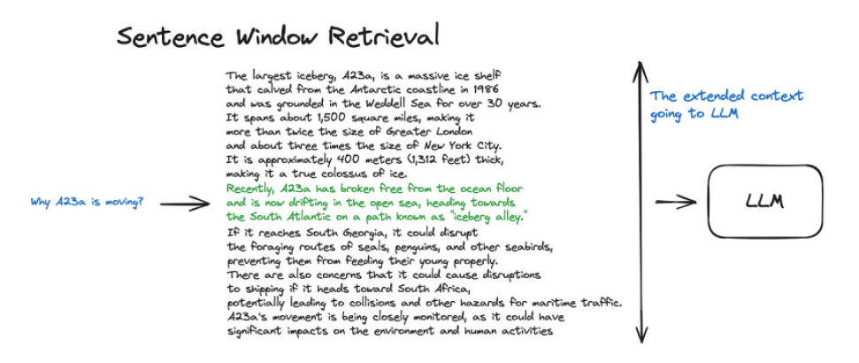

## Fine-tuning de LLMs para RAG: Aumento da Fidelidade e Desempenho

### Introdução
Este capítulo explora o fine-tuning de Large Language Models (LLMs) como uma estratégia para otimizar pipelines de Retrieval-Augmented Generation (RAG). O fine-tuning ganhou popularidade com a disponibilidade de APIs de fine-tuning de LLMs, como a da OpenAI, e implementações em frameworks como LlamaIndex [^1]. Exploraremos como essa técnica pode ser aplicada para melhorar a fidelidade e o desempenho geral de sistemas RAG, com base em métricas avaliadas por frameworks como Ragas [^1].

### Conceitos Fundamentais
**O que é Fine-tuning?**

O **fine-tuning** é o processo de ajustar um modelo pré-treinado (neste caso, um LLM) em um conjunto de dados específico para uma tarefa particular. Em vez de treinar um modelo do zero, o fine-tuning aproveita o conhecimento já adquirido pelo modelo durante o pré-treinamento, adaptando-o para um novo domínio ou tarefa. Isso geralmente requer menos dados e poder computacional do que o treinamento completo.

**Aplicações de Fine-tuning em RAG**

No contexto de RAG, o fine-tuning pode ser utilizado para:

*   **Melhorar a fidelidade:** O objetivo principal é garantir que as respostas geradas pelo LLM estejam mais alinhadas com as informações recuperadas da base de conhecimento. Isso pode ser medido usando métricas como a *faithfulness* do Ragas [^1].
*   **Otimizar a relevância:** Ajustar o LLM para melhor compreender e responder às consultas do usuário, considerando o contexto fornecido pelos documentos recuperados.
*   **Adaptar o modelo a domínios específicos:** Fine-tuning em dados específicos do domínio pode melhorar significativamente o desempenho do LLM em tarefas especializadas.

**Lema 1:** *Fine-tuning pode reduzir alucinações.*
Um modelo fine-tuned em um domínio específico aprende a distinguir entre informações relevantes e irrelevantes, reduzindo a probabilidade de gerar respostas que não são suportadas pelo contexto fornecido.

**Frameworks e APIs para Fine-tuning**

Frameworks como LlamaIndex [^1] e APIs como a da OpenAI [^1] simplificaram o processo de fine-tuning de LLMs. Eles fornecem ferramentas e interfaces que facilitam a preparação dos dados, o treinamento do modelo e a avaliação dos resultados.

**Ragas e Avaliação de Pipelines RAG**

Ragas [^1] é um framework para avaliar pipelines RAG. Ele oferece métricas como *faithfulness*, *answer relevance* e *context relevance*, que permitem quantificar a qualidade das respostas geradas pelo sistema RAG. A faithfulness, em particular, mede a consistência das respostas com as informações fornecidas no contexto recuperado.

**Processo de Fine-tuning**

1.  **Preparação dos dados:** Reúna um conjunto de dados relevante para a tarefa RAG. Este conjunto de dados deve conter pares de perguntas e respostas baseadas em documentos específicos.
2.  **Formatação dos dados:** Formate os dados no formato esperado pelo framework ou API de fine-tuning. Isso pode envolver a criação de prompts específicos que incluem o contexto recuperado e a pergunta do usuário.
3.  **Seleção do modelo:** Escolha um LLM pré-treinado adequado para a tarefa. Modelos maiores geralmente oferecem melhor desempenho, mas requerem mais recursos computacionais.
4.  **Configuração dos hiperparâmetros:** Ajuste os hiperparâmetros do treinamento, como a taxa de aprendizado, o tamanho do lote e o número de épocas. A escolha dos hiperparâmetros pode ter um impacto significativo no desempenho do modelo fine-tuned.
    **Teorema 1:** *A escolha da taxa de aprendizado é crucial para o desempenho do fine-tuning.* Uma taxa de aprendizado muito alta pode levar a instabilidade no treinamento, enquanto uma taxa muito baixa pode resultar em convergência lenta ou em um mínimo local subótimo.

> 💡 **Exemplo Numérico:**
> Suponha que estamos fine-tuning um LLM para responder perguntas sobre relatórios financeiros. Definimos um experimento com duas taxas de aprendizado diferentes: 0.01 e 0.0001. Após o fine-tuning, avaliamos os modelos usando a métrica *faithfulness* do Ragas.
>
> | Taxa de Aprendizado | Faithfulness |
> |--------------------|--------------|
> | 0.01               | 0.65         |
> | 0.0001             | 0.82         |
>
> Neste exemplo, a taxa de aprendizado mais baixa (0.0001) resultou em uma faithfulness significativamente melhor, indicando que o modelo estava gerando respostas mais alinhadas com os relatórios financeiros fornecidos como contexto. A taxa de aprendizado de 0.01 pode ter sido muito alta, fazendo com que o modelo "saltasse" sobre o mínimo ideal durante o treinamento.

5.  **Treinamento do modelo:** Execute o processo de fine-tuning usando o conjunto de dados preparado e os hiperparâmetros configurados. Monitore o progresso do treinamento e ajuste os hiperparâmetros conforme necessário.
6.  **Avaliação do modelo:** Avalie o desempenho do modelo fine-tuned usando métricas relevantes, como as fornecidas pelo Ragas [^1]. Compare o desempenho do modelo fine-tuned com o modelo original para quantificar os ganhos obtidos.

> 💡 **Exemplo Numérico:**
> Avaliamos um modelo LLM antes e depois do fine-tuning em um conjunto de dados de artigos científicos. Usamos o Ragas para medir a *answer relevance* (relevância da resposta) e a *context relevance* (relevância do contexto). Os resultados são mostrados abaixo:
>
> | Modelo        | Answer Relevance | Context Relevance |
> |---------------|------------------|-------------------|
> | Pré-Fine-tuning | 0.70             | 0.60              |
> | Fine-tuning   | 0.85             | 0.75              |
>
> A tabela demonstra uma melhoria significativa tanto na relevância da resposta quanto na relevância do contexto após o fine-tuning. Isso indica que o modelo ajustado é melhor em fornecer respostas relevantes e em utilizar o contexto fornecido de forma eficaz.
>
> $\text{Melhora na Answer Relevance} = 0.85 - 0.70 = 0.15$
> $\text{Melhora na Context Relevance} = 0.75 - 0.60 = 0.15$
>
> A melhoria de 0.15 (ou 15%) em ambas as métricas é um ganho considerável, demonstrando a eficácia do fine-tuning. Um teste estatístico (e.g., teste t pareado) poderia ser usado para determinar a significância estatística desta melhoria.

7.  **Implantação do modelo:** Implante o modelo fine-tuned em seu pipeline RAG.

**Proposição 1:** *O tamanho do contexto influencia a faithfulness.*
Contextos mais longos podem fornecer mais informações para o LLM gerar respostas fiéis, mas também podem introduzir ruído e dificultar a identificação das informações relevantes.

> 💡 **Exemplo Numérico:**
> Para demonstrar o efeito do tamanho do contexto, realizamos um experimento onde variamos o número de sentenças incluídas no contexto fornecido ao LLM. Avaliamos a faithfulness das respostas geradas para cada tamanho de contexto.
>
> | Tamanho do Contexto (nº de sentenças) | Faithfulness |
> |--------------------------------------|--------------|
> | 3                                    | 0.70         |
> | 5                                    | 0.85         |
> | 7                                    | 0.80         |
>
> Inicialmente, aumentar o tamanho do contexto de 3 para 5 sentenças melhorou a faithfulness, pois forneceu mais informações relevantes. No entanto, aumentar ainda mais para 7 sentenças diminuiu a faithfulness. Isso sugere que o contexto mais longo introduziu ruído, dificultando a identificação das informações mais importantes pelo LLM. Um tamanho de contexto intermediário (5 sentenças) apresentou o melhor equilíbrio entre informação e ruído.

**Exemplo Prático:**

Suponha que temos um sistema RAG para responder perguntas sobre documentos técnicos. Podemos fine-tunear um LLM utilizando pares de perguntas e respostas extraídos desses documentos técnicos. O dataset de fine-tuning consistiria em triplas da forma (contexto, pergunta, resposta), onde o contexto é o trecho do documento técnico relevante, a pergunta é a consulta do usuário, e a resposta é a resposta correta baseada no contexto. Durante o fine-tuning, o LLM aprende a gerar respostas mais precisas e alinhadas com as informações fornecidas no contexto.

**Corolário 1:** *Fine-tuning melhora a generalização.*
Um modelo fine-tuned não apenas melhora o desempenho em perguntas específicas presentes no conjunto de dados de treinamento, mas também generaliza melhor para perguntas semelhantes que não foram vistas durante o treinamento. Isso ocorre porque o fine-tuning permite que o modelo refine sua compreensão do domínio e aprenda a extrair informações relevantes de maneira mais eficaz.

### Conclusão

O fine-tuning de LLMs representa uma técnica poderosa para otimizar o desempenho de pipelines RAG. Ao ajustar um LLM pré-treinado em um conjunto de dados específico para a tarefa RAG, é possível melhorar significativamente a fidelidade, a relevância e a adaptabilidade do sistema. Frameworks como LlamaIndex [^1] e Ragas [^1], juntamente com APIs de fine-tuning como a da OpenAI [^1], facilitam a implementação e a avaliação dessa técnica. O aumento da faithfulness, medido pelo Ragas [^1], demonstra o potencial do fine-tuning para gerar respostas mais confiáveis e precisas em sistemas RAG. Ao implementar essa técnica, é crucial preparar os dados cuidadosamente, ajustar os hiperparâmetros adequadamente e avaliar o desempenho do modelo fine-tuned usando métricas relevantes.

### Referências
[^1]: Informação contextual fornecida.
<!-- END -->