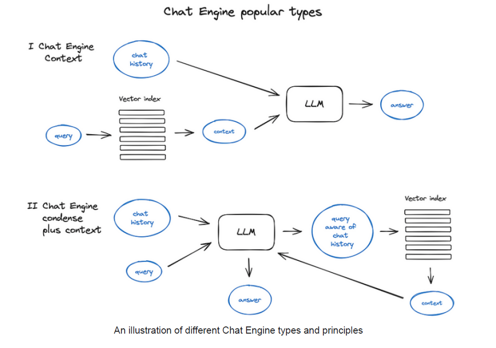

## Chat Engine: ContextChatEngine com CondensePlusContextMode

### Introdução
Este capítulo explora o **ContextChatEngine**, um componente crucial em sistemas de Neural Information Retrieval e RAG (Retrieval-Augmented Generation) que lida com o histórico de conversas e a recuperação de contexto relevante para a consulta do usuário. Especificamente, focaremos no modo **CondensePlusContextMode**, que otimiza a recuperação de contexto ao condensar o histórico de chat e a última mensagem em uma nova consulta, garantindo que o contexto recuperado seja altamente relevante e informado pelo histórico da interação.

### Conceitos Fundamentais

O **ContextChatEngine** é projetado para manter o contexto da conversa ao longo de múltiplas interações. Diferente de sistemas que tratam cada pergunta isoladamente, o ContextChatEngine considera o histórico de mensagens para fornecer respostas mais coerentes e informativas. O modo **CondensePlusContextMode** refina esse processo através de duas etapas principais:

1.  **Condensação do Histórico e da Consulta:** O histórico do chat e a última mensagem do usuário são condensados em uma nova consulta. Esta etapa é fundamental porque permite que o sistema de recuperação de contexto (geralmente um índice vetorial ou outro mecanismo de busca) opere sobre uma representação mais precisa das informações relevantes para a resposta. Esta nova consulta encapsula tanto o que foi discutido anteriormente quanto a pergunta atual, resultando em uma busca mais direcionada.

2.  **Recuperação de Contexto e Geração de Resposta:** A consulta condensada é utilizada para recuperar o contexto relevante. O contexto recuperado, juntamente com a mensagem original do usuário, é então passado para um Large Language Model (LLM). O LLM utiliza essa informação combinada para gerar uma resposta.

Para ilustrar o funcionamento do **CondensePlusContextMode**, considere o seguinte cenário:

*   **Usuário:** "Qual é a capital da França?"
*   **Sistema:** "A capital da França é Paris."
*   **Usuário:** "E qual é a população?"

Neste caso, sem o **CondensePlusContextMode**, um sistema simples de RAG poderia não entender que o usuário está perguntando sobre a população de Paris. Com o **CondensePlusContextMode**, o histórico ("Qual é a capital da França? A capital da França é Paris.") e a última pergunta ("E qual é a população?") seriam condensados em uma nova consulta, como "Qual é a população de Paris?". Essa consulta condensada permite que o sistema recupere informações precisas sobre a população de Paris.

💡 **Exemplo Numérico:** Suponha que o modelo de condensação utilize embeddings para representar as frases. O histórico "Qual é a capital da França? A capital da França é Paris." poderia ser representado pelo embedding $H = [0.2, 0.5, 0.1, 0.8]$ e a pergunta "E qual é a população?" pelo embedding $q_{original} = [0.3, 0.7, 0.2, 0.6]$. O modelo de condensação pode combinar esses embeddings, por exemplo, através de uma média ponderada ou uma rede neural, para gerar um novo embedding $q_{condensada} = [0.25, 0.6, 0.15, 0.7]$ que representa a consulta condensada "Qual é a população de Paris?". Este novo embedding será usado para a busca no índice vetorial.

**Vantagens do CondensePlusContextMode:**

*   **Melhora a relevância do contexto:** Ao condensar o histórico, a consulta para recuperação de contexto se torna mais precisa e direcionada.
*   **Reduz ruído:** O histórico irrelevante é removido, evitando que o sistema recupere informações desnecessárias ou confusas.
*   **Aumenta a coerência:** As respostas são mais consistentes e relevantes para o contexto da conversa.

**Implementação Técnica:**

A implementação do **CondensePlusContextMode** envolve várias etapas técnicas. Primeiro, um modelo de linguagem é utilizado para condensar o histórico e a consulta. Este modelo deve ser capaz de entender a semântica da conversa e gerar uma consulta que capture a essência da informação relevante. Segundo, um sistema de recuperação de contexto (como um índice vetorial) é utilizado para buscar documentos ou trechos de texto relevantes com base na consulta condensada. Finalmente, um LLM é utilizado para gerar a resposta, combinando o contexto recuperado com a mensagem original do usuário.

Para aprimorar a compreensão da implementação técnica, podemos discutir brevemente as características desejáveis do modelo de linguagem utilizado para a condensação. Além de capturar a essência da informação, o modelo deve ser eficiente em termos computacionais e adaptável a diferentes domínios e estilos de conversação.

**Lema 1:** *A eficiência do modelo de condensação $f$ impacta diretamente a latência do ContextChatEngine.*

*Prova.* Seja $t_f$ o tempo necessário para o modelo $f$ condensar o histórico $H$ e a consulta $q_{original}$. A latência total do ContextChatEngine, $T$, é dada por:
$$T = t_f + t_g + t_{LLM}$$
Onde $t_g$ é o tempo para a recuperação de contexto e $t_{LLM}$ é o tempo para o LLM gerar a resposta. Portanto, uma redução em $t_f$ resulta diretamente em uma redução em $T$, demonstrando que a eficiência de $f$ afeta a latência do sistema.

Em termos matemáticos, podemos representar a condensação do histórico e da consulta como uma função:

$$ q_{condensada} = f(H, q_{original})$$

Onde:

*   $q_{condensada}$ é a consulta condensada.
*   $H$ é o histórico do chat.
*   $q_{original}$ é a consulta original do usuário.
*   $f$ é o modelo de condensação, que pode ser uma rede neural ou outro algoritmo de processamento de linguagem natural.

💡 **Exemplo Numérico:** Suponha que o modelo *f* seja uma rede Transformer. O histórico *H* e a consulta original *q_original* são concatenados e passados pela rede. A rede retorna *q_condensada*. Se a rede *f* leva 50ms ($t_f = 0.05s$) para processar, o tempo total *T* é diretamente afetado. Se otimizarmos *f* para levar apenas 30ms ($t_f = 0.03s$), reduzimos a latência total do sistema.

A recuperação de contexto pode ser representada como:

$$ C = g(q_{condensada}, I)$$

Onde:

*   $C$ é o contexto recuperado.
*   $q_{condensada}$ é a consulta condensada.
*   $I$ é o índice de documentos ou trechos de texto.
*   $g$ é a função de recuperação, que depende do tipo de índice utilizado (e.g., busca por similaridade de vetores).

💡 **Exemplo Numérico:** Suponha que *I* seja um índice FAISS de embeddings de documentos. A função *g* calcula a similaridade do vetor *q_condensada* com os vetores no índice *I* usando similaridade do cosseno. Se *q_condensada* = [0.25, 0.6, 0.15, 0.7] e um documento no índice tem o embedding *d* = [0.2, 0.5, 0.2, 0.75], a similaridade do cosseno é:

$\text{Cosine Similarity} = \frac{q_{condensada} \cdot d}{||q_{condensada}|| \cdot ||d||} = \frac{(0.25 \cdot 0.2) + (0.6 \cdot 0.5) + (0.15 \cdot 0.2) + (0.7 \cdot 0.75)}{\sqrt{0.25^2 + 0.6^2 + 0.15^2 + 0.7^2} \cdot \sqrt{0.2^2 + 0.5^2 + 0.2^2 + 0.75^2}} \approx 0.97$

Se um outro documento tem similaridade 0.85, o primeiro documento é considerado mais relevante e será incluído no contexto *C*.

Finalmente, a geração da resposta é dada por:

$$ resposta = LLM(C, q_{original})$$

Onde:

*   $resposta$ é a resposta gerada pelo LLM.
*   $C$ é o contexto recuperado.
*   $q_{original}$ é a consulta original do usuário.
*   $LLM$ é o Large Language Model.
Para melhor ilustrar o funcionamento, a imagem a seguir presenta os dois tipos de arquiteturas de Chat Engine.

Além das equações apresentadas, é importante considerar como o tamanho do histórico ($|H|$) influencia a qualidade da consulta condensada ($q_{condensada}$). Um histórico muito extenso pode conter informações redundantes ou irrelevantes que prejudicam a precisão da condensação. Por outro lado, um histórico muito curto pode não fornecer contexto suficiente para gerar uma consulta eficaz.

**Teorema 1:** *Existe um tamanho ótimo para o histórico do chat ($|H|_{otimo}$) que maximiza a relevância do contexto recuperado.*

*Estratégia da Prova.* A prova deste teorema envolveria definir uma métrica para quantificar a relevância do contexto recuperado (e.g., precisão, revocação) e, em seguida, analisar como essa métrica varia em função do tamanho do histórico. Poderíamos modelar a relevância como uma função de $|H|$ e encontrar o valor de $|H|$ que maximiza essa função. Este valor representaria o tamanho ótimo do histórico.

💡 **Exemplo Numérico:** Suponha que a relevância do contexto seja medida pela Precisão@K (i.e., a proporção de documentos relevantes nos K primeiros resultados recuperados). Podemos variar o tamanho do histórico |H| e medir a Precisão@K.

| Tamanho do Histórico (|H|) | Precisão@3 |
|--------------------------|------------|
| 1                         | 0.6        |
| 3                         | 0.8        |
| 5                         | 0.9        |
| 7                         | 0.85       |
| 10                        | 0.75       |

Neste exemplo, |H|_otimo = 5, pois maximiza a Precisão@3. Um histórico maior que 5 introduz ruído e diminui a precisão.

**Corolário 1:** *Implementar um mecanismo de janela deslizante ou sumarização do histórico pode aproximar o sistema do tamanho ótimo de histórico, $|H|_{otimo}$.*

Este corolário sugere que, na prática, manter apenas as $n$ mensagens mais recentes ou aplicar técnicas de sumarização ao histórico podem melhorar o desempenho do sistema.

💡 **Exemplo Numérico:** Usando uma janela deslizante de tamanho 3 no histórico do chat. Se o histórico completo é [M1, M2, M3, M4, M5], o modelo de condensação considera apenas [M3, M4, M5] para a próxima consulta. Isso simula ter um tamanho de histórico fixo e pode melhorar a relevância se o histórico completo se tornar muito longo e irrelevante.

### Conclusão

O **CondensePlusContextMode** oferece uma abordagem sofisticada para gerenciar o contexto em sistemas de Chat Engine. Ao condensar o histórico de conversas e a última mensagem do usuário, ele garante que a recuperação de contexto seja mais precisa, relevante e coerente. Isso resulta em respostas mais informativas e consistentes, melhorando significativamente a experiência do usuário em aplicações de Neural Information Retrieval e RAG. A capacidade de representar matematicamente as etapas de condensação, recuperação e geração permite uma análise mais profunda e uma otimização mais eficaz do sistema. Além disso, considerar o tamanho ótimo do histórico e a eficiência do modelo de condensação são aspectos cruciais para o desempenho geral do sistema.
<!-- END -->