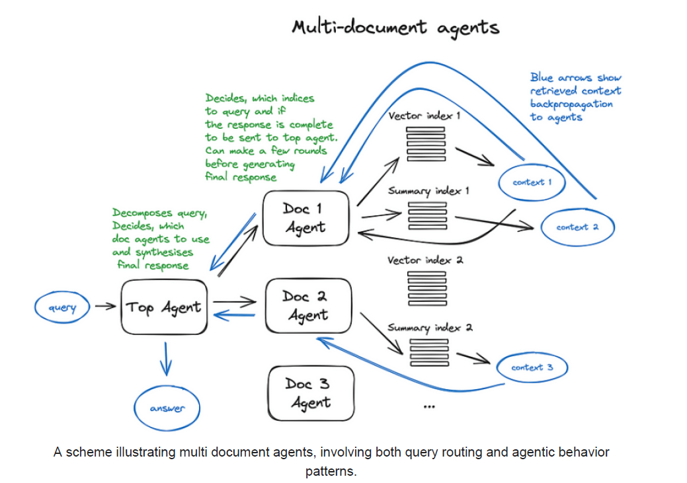
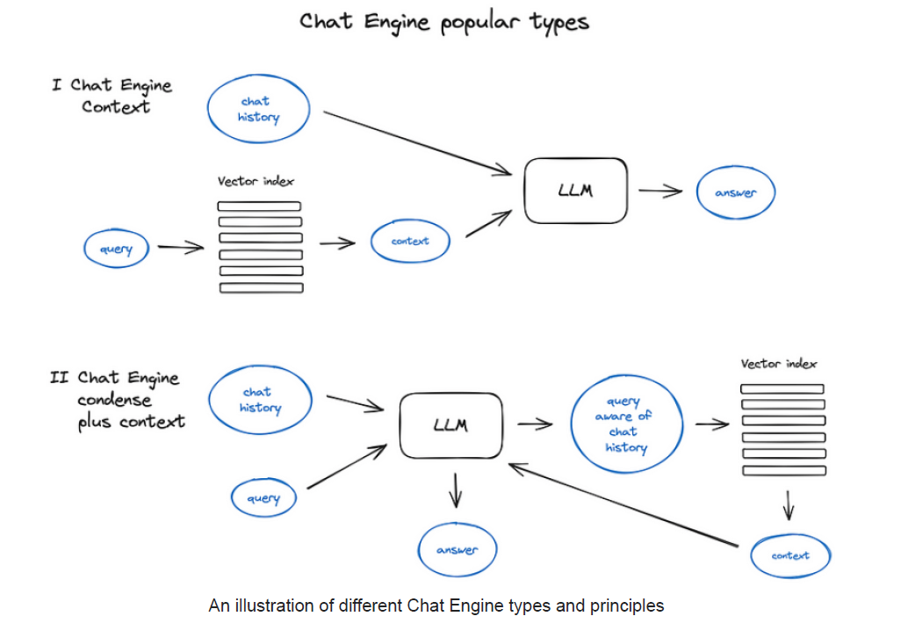

The image illustrates a basic index retrieval process in a Retrieval-Augmented Generation (RAG) system, as described in Section 2.1 of the document. It outlines the flow from documents to a vector store, then to the retrieval of top k relevant chunks in response to a query, which are subsequently fed into a Large Language Model (LLM) to generate an answer. The diagram simplifies the process by omitting the Encoder block, focusing on the indexing and retrieval of pre-vectorized chunks.

The image illustrates a multi-document agent architecture for advanced RAG, as discussed in section 7. It involves a 'Top Agent' that decomposes queries and routes them to individual document agents ('Doc 1 Agent', 'Doc 2 Agent', 'Doc 3 Agent'). These agents utilize vector and summary indices to retrieve context, with blue arrows indicating context backpropagation, and the architecture supports query routing and agentic behavior patterns for comparing solutions across different documents.

The image illustrates the "Sentence Window Retrieval" technique, discussed in section 2.4.1 of the document, where individual sentences are embedded and indexed separately. The diagram shows a query prompting the system to retrieve the most relevant sentence and then expand the context window by adding sentences before and after this single sentence, thus providing an extended context to the Large Language Model (LLM). This method improves reasoning by enriching the context provided to the LLM.

The image illustrates a Naive Retrieval Augmented Generation (RAG) architecture as described on page 3 of the document. It shows a query being processed by an embedding model to create a vector representation, which is then used to retrieve relevant context from a vector store index. The retrieved context, along with the original query, is fed into a Large Language Model (LLM) to generate an answer. This diagram provides a foundational understanding of the RAG process before diving into more advanced techniques.

A imagem ilustra os princípios da transformação de consultas (Query Transformation) em sistemas RAG (Retrieval-Augmented Generation), conforme mencionado na seção 4 da página 9. O diagrama mostra como uma consulta inicial é processada por um LLM (Large Language Model) para gerar subconsultas ou consultas mais gerais. Essas subconsultas são então usadas para buscar informações em um 'Vector Index', com os principais resultados sendo combinados para sintetizar uma resposta final.

The image, found on page 12 of the document, presents two popular types of Chat Engine architectures used within Retrieval-Augmented Generation (RAG) systems. The first architecture, 'I Chat Engine Context', showcases a setup where chat history and context from a vector index are fed into a Large Language Model (LLM) to generate an answer. The second architecture, 'II Chat Engine condense plus context', introduces a more sophisticated approach where the chat history and initial query are used by the LLM to condense and generate a new query, which is then used to retrieve context from a vector index before the LLM generates an answer.

The image illustrates the 'Fusion retrieval / hybrid search' technique described in section 2.5 of the document, which combines keyword-based (sparse n-grams index (BM25)) and semantic (vector index) search methods. It shows how an incoming query is processed against both indexes, top results are retrieved from each, then combined using Reciprocal Rank Fusion before being passed to an LLM to generate the final answer. This diagram explains the combination of different similarity scores to improve retrieval quality, as mentioned on page 8.

The image illustrates the key components of an advanced Retrieval Augmented Generation (RAG) architecture, as discussed in Section 7, emphasizing it as a collection of instruments rather than a rigid blueprint. It depicts the flow from an initial query, through agents for query transformation and routing, into DB storage with vector and summary indices, followed by reranking and post-processing to retrieve context, and finally, integration with a Large Language Model (LLM) to generate an answer. The diagram highlights the use of agents and various indexing techniques to optimize the retrieval and processing of information within the RAG pipeline.

The image (from page 6 of the document) illustrates a hierarchical index retrieval process in Retrieval Augmented Generation (RAG). It begins with a 'query' that is passed to an 'Index of summary vectors,' and then the most relevant summary vectors are used to retrieve 'Top k relevant chunks' from a 'Vector store of all chunks vectors.' The relevant chunks are finally fed into a Large Language Model (LLM) to generate an 'answer,' showcasing a multi-stage retrieval for efficient information synthesis from large databases.

The image illustrates the parent-child chunks retrieval method, a context enrichment technique described in Section 2.4.2 of the document. In this method, documents are divided into a hierarchy of chunks, with leaf chunks sent to the index and at retrieval time, if multiple leaf chunks point to the same parent, they are replaced with the parent chunk before being passed to the LLM, effectively merging them into a larger context.
